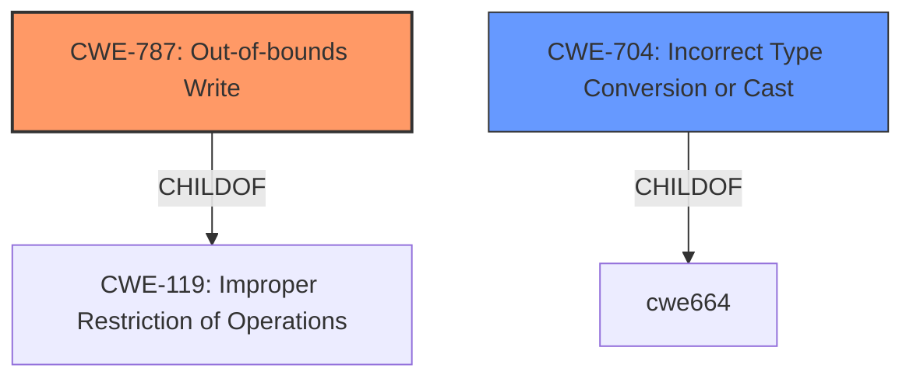

# Analysis for CVE-2022-22102

# Summary
| CWE ID | CWE Name | Confidence | CWE Abstraction Level | CWE Vulnerability Mapping Label | CWE-Vulnerability Mapping Notes |
|---|---|---|---|---|---|
| CWE-787 | Out-of-bounds Write | 0.9 | Base | Allowed | Primary CWE |
| CWE-704 | Incorrect Type Conversion or Cast | 0.6 | Class | Allowed-with-Review | Secondary CWE |

## Evidence and Confidence

*   **Confidence Score:** 0.75
*   **Evidence Strength:** MEDIUM

## Relationship Analysis
The primary CWE selected is CWE-787 (Out-of-bounds Write), which is a base-level CWE. It is related to CWE-119 (Improper Restriction of Operations Within the Bounds of a Memory Buffer). CWE-787 is a child of CWE-119. CWE-704 (Incorrect Type Conversion or Cast) is a Class-level CWE and a potential contributing factor. It's a parent of more specific issues but could be relevant if the **incorrect type conversion** leads to memory corruption directly.

## Vulnerability Chain
The vulnerability chain starts with an **incorrect type conversion**, which leads to **memory corruption** in the form of an out-of-bounds write. The chain is: Incorrect Type Conversion -> Out-of-bounds Write -> Memory Corruption

## Summary of Analysis
The vulnerability description clearly states "**incorrect type conversion while adding data**" as the root cause and "**memory corruption**" as the weakness. Given the description, the most likely cause of memory corruption is an out-of-bounds write (CWE-787).

The retriever results also lists CWE-787 as the top candidate. "Alternative Terms" for CWE-787 include "Memory Corruption". The description of CWE-787, "The product writes data past the end, or before the beginning, of the intended buffer," closely aligns with the concept of memory corruption.

CWE-704 (Incorrect Type Conversion or Cast) is considered as a secondary weakness. The description states, "The product does not correctly convert an object, resource, or structure from one type to a different type." While the description mentions **incorrect type conversion**, this could be a contributing factor, but the ultimate impact is an out-of-bounds write, making CWE-787 the primary issue.

The selected CWEs are at the optimal level of specificity. CWE-787 is a Base-level CWE, which is preferred. CWE-704, while a Class, is considered a secondary contributing factor.

Relevant CWE Information:

# Enhanced Context (25 CWEs)

## CWE-131: Incorrect Calculation of Buffer Size
**Abstraction Level**: Base
**Similarity Score**: 0.79

**Description**:
The product does not correctly calculate the size to be used when allocating a buffer, which could lead to a buffer overflow.

**Mapping Guidance**:
- Usage: Allowed
- Rationale: This CWE entry is at the Base level of abstraction, which is a preferred level of abstraction for mapping to the root causes of vulnerabilities.

*Not selected:* While incorrect buffer size calculation can lead to memory corruption, the root cause is described as an **incorrect type conversion**, not an incorrect buffer size calculation.

## CWE-681: Incorrect Conversion between Numeric Types
**Abstraction Level**: Base
**Similarity Score**: 0.79

**Description**:
When converting from one data type to another, such as long to integer, data can be omitted or translated in a way that produces unexpected values. If the resulting values are used in a sensitive context, then dangerous behaviors may occur.

**Mapping Guidance**:
- Usage: Allowed
- Rationale: This CWE entry is at the Base level of abstraction, which is a preferred level of abstraction for mapping to the root causes of vulnerabilities.

*Not selected:* Although the vulnerability description mentions **incorrect type conversion**, it doesn't specifically state that numeric types are being converted. CWE-704 (Incorrect Type Conversion or Cast) is more general.

## CWE-367: Time-of-check Time-of-use (TOCTOU) Race Condition
**Abstraction Level**: Base
**Similarity Score**: 0.79

**Description**:
The product checks the state of a resource before using that resource, but the resource's state can change between the check and the use in a way that invalidates the results of the check. This can cause the product to perform invalid actions when the resource is in an unexpected state.

**Mapping Guidance**:
- Usage: Allowed
- Rationale: This CWE entry is at the Base level of abstraction, which is a preferred level of abstraction for mapping to the root causes of vulnerabilities.

*Not selected:* There is no evidence of a race condition in the vulnerability description.

## CWE-843: Access of Resource Using Incompatible Type ('Type Confusion')
**Abstraction Level**: Base
**Similarity Score**: 0.79

**Description**:
The product allocates or initializes a resource such as a pointer, object, or variable using one type, but it later accesses that resource using a type that is incompatible with the original type.

**Mapping Guidance**:
- Usage: Allowed
- Rationale: This CWE entry is at the Base level of abstraction, which is a preferred level of abstraction for mapping to the root causes of vulnerabilities.

*Not selected:* Type confusion could be related, but it isn't the primary issue identified. The **incorrect type conversion** more directly leads to the out-of-bounds write.

## CWE-667: Improper Locking
**Abstraction Level**: Class
**Similarity Score**: 0.78

**Description**:
The product does not properly acquire or release a lock on a resource, leading to unexpected resource state changes and behaviors.

**Mapping Guidance**:
- Usage: Allowed-with-Review
- Rationale: This CWE entry is a Class and might have Base-level children that would be more appropriate

*Not selected:* There is no evidence of locking issues in the vulnerability description.

## CWE-129: Improper Validation of Array Index
**Abstraction Level**: Variant
**Similarity Score**: 0.78

**Description**:
The product uses untrusted input when calculating or using an array index, but the product does not validate or incorrectly validates the index to ensure the index references a valid position within the array.

**Mapping Guidance**:
- Usage: Allowed
- Rationale: This CWE entry is at the Variant level of abstraction, which is a preferred level of abstraction for mapping to the root causes of vulnerabilities.

*Not selected:* While this could lead to an out-of-bounds write, the root cause is not directly related to array index validation. The **incorrect type conversion** is the primary issue.

## CWE-822: Untrusted Pointer Dereference
**Abstraction Level**: Base
**Similarity Score**: 0.78

**Description**:
The product obtains a value from an untrusted source, converts this value to a pointer, and dereferences the resulting pointer.

**Mapping Guidance**:
- Usage: Allowed
- Rationale: This CWE entry is at the Base level of abstraction, which is a preferred level of abstraction for mapping to the root causes of vulnerabilities.

*Not selected:* There is no evidence of untrusted pointer dereference.

## CWE-754: Improper Check for Unusual or Exceptional Conditions
**Abstraction Level**: Class
**Similarity Score**: 0.78

**Description**:
The product does not check or incorrectly checks for unusual or exceptional conditions that are not expected to occur frequently during day to day operation of the product.

**Mapping Guidance**:
- Usage: Allowed-with-Review
- Rationale: This CWE entry is a Class and might have Base-level children that would be more appropriate

*Not selected:* This is too general and doesn't fit the specific vulnerability.

## CWE-823: Use of Out-of-range Pointer Offset
**Abstraction Level**: Base
**Similarity Score**: 0.77

**Description**:
The product performs pointer arithmetic on a valid pointer, but it uses an offset that can point outside of the intended range of valid memory locations for the resulting pointer.

**Mapping Guidance**:
- Usage: Allowed
- Rationale: This CWE entry is at the Base level of abstraction, which is a preferred level of abstraction for mapping to the root causes of vulnerabilities.

*Not selected:* Out-of-range pointer offset is similar to out-of-bounds write but less direct given that **incorrect type conversion** is the rootcause.

## CWE-252: Unchecked Return Value
**Abstraction Level**: Base
**Similarity Score**: 0.77

**Description**:
The product does not check the return value from a