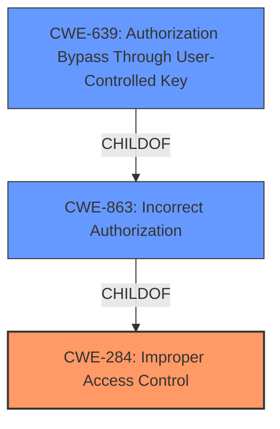

# Enhanced Analysis for CVE-2022-22127

# Summary
| CWE ID | CWE Name | Confidence | CWE Abstraction Level | CWE Vulnerability Mapping Label | CWE-Vulnerability Mapping Notes |
|---|---|---|---|---|---|
| CWE-284 | Improper Access Control | 0.7 | Pillar | Primary | Discouraged |
| CWE-639 | Authorization Bypass Through User-Controlled Key | 0.6 | Base | Secondary | Allowed |
| CWE-863 | Incorrect Authorization | 0.5 | Class | Secondary | Allowed-with-Review |

## Evidence and Confidence

*   **Confidence Score:** 0.7
*   **Evidence Strength:** MEDIUM

## Relationship Analysis
The primary CWE chosen is CWE-284, which is a Pillar, the highest level of abstraction. Given the limited details, the specific nature of the **broken access control** isn't evident, making it hard to choose a more specific CWE. CWE-639 is a child of CWE-863, which is a child of CWE-284.



## Vulnerability Chain
The chain starts with **broken access control**, allowing a malicious site administrator to change passwords for users in different sites, potentially leading to unauthorized access to data.

## Summary of Analysis
The initial assessment pointed towards access control issues, primarily due to the "**broken access control**" root cause. The **impact** of this vulnerability allows a malicious site administrator to change passwords for users in different sites.

The retriever results indicated CWE-284 [CWE-284: Improper Access Control], CWE-522 [CWE-522: Insufficiently Protected Credentials], CWE-1390 [CWE-1390: Weak Authentication], CWE-287 [CWE-287: Improper Authentication], CWE-639 [CWE-639: Authorization Bypass Through User-Controlled Key], CWE-285 [CWE-285: Improper Authorization], CWE-613 [CWE-613: Insufficient Session Expiration], CWE-863 [CWE-863: Incorrect Authorization], CWE-327 [CWE-327: Use of a Broken or Risky Cryptographic Algorithm], and CWE-306 [CWE-306: Missing Authentication for Critical Function].

CWE-284 [CWE-284: Improper Access Control] is chosen as the primary CWE, but it is a high-level Pillar. The mapping guidance discourages its use because it is too high-level. However, the description mentions "**broken access control**", and without more information, a more specific CWE is difficult to determine.

CWE-639 [CWE-639: Authorization Bypass Through User-Controlled Key] and CWE-863 [CWE-863: Incorrect Authorization] are also added as secondary CWEs. CWE-639 [CWE-639: Authorization Bypass Through User-Controlled Key] is a base CWE which is a child of CWE-863 [CWE-863: Incorrect Authorization]. The description matches the concept of authorization bypass.

CWE-522 [CWE-522: Insufficiently Protected Credentials], CWE-1390 [CWE-1390: Weak Authentication], CWE-287 [CWE-287: Improper Authentication], CWE-285 [CWE-285: Improper Authorization], CWE-613 [CWE-613: Insufficient Session Expiration], CWE-327 [CWE-327: Use of a Broken or Risky Cryptographic Algorithm], and CWE-306 [CWE-306: Missing Authentication for Critical Function] were considered but not chosen. The vulnerability description centers around access control, and these CWEs are either not directly related or are more about authentication or cryptographic issues.

The selected CWEs are at the optimal level of specificity, given the information available in the vulnerability description. More detailed information about the specific access control mechanisms involved would allow for a more precise classification.

Relevant CWE Information:
- CWE-284: Improper Access Control
- CWE-639: Authorization Bypass Through User-Controlled Key
- CWE-863: Incorrect Authorization


## CWE Relationship Analysis

Current CWEs represent these abstraction levels: .


### Vulnerability Chain Analysis

**Chain starting from CWE-327:**
- 327 (Use of a Broken or Risky Cryptographic Algorithm) - ROOT


**Chain starting from CWE-1390:**
- 1390 (Weak Authentication) - ROOT


### CWE Relationship Diagram

```mermaid
graph TD
    classDef primary fill:#f96,stroke:#333,stroke-width:2px
    classDef secondary fill:#69f,stroke:#333
    classDef tertiary fill:#9e9,stroke:#333
```