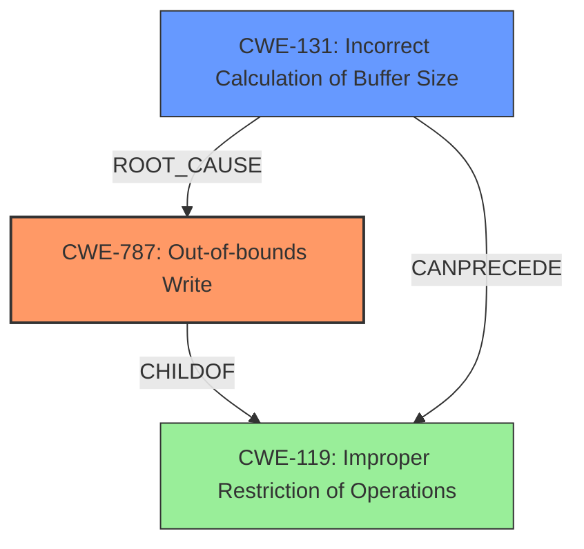

# Raw Analyzer Response for CVE-2022-22137

# Summary
| CWE ID | CWE Name | Confidence | CWE Abstraction Level | CWE Vulnerability Mapping Label | CWE-Vulnerability Mapping Notes |
|---|---|---|---|---|---|
| CWE-787 | Out-of-bounds Write | 1.0 | Base | Allowed | Primary CWE. The vulnerability results in memory corruption due to an incorrect buffer size, leading to writing outside the intended memory region. |
| CWE-131 | Incorrect Calculation of Buffer Size | 0.8 | Base | Allowed | Secondary CWE. The root cause is the incorrect calculation of the buffer size, triggering the out-of-bounds write. |

## Evidence and Confidence

*   **Confidence Score:** 0.9
*   **Evidence Strength:** HIGH

## Relationship Analysis
The primary CWE is CWE-787 **Out-of-bounds Write**, which occurs because of CWE-131 **Incorrect Calculation of Buffer Size**. CWE-131 can precede CWE-119 **Improper Restriction of Operations within the Bounds of a Memory Buffer**, which is a parent of CWE-787. This shows a clear hierarchical and chain relationship where an incorrect calculation leads to memory corruption by writing beyond the intended buffer.

## Vulnerability Chain
The vulnerability chain starts with:
1.  **Incorrect Calculation of Buffer Size (CWE-131)** in `ioca_mys_rgb_allocate` function.
2.  This leads to a zero-byte allocation for `table_mys_rgb` array.
3.  Later, `IGDIBRunEnds::delete_table_mys_rbg_ptr` attempts to free an uninitialized pointer within this array.
4.  This results in an **Out-of-bounds Write (CWE-787)** due to the arbitrary free, causing **memory corruption**.

## Summary of Analysis
The analysis indicates that the vulnerability is primarily due to an out-of-bounds write (CWE-787) caused by an incorrect buffer size calculation (CWE-131). The evidence is strong, with the CVE reference links providing details on the root cause and impact. The hierarchical and chain relationships between CWE-131, CWE-119, and CWE-787 further support this classification.

The key evidence supporting CWE-787 is: "**A memory corruption vulnerability** exists... A specially-crafted malformed file can lead to an arbitrary free." The "CVE Reference Links Content Summary" section confirms this: "when the `size_Y` value in the file is null, a zero-byte allocation occurs... the code attempts to free an uninitialized pointer... leading to an arbitrary free."

The evidence supporting CWE-131 is in the "CVE Reference Links Content Summary": "The vulnerability stems from an **incorrect calculation of buffer size** when processing a malformed IOCA file."

The selected CWEs are at the optimal level of specificity because they directly address the root cause (CWE-131) and the resulting memory corruption (CWE-787).

Other CWEs Considered but Not Used:

*   CWE-190 **Integer Overflow or Wraparound**: Considered, but the primary issue is the incorrect buffer size calculation rather than an integer overflow.
*   CWE-125 **Out-of-bounds Read**: Not applicable because the vulnerability involves writing to memory, not reading from it.
*   CWE-129 **Improper Validation of Array Index**: While related to buffer access, the root cause isn't related to array index validation but rather the buffer size calculation itself.
*   CWE-789 **Memory Allocation with Excessive Size Value**: While allocation is involved, the problem is a zero-byte allocation, not an excessive size value.