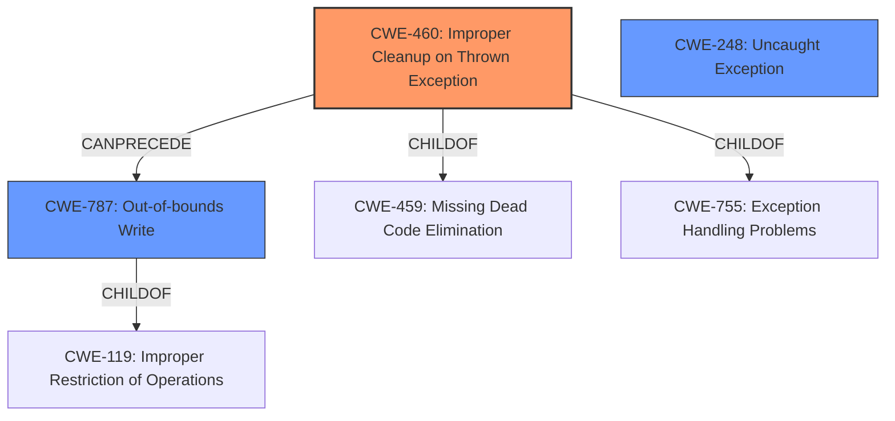

# Raw Analyzer Response for CVE-2022-22150

# Summary
| CWE ID    | CWE Name                                                        | Confidence | CWE Abstraction Level | CWE Vulnerability Mapping Label | CWE-Vulnerability Mapping Notes |
| :--------- | :-------------------------------------------------------------- | :--------- | :---------------------- | :------------------------------ | :------------------------------ |
| CWE-460     | Improper Cleanup on Thrown Exception                            | 0.95       | Base                    | Allowed                         | Primary CWE                     |
| CWE-787     | Out-of-bounds Write                                              | 0.85       | Base                    | Allowed                         | Secondary candidate             |
| CWE-248     | Uncaught Exception                                              | 0.75       | Base                    | Allowed                         | Secondary candidate             |

## Evidence and Confidence

*   **Confidence Score:** 0.90
*   **Evidence Strength:** HIGH

## Relationship Analysis
The primary relationship impacting the decision is the ChildOf relationship, specifically how CWE-460 fits under broader categories like CWE-459 (Missing Dead Code Elimination) and CWE-755 (Exception Handling Problems). The vulnerability involves an **improperly handled exception** leading to memory corruption, making CWE-460 a precise fit. CWE-787 is a consequence of the **improper exception handling**, which leads to the memory corruption. CWE-248 was also considered, but the description indicates the exception is thrown and not properly handled rather than simply uncaught, so it's less direct.

## Vulnerability Chain
The vulnerability chain starts with the **improperly handled exception** (CWE-460), leading to an invalid engine state, which results in **memory corruption** (CWE-787), and ultimately enables arbitrary code execution. The vulnerability chain is:

1.  **Improper Exception Handling** (CWE-460)
2.  Invalid Engine State
3.  **Memory Corruption** (CWE-787)
4.  Arbitrary Code Execution (Impact)

## Summary of Analysis
The initial analysis focused on the **improperly handled exception** as the root cause, supported by the "Vulnerability Description Key Phrases" which explicitly lists "**improperly handled exception**" as a root cause. The "CVE Reference Links Content Summary" confirms that a C++ exception is thrown but not properly handled within the JavaScript engine, leading to memory corruption.

The retriever results also highlighted CWE-460 as a strong candidate. The relationship analysis further solidified this selection, showing how CWE-460 fits within the broader context of exception handling problems.

The final decision is primarily based on the provided evidence, particularly the root cause analysis in the vulnerability description and the corroborating details in the CVE reference links content summary. The CWEs are selected at the optimal level of specificity, with CWE-460 capturing the root cause and CWE-787 representing a direct consequence.

Relevant CWE Information:

# Enhanced Context (25 CWEs)

## CWE-787: Out-of-bounds Write
**Abstraction:** Base
**Similarity Score**: 3.30
**Source**: graph

**Description**:
CWE-787: Out-of-bounds Write

**Mapping Guidance**:
- Usage: Allowed
- Rationale: This CWE entry is at the Base level of abstraction, which is a preferred level of abstraction for mapping to the root causes of vulnerabilities.

**Relationships**:
- CANFOLLOW -> CWE-825
- CANFOLLOW -> CWE-824
- CANFOLLOW -> CWE-823
- CANFOLLOW -> CWE-822
- PARENTOF -> CWE-124
### Technical Explanation for CWE-787:
*   **How the vulnerability's details match the CWE's characteristics:** The vulnerability description states that the improper exception handling leaves the engine in an invalid state, leading to **memory corruption**. This memory corruption is directly related to writing data outside the intended buffer boundaries, which aligns with the definition of CWE-787.
*   **The security implications and potential impact:** The **out-of-bounds write** allows an attacker to overwrite critical data structures, potentially leading to arbitrary code execution.
*   **Any parent-child relationships or chain patterns that influenced your mapping:** CWE-787 is a child of CWE-119 (Improper Restriction of Operations Within the Bounds of a Memory Buffer). The chain pattern here is that the **improper exception handling** (CWE-460) leads to a state where an **out-of-bounds write** (CWE-787) can occur.
*   **Whether the weakness is primary or secondary in the vulnerability:** CWE-787 is a secondary weakness, resulting from the primary weakness of **improper exception handling** (CWE-460).
*   **How the official MITRE mapping guidance influenced your decision:** The MITRE mapping guidance allows for the use of CWE-787 at the Base level, which is appropriate for this vulnerability.

## CWE-460: Improper Cleanup on Thrown Exception
**Abstraction:** Base
**Similarity Score**: 0.866
**Source**: sparse

**Description**:
The product does not clean up its state or incorrectly cleans up its state when an exception is thrown, leading to unexpected state or control flow.

**Mapping Guidance**:
- Usage: Allowed
- Rationale: This CWE entry is at the Base level of abstraction, which is a preferred level of abstraction for mapping to the root causes of vulnerabilities.

### Technical Explanation for CWE-460:
*   **How the vulnerability's details match the CWE's characteristics:** The vulnerability description states the root cause is an "**improperly handled exception**" within the JavaScript engine, which perfectly aligns with CWE-460's description. The "CVE Reference Links Content Summary" also explicitly mentions that a C++ exception is thrown but not properly handled.
*   **The security implications and potential impact:** The **improper cleanup** leaves the engine in an inconsistent state, allowing memory corruption and potentially leading to arbitrary code execution.
*   **Any parent-child relationships or chain patterns that influenced your mapping:** CWE-460 is a child of CWE-459 (Missing Dead Code Elimination) and CWE-755 (Exception Handling Problems). This hierarchical relationship helps refine the classification from a general exception handling issue to a specific problem of **improper cleanup**. The chain pattern is that this **improper cleanup** directly leads to memory corruption (CWE-787).
*   **Whether the weakness is primary or secondary in the vulnerability:** CWE-460 is the primary weakness, as it's the direct root cause identified in the vulnerability description.
*   **How the official MITRE mapping guidance influenced your decision:** The MITRE mapping guidance allows for the use of CWE-460 at the Base level, which is appropriate for this vulnerability's root cause.

## CWE-248: Uncaught Exception
**Abstraction:** Base
**Similarity Score**: 0.484
**Source**: sparse

**Description**:
An exception is thrown from a function, but it is not caught.

**Mapping Guidance**:
- Usage: Allowed
- Rationale: This CWE entry is at the Base level of abstraction, which is a preferred level of abstraction for mapping to the root causes of vulnerabilities.

### Technical Explanation for CWE-248:
*   **How the vulnerability's details match the CWE's characteristics:** While the vulnerability involves an exception, the key aspect is that it is **improperly handled**, not simply uncaught. CWE-248 describes a scenario where an exception is not caught at all, whereas in this case, the exception is caught but not handled correctly.
*   **The security implications and potential impact:** An uncaught exception can lead to program crashes or exposure of sensitive information.
*   **Any parent-child relationships or chain patterns that influenced your mapping:** CWE-248 is related to CWE-705 (Incorrect Control Flow Scoping) and CWE-755 (Exception Handling Problems).
*   **Whether the weakness is primary or secondary in the vulnerability:** While an uncaught exception is a potential issue, the