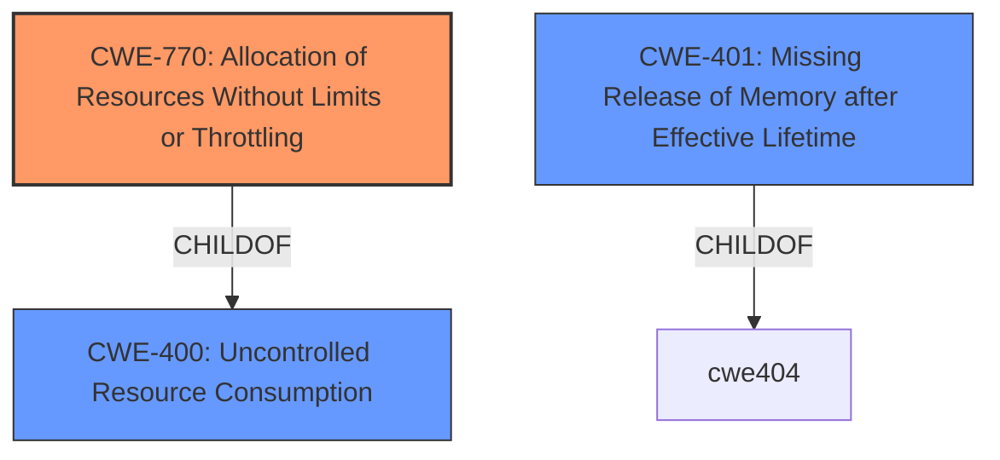

# Analysis Report for CVE-2022-22155

# Vulnerability Analysis Report: CVE-2022-22155

## Description


## Analysis (with Relationship Data)

# Summary
| CWE ID | CWE Name | Confidence | CWE Abstraction Level | CWE Vulnerability Mapping Label | CWE-Vulnerability Mapping Notes |
|---|---|---|---|---|---|
| CWE-770 | Allocation of Resources Without Limits or Throttling | 1 | Base | Allowed | Primary CWE |
| CWE-401 | Missing Release of Memory after Effective Lifetime | 0.8 | Variant | Allowed | Secondary Candidate |
| CWE-400 | Uncontrolled Resource Consumption | 0.7 | Class | Discouraged | Secondary Candidate |

## Evidence and Confidence

*   **Confidence Score:** 0.9
*   **Evidence Strength:** HIGH

## Relationship Analysis
The primary CWE selected is CWE-770, which represents the **allocation of resources without limits or throttling**. This is a base-level CWE and a child of CWE-400. CWE-400 is a class-level CWE representing **Uncontrolled Resource Consumption**, which is a more general category. CWE-401 (**Missing Release of Memory after Effective Lifetime**) is considered because the description mentions a memory leak as an impact, indicating memory is not being released properly.



## Vulnerability Chain
The chain of events is as follows:

1.  The system **allocates resources without limits or throttling (CWE-770)** when handling IPv6 neighbor state change events.
2.  This leads to **uncontrolled resource consumption (CWE-400)**, specifically memory.
3.  The **impact** is a **memory leak (CWE-401)** in the FPC, eventually leading to a Denial of Service (DoS) condition.

## Summary of Analysis
The initial assessment identified **Uncontrolled Resource Consumption** as the primary issue based on the "Vulnerability Description Key Phrases". However, after reviewing the retriever results and considering the CWE relationships, CWE-770 (**Allocation of Resources Without Limits or Throttling**) was selected as the primary CWE. The vulnerability description clearly states the router does not impose restrictions on the resources that can be allocated when handling IPv6 neighbor state change events. This directly aligns with the definition of CWE-770.

The description states, "The continuous flapping of an IPv6 neighbor with specific timing will cause the FPC to run out of resources, leading to a Denial of Service (DoS) condition." This provides strong evidence for **Uncontrolled Resource Consumption**.

CWE-400 (**Uncontrolled Resource Consumption**) is a Class-level CWE and MITRE's mapping guidance discourages its usage, recommending more specific children.

CWE-401 (**Missing Release of Memory after Effective Lifetime**) is considered as a secondary candidate because of the mentioned "memory leak".

Relevant CWE Information:
- CWE-400: Uncontrolled Resource Consumption
- CWE-401: Missing Release of Memory after Effective Lifetime
- CWE-770: Allocation of Resources Without Limits or Throttling


## CWE Relationship Analysis

Current CWEs represent these abstraction levels: .


### Vulnerability Chain Analysis

**Chain starting from CWE-400:**
- 400 (Uncontrolled Resource Consumption) - ROOT


**Chain starting from CWE-770:**
- 770 (Allocation of Resources Without Limits or Throttling) - ROOT


### CWE Relationship Diagram

```mermaid
graph TD
    classDef primary fill:#f96,stroke:#333,stroke-width:2px
    classDef secondary fill:#69f,stroke:#333
    classDef tertiary fill:#9e9,stroke:#333
```


*Report generated on 2025-03-31 01:57:27*
