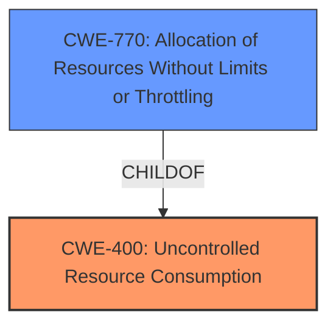

# Analysis for CVE-2022-22161

# Summary
| CWE ID | CWE Name | Confidence | CWE Abstraction Level | CWE Vulnerability Mapping Label | CWE-Vulnerability Mapping Notes |
|---|---|---|---|---|---|
| CWE-400 | Uncontrolled Resource Consumption | 0.9 | Class | Primary | Allowed-with-Review |
| CWE-770 | Allocation of Resources Without Limits or Throttling | 0.7 | Base | Secondary | Allowed |

## Evidence and Confidence

*   **Confidence Score:** 0.8
*   **Evidence Strength:** HIGH

## Relationship Analysis
The primary CWE is CWE-400, a Class-level CWE, which is related to the **uncontrolled consumption** of resources. The retriever results also suggest CWE-770, a Base-level CWE, which is a child of CWE-400. CWE-770 focuses on the allocation of resources without limits. The relationship helps to refine the classification from a general resource consumption issue to a more specific allocation problem, where no limits are imposed.

## Vulnerability Chain
The chain of events is as follows:
1.  The system **allocates resources without limits** or throttling (CWE-770).
2.  This leads to **uncontrolled resource consumption** (CWE-400).
3.  The impact is 100% CPU load and the device becoming unresponsive, resulting in a Denial of Service (DoS).

## Summary of Analysis
Initially, the vulnerability was identified as **Uncontrolled Resource Consumption**, which aligns with CWE-400. The key phrase "**Uncontrolled Resource Consumption**" from the vulnerability description directly supports this classification. However, further analysis of the retriever results suggests that CWE-770, "Allocation of Resources Without Limits or Throttling," is also relevant and provides a more specific description of the root cause. The vulnerability description indicates that the system does not impose restrictions on the size or number of resources allocated, which aligns with CWE-770.

The decision to include both CWE-400 and CWE-770 is based on the evidence provided and the relationships between the CWEs. CWE-400 represents the general issue of **uncontrolled resource consumption**, while CWE-770 specifies the **root cause** related to the **allocation of resources without limits**. Using both CWEs provides a more comprehensive understanding of the vulnerability.

The final selection is at the optimal level of specificity, with CWE-400 being a Class-level CWE and CWE-770 being a Base-level CWE, providing a clear picture of both the overall issue and the specific weakness.

Relevant CWE Information:

# Enhanced Context (25 CWEs)
The following CWEs were identified as potentially relevant to this vulnerability:

## CWE-404: Improper Resource Shutdown or Release
**Abstraction Level**: Class
**Similarity Score**: 0.79
**Source**: dense

**Description**:
The product does not release or incorrectly releases a resource before it is made available for re-use.

**Mapping Guidance**:
- Usage: Allowed-with-Review
- Rationale: This CWE entry is a Class and might have Base-level children that would be more appropriate

This CWE was considered but not selected because the vulnerability is more about **allocating** resources without limits rather than failing to release them.

## CWE-664: Improper Control of a Resource Through its Lifetime
**Abstraction Level**: Pillar
**Similarity Score**: 0.78
**Source**: dense

**Description**:
The product does not maintain or incorrectly maintains control over a resource throughout its lifetime of creation, use, and release.

**Mapping Guidance**:
- Usage: Discouraged
- Rationale: This CWE entry is high-level when lower-level children are available.

This CWE was considered but not selected because it's a high-level Pillar, and more specific CWEs like CWE-400 and CWE-770 are more relevant.

## CWE-226: Sensitive Information in Resource Not Removed Before Reuse
**Abstraction Level**: Base
**Similarity Score**: 0.78
**Source**: dense

**Description**:
The product releases a resource such as memory or a file so that it can be made available for reuse, but it does not clear or "zeroize" the information contained in the resource before the product performs a critical state transition or makes the resource available for reuse by other entities.

**Mapping Guidance**:
- Usage: Allowed
- Rationale: This CWE entry is at the Base level of abstraction, which is a preferred level of abstraction for mapping to the root causes of vulnerabilities.

This CWE was considered but not selected because the vulnerability is not related to sensitive information in resources but rather to **uncontrolled resource allocation**.

## CWE-772: Missing Release of Resource after Effective Lifetime
**Abstraction Level**: Base
**Similarity Score**: 0.77
**Source**: dense

**Description**:
The product does not release a resource after its effective lifetime has ended, i.e., after the resource is no longer needed.

**Mapping Guidance**:
- Usage: Allowed
- Rationale: This CWE entry is at the Base level of abstraction, which is a preferred level of abstraction for mapping to the root causes of vulnerabilities.

This CWE was considered but not selected because the vulnerability is more about **allocating resources without limits** rather than failing to release them after their effective lifetime.

## CWE-775: Missing Release of File Descriptor or Handle after Effective Lifetime
**Abstraction Level**: Variant
**Similarity Score**: 0.76
**Source**: dense

**Description**:
The product does not release a file descriptor or handle after its effective lifetime has ended, i.e., after the file descriptor/handle is no longer needed.

**Mapping Guidance**:
- Usage: Allowed
- Rationale: This CWE entry is at the Variant level of abstraction, which is a preferred level of abstraction for mapping to the root causes of vulnerabilities.

This CWE was considered but not selected because it focuses specifically on file descriptors or handles, while the described vulnerability is about general **resource consumption**.

## CWE-405: Asymmetric Resource Consumption (Amplification)
**Abstraction Level**: Class
**Similarity Score**: 0.76
**Source**: dense

**Description**:
The product does not properly control situations in which an adversary can cause the product to consume or produce excessive resources without requiring the adversary to invest equivalent work or otherwise prove authorization, i.e., the adversary's influence is "asymmetric."

**Mapping Guidance**:
- Usage: Allowed-with-Review
- Rationale: This CWE entry is a Class and might have Base-level children that would be more appropriate

This CWE was considered but not selected because the vulnerability doesn't explicitly mention an asymmetric relationship between the attacker's effort and the resource consumption.

## CWE-667: Improper Locking
**Abstraction Level**: Class
**Similarity Score**: 0.76
**Source**: dense

**Description**:
The product does not properly acquire or release a lock on a resource, leading to unexpected resource state changes and behaviors.

**Mapping Guidance**:
- Usage: Allowed-with-Review
- Rationale: This CWE entry is a Class and might have Base-level children that would be more appropriate

This CWE was considered but not selected because the vulnerability isn't related to locking mechanisms.

## CWE-668: Exposure of Resource to Wrong Sphere
**Abstraction Level**: Class
**Similarity Score**: 0.75
**Source**: dense

**Description**:
The product exposes a resource to the wrong control sphere, providing unintended actors with inappropriate access to the resource.

**Mapping Guidance**:
- Usage: Discouraged
- Rationale: CWE-668 is high-level and is often misused as a catch-all when lower-level CWE IDs might be applicable. It is sometimes used for low-information vulnerability reports [REF-1287]. It is a level-1 Class (i.e., a child of a Pillar). It is not useful for trend analysis.

This CWE was considered but not selected because the vulnerability is not about exposing resources to the wrong sphere but rather about **uncontrolled resource allocation**.

## CWE-754: Improper Check for Unusual or Exceptional Conditions
**Abstraction Level**: Class
**Similarity Score**: 0.75
**Source**: dense

**Description**:
The product does not check or incorrectly checks for unusual or exceptional conditions that are not expected to occur frequently during day to day operation of the product.

**Mapping Guidance**:
- Usage: Allowed-with-Review
- Rationale: This CWE entry is a Class and might have Base-level children that would be more appropriate

This CWE was considered but not selected because the vulnerability is not specifically about failing to check for unusual conditions.

## CWE-789: Memory Allocation with Excessive Size Value
**Abstraction Level**: Variant
**Similarity Score**: 0.75