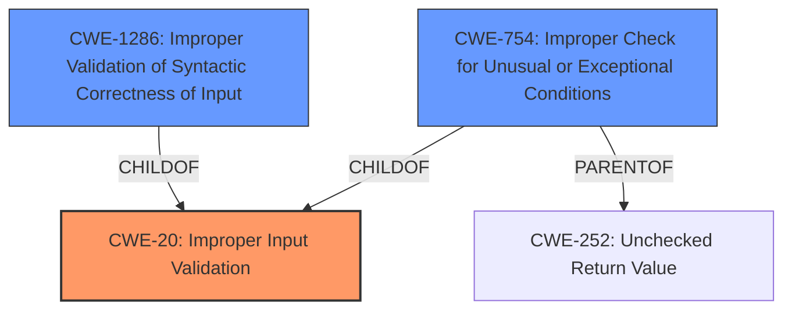

# Enhanced Analysis for CVE-2022-22184

# Summary
| CWE ID  | CWE Name                                                                                       | Confidence | CWE Abstraction Level | CWE Vulnerability Mapping Label | CWE-Vulnerability Mapping Notes |
| :-------- | :--------------------------------------------------------------------------------------------- | :---------- | :---------------------- | :------------------------------ | :------------------------------ |
| CWE-20    | CWE-20: Improper Input Validation                                                              | 1.0         | Class                  | Primary                       | Allowed-with-Review           |
| CWE-1286  | CWE-1286: Improper Validation of Syntactic Correctness of Input                               | 0.7         | Base                   | Secondary                      | Allowed                       |
| CWE-754   | CWE-754: Improper Check for Unusual or Exceptional Conditions                                  | 0.6         | Class                   | Secondary                      | Allowed-with-Review           |

## Evidence and Confidence

*   **Confidence Score:** 0.8
*   **Evidence Strength:** HIGH

## Relationship Analysis
The primary CWE is CWE-20, which is a class-level weakness. Several child CWEs provide more specific details on the type of input validation issue. CWE-1286 is a base-level weakness that specifically addresses the lack of syntactic validation, making it a strong secondary candidate. CWE-754 represents a more general case of improper checks for exceptional conditions and can be viewed as a parent of CWE-252, representing unchecked return values. The relationship between CWE-20 and its children indicates that the input validation issue may be further specified.



## Vulnerability Chain
The vulnerability chain starts with **Improper Input Validation** (CWE-20). Specifically, a BGP update message containing a specific, optional transitive attribute isn't properly validated. This leads to a denial-of-service (DoS) impact, as the affected system tears down the BGP session. The chain is relatively short:
1.  **Improper Input Validation** (CWE-20)
2.  Denial of Service (DoS)

## Summary of Analysis
The initial analysis focused on the **Improper Input Validation** as the root cause, aligning with the vulnerability description's key phrases. The retriever results also pointed to related CWEs such as CWE-1286 and CWE-754.

The analysis is strongly based on the provided evidence, particularly the "Vulnerability Description Key Phrases" which identifies the **rootcause** as **Improper Input Validation**.
> **rootcause:** **Improper Input Validation**

The hierarchical relationships influenced the selection by guiding the choice of the most specific CWE. While CWE-20 is a high-level class, it accurately represents the **root cause**. CWE-1286 provides more specific detail by addressing the syntactic correctness, making it a relevant secondary weakness.

The selected CWEs are at the optimal level of specificity because they accurately capture the **root cause** (**Improper Input Validation**) and a specific aspect of it (**Improper Validation of Syntactic Correctness of Input**).

Relevant CWE Information:

# Enhanced Context (25 CWEs)
The following CWEs were identified as potentially relevant to this vulnerability:

## CWE-755: Improper Handling of Exceptional Conditions
**Abstraction Level**: Class
**Similarity Score**: 0.77
**Source**: dense

**Description**:
The product does not handle or incorrectly handles an exceptional condition.

**Mapping Guidance**:
- Usage: Discouraged
- Rationale: This CWE entry is a level-1 Class (i.e., a child of a Pillar). It might have lower-level children that would be more appropriate

## CWE-1286: Improper Validation of Syntactic Correctness of Input
**Abstraction Level**: Base
**Similarity Score**: 0.77
**Source**: dense

**Description**:
The product receives input that is expected to be well-formed - i.e., to comply with a certain syntax - but it does not validate or incorrectly validates that the input complies with the syntax.

**Mapping Guidance**:
- Usage: Allowed
- Rationale: This CWE entry is at the Base level of abstraction, which is a preferred level of abstraction for mapping to the root causes of vulnerabilities.

## CWE-664: Improper Control of a Resource Through its Lifetime
**Abstraction Level**: Pillar
**Similarity Score**: 0.77
**Source**: dense

**Description**:
The product does not maintain or incorrectly maintains control over a resource throughout its lifetime of creation, use, and release.

**Mapping Guidance**:
- Usage: Discouraged
- Rationale: This CWE entry is high-level when lower-level children are available.

## CWE-252: Unchecked Return Value
**Abstraction Level**: Base
**Similarity Score**: 0.77
**Source**: dense

**Description**:
The product does not check the return value from a method or function, which can prevent it from detecting unexpected states and conditions.

**Mapping Guidance**:
- Usage: Allowed
- Rationale: This CWE entry is at the Base level of abstraction, which is a preferred level of abstraction for mapping to the root causes of vulnerabilities.

## CWE-362: Concurrent Execution using Shared Resource with Improper Synchronization ('Race Condition')
**Abstraction Level**: Class
**Similarity Score**: 0.77
**Source**: dense

**Description**:
The product contains a concurrent code sequence that requires temporary, exclusive access to a shared resource, but a timing window exists in which the shared resource can be modified by another code sequence operating concurrently.

**Mapping Guidance**:
- Usage: Allowed-with-Review
- Rationale: This CWE entry is a Class and might have Base-level children that would be more appropriate

### CWE Selection Details:

*   **CWE-20: Improper Input Validation**
    *   **Explanation:** The vulnerability description explicitly states that there is an **Improper Input Validation** issue. The BGP update message is not properly validated, leading to the vulnerability.
    *   **Security Implications:** This can lead to various issues, including denial of service, code execution, or information disclosure. In this case, it leads to a denial of service.
    *   **Relationship:** CWE-20 is a class-level weakness.
    *   **Mapping Guidance:** Allowed-with-Review
    *   **Confidence:** 1.0

*   **CWE-1286: Improper Validation of Syntactic Correctness of Input**
    *   **Explanation:** This CWE is more specific, addressing the syntactic correctness of the input. The BGP update message has a specific format, and the system fails to validate that the message adheres to this format.
    *   **Security Implications:** Failure to validate syntactic correctness can lead to parsing errors and unexpected behavior, which can be exploited.
    *   **Relationship:** CWE-1286 is a base-level weakness and a child of CWE-20.
    *   **Mapping Guidance:** Allowed
    *   **Confidence:** 0.7

*   **CWE-754: Improper Check for Unusual or Exceptional Conditions**
    *   **Explanation:** This CWE describes a failure to check for unusual or exceptional conditions, and this could be related to the input validation problem.
    *   **Security Implications:** This can lead to unexpected behavior and potential vulnerabilities.
    *   **Relationship:** CWE-754 is a class-level weakness.
    *   **Mapping Guidance:** Allowed-with-Review
    *   **Confidence:** 0.6

*   **CWEs Considered but Not Used:**
    *   CWE-755: Improper Handling of Exceptional Conditions: This is related to error handling, but the primary issue is the input validation itself.
    *   CWE-664: Improper Control of a Resource Through its Lifetime: While a BGP session can be considered a resource, the problem isn't about the control of the resource over its lifetime, but rather the initial validation of the message.
    *   CWE-252: Unchecked Return Value: The description doesn't provide information on the return value, but the **Improper Input Validation** is the weakness, not the return value.
    *   CWE-362: Concurrent Execution using Shared Resource with Improper Synchronization ('Race Condition'): There's no evidence of concurrent execution or race conditions in the description.
    *   CWE-606: Unchecked Input for Loop Condition: The


## CWE Relationship Analysis

Current CWEs represent these abstraction levels: .


### Vulnerability Chain Analysis

**Chain starting from CWE-755:**
- 755 (Improper Handling of Exceptional Conditions) - ROOT


**Chain starting from CWE-20:**
- 20 (Improper Input Validation) - ROOT


### CWE Relationship Diagram

```mermaid
graph TD
    classDef primary fill:#f96,stroke:#333,stroke-width:2px
    classDef secondary fill:#69f,stroke:#333
    classDef tertiary fill:#9e9,stroke:#333
```