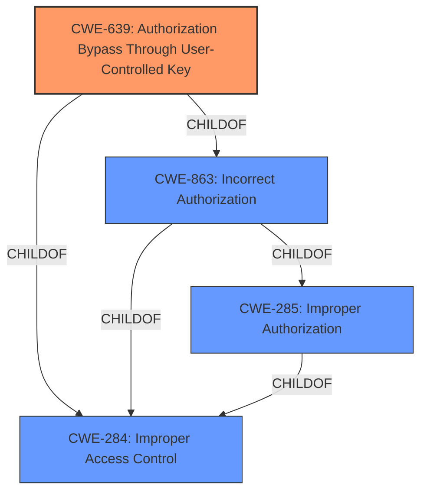

# Raw Analyzer Response for CVE-2022-22190

# Summary
| CWE ID | CWE Name | Confidence | CWE Abstraction Level | CWE Vulnerability Mapping Label | CWE-Vulnerability Mapping Notes |
|---|---|---|---|---|---|
| CWE-639 | Authorization Bypass Through User-Controlled Key | 0.9 | Base | Allowed | Primary CWE |
| CWE-863 | Incorrect Authorization | 0.7 | Class | Allowed-with-Review | Secondary Candidate |
| CWE-285 | Improper Authorization | 0.6 | Class | Discouraged | Secondary Candidate |

## Evidence and Confidence

*   **Confidence Score:** 0.9
*   **Evidence Strength:** HIGH

## Relationship Analysis
The primary CWE selected, CWE-639 [Authorization Bypass Through User-Controlled Key], is a child of CWE-863 [Incorrect Authorization] and CWE-284 [Improper Access Control]. CWE-863 [Incorrect Authorization] is a child of CWE-285 [Improper Authorization] and CWE-284 [Improper Access Control]. These parent-child relationships helped narrow down the selection to CWE-639 [Authorization Bypass Through User-Controlled Key] as the most specific and accurate representation of the vulnerability.

## Vulnerability Chain
The vulnerability chain starts with an **improper access control** implementation, leading to an unauthenticated attacker crafting a URL to generate PDF reports containing sensitive information. The root cause is the **improper authorization** that allows bypassing access controls through a user-controlled key (the unique identifier in the URL).

## Summary of Analysis
The initial assessment identified **"Improper Access Control"** as the key phrase in the vulnerability description. The retriever results also show CWE-639 [Authorization Bypass Through User-Controlled Key] as the top result.

The vulnerability description states: "An **Improper Access Control** vulnerability in the Juniper Networks Paragon Active Assurance Control Center allows an unauthenticated attacker to leverage a crafted URL to generate PDF reports, potentially containing sensitive configuration information. A feature was introduced in version 3.1 of the Paragon Active Assurance Control Center which allows users to selective share account data using a unique identifier. Knowing the proper format of the URL and the identifier of an existing object in an application it is possible to get access to that object without being logged in, even if the object is not shared, resulting in the opportunity for malicious exfiltration of user data."

CWE-639 [Authorization Bypass Through User-Controlled Key] closely matches this scenario, as it involves modifying a key value (the unique identifier in the URL) to gain unauthorized access to data. The CWE description states: "The system's authorization functionality does not prevent one user from gaining access to another user's data or record by modifying the key value identifying the data."

CWE-863 [Incorrect Authorization] and CWE-285 [Improper Authorization] were considered but are more general. CWE-639 [Authorization Bypass Through User-Controlled Key] provides a more specific and accurate representation of the **improper authorization** issue.

The final decision is based on the evidence from the vulnerability description, the retriever results, and the parent-child relationships between the CWEs. CWE-639 [Authorization Bypass Through User-Controlled Key] is at the optimal level of specificity, representing the root cause of the vulnerability.