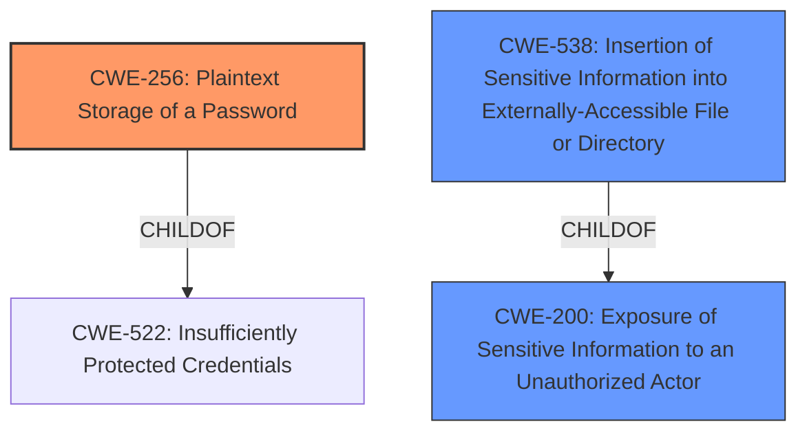

# Enhanced Analysis for CVE-2022-2221

# Summary
| CWE ID  | CWE Name                                                          | Confidence | CWE Abstraction Level | CWE Vulnerability Mapping Label | CWE-Vulnerability Mapping Notes |
| :-------- | :---------------------------------------------------------------- | :--------- | :-------------------- | :------------------------------ | :------------------------------ |
| CWE-256   | Plaintext Storage of a Password                                 | 0.75       | Base                  | Primary CWE                     | Allowed                       |
| CWE-538   | Insertion of Sensitive Information into Externally-Accessible File or Directory | 0.6        | Base                  | Secondary Candidate             | Allowed                       |
| CWE-200   | Exposure of Sensitive Information to an Unauthorized Actor          | 0.5        | Class                 | Secondary Candidate             | Discouraged                    |

## Evidence and Confidence

*   **Confidence Score:** 0.7
*   **Evidence Strength:** MEDIUM

## Relationship Analysis
The primary relationship influencing the CWE selection is the parent-child relationship between CWE-522 (Insufficiently Protected Credentials) and CWE-256 (Plaintext Storage of a Password). CWE-256 is a more specific base-level weakness that directly addresses the storage of credentials in plaintext.
CWE-538 is related to CWE-200 (Exposure of Sensitive Information), but focuses on insertion of information into externally accessible files.
CWE-200 is high level, and lower level CWEs are preferrable.



## Vulnerability Chain
The vulnerability chain starts with an **insecure default configuration** leading to **plaintext storage of credentials** which then results in **exposure of sensitive information** to unauthorized actors.

## Summary of Analysis
Initially, the vulnerability was described as an **Exposure vulnerability**. The analysis focused on identifying the root cause of this **exposure**. The CVE Reference Links Content Summary revealed that the core issue was that credentials were being saved in a shared data source by default instead of locally. This points towards **insecure storage of credentials**.

The Retriever Results suggested several CWEs, including:
* CWE-256 (Plaintext Storage of a Password)
* CWE-538 (Insertion of Sensitive Information into Externally-Accessible File or Directory)
* CWE-200 (Exposure of Sensitive Information to an Unauthorized Actor)

CWE-256 was selected as the primary CWE because the **rootcause** was the **plaintext storage of credentials**, which matches the description of CWE-256 exactly.
The vulnerability description states that the application defaulted to storing credentials in a shared data source. This implies that the credentials themselves were stored in a way that was accessible to multiple users, which increases the likelihood of **exposure** if the shared data source is compromised or if access controls are not properly implemented.

CWE-538 (Insertion of Sensitive Information into Externally-Accessible File or Directory) was considered as a secondary CWE. This is because the vulnerability involves placing sensitive information (credentials) into a shared data source that is accessible to multiple users. The shared data source can be considered an externally-accessible file or directory in this context.

CWE-200 (Exposure of Sensitive Information to an Unauthorized Actor) was also considered, but ultimately deemed less specific than CWE-256 and CWE-538. While the vulnerability does result in the exposure of sensitive information, the root cause is the **insecure storage** of the credentials and the **placement of those credentials** in a shared location.
CWE-200 is too high level and recommends lower level CWE's be used instead.

Relevant CWE Information:

# Enhanced Context (25 CWEs)
The following CWEs were identified as potentially relevant to this vulnerability:

## CWE-538: Insertion of Sensitive Information into Externally-Accessible File or Directory
**Abstraction Level**: Base
**Similarity Score**: 0.80
**Source**: dense

**Description**:
The product places sensitive information into files or directories that are accessible to actors who are allowed to have access to the files, but not to the sensitive information.

**Mapping Guidance**:
- Usage: Allowed
- Rationale: This CWE entry is at the Base level of abstraction, which is a preferred level of abstraction for mapping to the root causes of vulnerabilities.


## CWE-552: Files or Directories Accessible to External Parties
**Abstraction Level**: Base
**Similarity Score**: 0.76
**Source**: dense

**Description**:
The product makes files or directories accessible to unauthorized actors, even though they should not be.

**Mapping Guidance**:
- Usage: Allowed
- Rationale: This CWE entry is at the Base level of abstraction, which is a preferred level of abstraction for mapping to the root causes of vulnerabilities.


## CWE-497: Exposure of Sensitive System Information to an Unauthorized Control Sphere
**Abstraction Level**: Base
**Similarity Score**: 0.76
**Source**: dense

**Description**:
The product does not properly prevent sensitive system-level information from being accessed by unauthorized actors who do not have the same level of access to the underlying system as the product does.

**Mapping Guidance**:
- Usage: Allowed
- Rationale: This CWE entry is at the Base level of abstraction, which is a preferred level of abstraction for mapping to the root causes of vulnerabilities.


## CWE-212: Improper Removal of Sensitive Information Before Storage or Transfer
**Abstraction Level**: Base
**Similarity Score**: 0.75
**Source**: dense

**Description**:
The product stores, transfers, or shares a resource that contains sensitive information, but it does not properly remove that information before the product makes the resource available to unauthorized actors.

**Mapping Guidance**:
- Usage: Allowed
- Rationale: This CWE entry is at the Base level of abstraction, which is a preferred level of abstraction for mapping to the root causes of vulnerabilities.


## CWE-226: Sensitive Information in Resource Not Removed Before Reuse
**Abstraction Level**: Base
**Similarity Score**: 0.75
**Source**: dense

**Description**:
The product releases a resource such as memory or a file so that it can be made available for reuse, but it does not clear or "zeroize" the information contained in the resource before the product performs a critical state transition or makes the resource available for reuse by other entities.

**Mapping Guidance**:
- Usage: Allowed
- Rationale: This CWE entry is at the Base level of abstraction, which is a preferred level of abstraction for mapping to the root causes of vulnerabilities.


## CWE-312: Cleartext Storage of Sensitive Information
**Abstraction Level**: Base
**Similarity Score**: 0.74
**Source**: dense

**Description**:
The product stores sensitive information in cleartext within a resource that might be accessible to another control sphere.

**Mapping Guidance**:
- Usage: Allowed
- Rationale: This CWE entry is at the Base level of abstraction, which is a preferred level of abstraction for mapping to the root causes of vulnerabilities.


## CWE-668: Exposure of Resource to Wrong Sphere
**Abstraction Level**: Class
**Similarity Score**: 0.74
**Source**: dense

**Description**:
The product exposes a resource to the wrong control sphere, providing unintended actors with inappropriate access to the resource.

**Mapping Guidance**:
- Usage: Discouraged
- Rationale: CWE-668 is high-level and is often misused as a catch-all when lower-level CWE IDs might be applicable. It is sometimes used for low-information vulnerability reports [REF-1287]. It is a level-1 Class (i.e., a child of a Pillar). It is not useful for trend analysis.


## CWE-213: Exposure of Sensitive Information Due to Incompatible Policies
**Abstraction Level**: Base
**Similarity Score**: 0.74
**Source**: dense

**Description**:
The product's intended functionality exposes information to certain actors in accordance with the developer's security policy, but this information is regarded as sensitive according to the intended security policies of other stakeholders such as the product's administrator, users, or others whose information is being processed.

**Mapping Guidance**:
- Usage: Allowed
- Rationale: This CWE entry is at the Base level of abstraction, which is a preferred level of abstraction for mapping to the root causes of vulnerabilities.


## CWE-274: Improper Handling of Insufficient Privileges
**Abstraction Level**: Base
**Similarity Score**: 0.74
**Source**: dense

**Description**:
The product does not handle or incorrectly handles when it has


## CWE Relationship Analysis

Current CWEs represent these abstraction levels: .


### Vulnerability Chain Analysis

**Chain starting from CWE-552:**
- 552 (Files or Directories Accessible to External Parties) - ROOT


**Chain starting from CWE-200:**
- 200 (Exposure of Sensitive Information to an Unauthorized Actor) - ROOT


### CWE Relationship Diagram

```mermaid
graph TD
    classDef primary fill:#f96,stroke:#333,stroke-width:2px
    classDef secondary fill:#69f,stroke:#333
    classDef tertiary fill:#9e9,stroke:#333
```