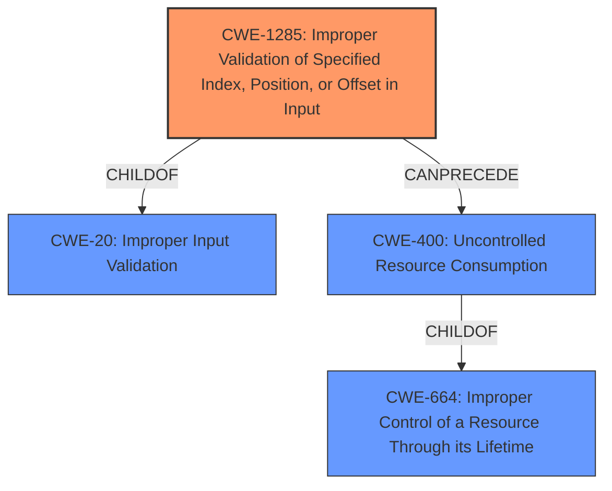

# Analysis for CVE-2022-22223

# Summary
| CWE ID    | CWE Name                                                               | Confidence | CWE Abstraction Level | CWE Vulnerability Mapping Label | CWE-Vulnerability Mapping Notes |
| :--------- | :--------------------------------------------------------------------- | :--------- | :-------------------- | :------------------------------ | :----------------------------- |
| CWE-1285  | Improper Validation of Specified Index, Position, or Offset in Input | 1          | Base                  | Primary                         | Allowed                      |
| CWE-400     | Uncontrolled Resource Consumption                                          | 0.7         | Class                     | Secondary                        | Discouraged                |

## Evidence and Confidence

*   **Confidence Score:** 0.85
*   **Evidence Strength:** HIGH

## Relationship Analysis
The primary weakness is **CWE-1285 (Improper Validation of Specified Index, Position, or Offset in Input)**, which is a child of **CWE-20 (Improper Input Validation)**. This indicates a hierarchical relationship where **CWE-1285** is a more specific case of the general input validation issue described by **CWE-20**. The secondary weakness **CWE-400 (Uncontrolled Resource Consumption)**, is a child of **CWE-664 (Improper Control of a Resource Through its Lifetime)**. The relationship between **CWE-1285** and **CWE-400** is that the improper input validation can lead to uncontrolled resource consumption.

## Vulnerability Chain
The vulnerability chain starts with the **Improper Validation of Specified Index, Position, or Offset in Input (CWE-1285)**. This leads to an attacker being able to send certain IP packets to cause multiple interfaces in the LAG to detach, resulting in **Uncontrolled Resource Consumption (CWE-400)** and ultimately causing a Denial of Service (DoS).

## Summary of Analysis
The primary weakness is **CWE-1285 (Improper Validation of Specified Index, Position, or Offset in Input)**. This is supported by the vulnerability description key phrase "**Improper Validation of Specified Index, Position, or Offset in Input** weakness allows an attacker sending certain IP packets to cause multiple interfaces in the LAG to detach causing a Denial of Service (DoS) condition." This directly aligns with the description of **CWE-1285**, which states, "The product receives input that is expected to specify an index, position, or offset into an indexable resource such as a buffer or file, but it does not validate or incorrectly validates that the specified index/position/offset has the required properties." The **Retriever Results** also list **CWE-1285** as the top combined result.

A secondary weakness is **CWE-400 (Uncontrolled Resource Consumption)**. The vulnerability description states that the **improper validation** "allows an attacker sending certain IP packets to cause multiple interfaces in the LAG to detach causing a Denial of Service (DoS) condition". This consumption of interfaces can be seen as a form of resource exhaustion, making **CWE-400** relevant. However, **CWE-400** is a Class-level CWE and the MITRE mapping guidance discourages its use when more specific mappings are available. The root cause is the **improper input validation**, and the impact is the **DoS**, which is a result of the resource consumption.

The selection of **CWE-1285** is at the optimal level of specificity, as it directly describes the **root cause** of the vulnerability, which is the **improper validation** of the index, position, or offset in the input.

Relevant CWE Information:
- **CWE-1285: Improper Validation of Specified Index, Position, or Offset in Input**: This is the primary CWE because it directly matches the **root cause** described in the vulnerability description.
- **CWE-400: Uncontrolled Resource Consumption**: This is a secondary CWE because it describes the impact of the vulnerability, which is the denial of service caused by the exhaustion of resources. This is less specific than the **root cause**.
- **CWE-401: Missing Release of Memory after Effective Lifetime** This was considered but rejected because the vulnerability is not specifically about memory leaks, but about a more general problem of resource exhaustion caused by improper input validation.
- **CWE-770: Allocation of Resources Without Limits or Throttling**: This was considered but rejected because the vulnerability is not about allocating resources without limits, but about detaching interfaces because of an **improperly validated** input.
- **CWE-789: Memory Allocation with Excessive Size Value**: This was considered but rejected because the vulnerability is not about allocating memory with an excessive size value, but about a more general problem of resource exhaustion caused by **improper input validation**.