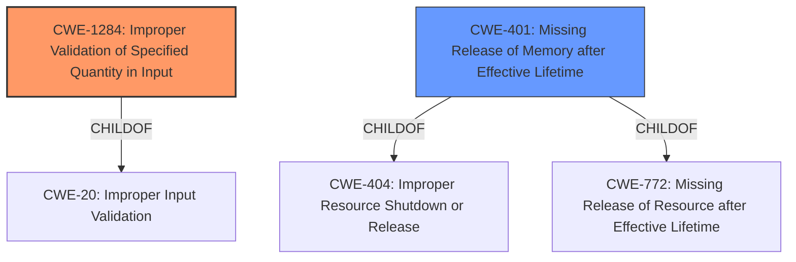

# Analysis for CVE-2022-22228

# Summary
| CWE ID    | CWE Name                                                          | Confidence | CWE Abstraction Level | CWE Vulnerability Mapping Label | CWE-Vulnerability Mapping Notes |
| :-------- | :---------------------------------------------------------------- | :--------- | :---------------------- | :------------------------------ | :------------------------------ |
| CWE-1284 | Improper Validation of Specified Quantity in Input                  | 0.9        | Base                    | Primary                         | Allowed                      |
| CWE-401   | Missing Release of Memory after Effective Lifetime                | 0.7        | Variant                 | Secondary                       | Allowed                      |

## Evidence and Confidence

*   **Confidence Score:** 0.8
*   **Evidence Strength:** MEDIUM

## Relationship Analysis
The primary CWE, CWE-1284, is a child of CWE-20 (Improper Input Validation). While CWE-1284 captures the specific issue of validating the quantity of input, CWE-20 is a broader category. CWE-401 is a variant and a child of CWE-404 and CWE-772, indicating a specific type of resource leak. The hierarchical relationship highlights that CWE-1284 focuses on input validation, while CWE-401 addresses resource management.

## Vulnerability Chain
The vulnerability chain starts with **Improper Validation of Specified Quantity of Input** (CWE-1284), leading to a memory leak due to the **Missing Release of Memory after Effective Lifetime** (CWE-401), culminating in a Denial of Service (DoS).

## Summary of Analysis
The initial analysis identified the **Improper Validation of Specified Type of Input** as the root cause, leading to a memory leak and ultimately a Denial of Service (DoS).

The vulnerability description clearly states: "An **Improper Validation of Specified Type of Input** vulnerability in the routing protocol daemon (rpd) of Juniper Networks Junos OS allows an attacker to cause an RPD memory leak leading to a Denial of Service (DoS). This memory leak only occurs when the attackers packets are destined to any configured IPv6 address on the device."

The retriever results identified several candidate CWEs, including CWE-1286 (Improper Validation of Syntactic Correctness of Input), CWE-252 (Unchecked Return Value), and CWE-401 (Missing Release of Memory after Effective Lifetime). However, based on the description, CWE-1284 (Improper Validation of Specified Quantity in Input) is a more precise fit for the root cause, as it addresses the validation of the *type* of input, leading to a memory leak (CWE-401).

CWE-1286 was considered, but the vulnerability description focuses on the *type* of input being validated and not the syntax. CWE-252 was also considered but doesn't fit the root cause as well as the input validation issues. The final decision to select CWE-1284 is based on its direct relevance to the **improper validation** aspect and the subsequent memory leak, which is represented by CWE-401. CWE-1284 is at the base level of abstraction, providing sufficient specificity, and CWE-401 is at the variant level of abstraction, which is also specific.

Relevant CWE Information:

# Enhanced Context (25 CWEs)
The following CWEs were identified as potentially relevant to this vulnerability:

## CWE-664: Improper Control of a Resource Through its Lifetime
**Abstraction Level**: Pillar
**Similarity Score**: 0.79
**Source**: dense

**Description**:
The product does not maintain or incorrectly maintains control over a resource throughout its lifetime of creation, use, and release.

**Mapping Guidance**:
- Usage: Discouraged
- Rationale: This CWE entry is high-level when lower-level children are available.

## CWE-404: Improper Resource Shutdown or Release
**Abstraction Level**: Class
**Similarity Score**: 0.78
**Source**: dense

**Description**:
The product does not release or incorrectly releases a resource before it is made available for re-use.

**Mapping Guidance**:
- Usage: Allowed-with-Review
- Rationale: This CWE entry is a Class and might have Base-level children that would be more appropriate

## CWE-226: Sensitive Information in Resource Not Removed Before Reuse
**Abstraction Level**: Base
**Similarity Score**: 0.77
**Source**: dense

**Description**:
The product releases a resource such as memory or a file so that it can be made available for reuse, but it does not clear or "zeroize" the information contained in the resource before the product performs a critical state transition or makes the resource available for reuse by other entities.

**Mapping Guidance**:
- Usage: Allowed
- Rationale: This CWE entry is at the Base level of abstraction, which is a preferred level of abstraction for mapping to the root causes of vulnerabilities.

## CWE-754: Improper Check for Unusual or Exceptional Conditions
**Abstraction Level**: Class
**Similarity Score**: 0.76
**Source**: dense

**Description**:
The product does not check or incorrectly checks for unusual or exceptional conditions that are not expected to occur frequently during day to day operation of the product.

**Mapping Guidance**:
- Usage: Allowed-with-Review
- Rationale: This CWE entry is a Class and might have Base-level children that would be more appropriate

## CWE-775: Missing Release of File Descriptor or Handle after Effective Lifetime
**Abstraction Level**: Variant
**Similarity Score**: 0.76
**Source**: dense

**Description**:
The product does not release a file descriptor or handle after its effective lifetime has ended, i.e., after the file descriptor/handle is no longer needed.

**Mapping Guidance**:
- Usage: Allowed
- Rationale: This CWE entry is at the Variant level of abstraction, which is a preferred level of abstraction for mapping to the root causes of vulnerabilities.

## CWE-703: Improper Check or Handling of Exceptional Conditions
**Abstraction Level**: Pillar
**Similarity Score**: 0.75
**Source**: dense

**Description**:
The product does not properly anticipate or handle exceptional conditions that rarely occur during normal operation of the product.

**Mapping Guidance**:
- Usage: Discouraged
- Rationale: This CWE entry is extremely high-level, a Pillar.

## CWE-772: Missing Release of Resource after Effective Lifetime
**Abstraction Level**: Base
**Similarity Score**: 0.75
**Source**: dense

**Description**:
The product does not release a resource after its effective lifetime has ended, i.e., after the resource is no longer needed.

**Mapping Guidance**:
- Usage: Allowed
- Rationale: This CWE entry is at the Base level of abstraction, which is a preferred level of abstraction for mapping to the root causes of vulnerabilities.

## CWE-667: Improper Locking
**Abstraction Level**: Class
**Similarity Score**: 0.75
**Source**: dense

**Description**:
The product does not properly acquire or release a lock on a resource, leading to unexpected resource state changes and behaviors.

**Mapping Guidance**:
- Usage: Allowed-with-Review
- Rationale: This CWE entry is a Class and might have Base-level children that would be more appropriate

## CWE-410: Insufficient Resource Pool
**Abstraction Level**: Base
**Similarity Score**: 0.75
**Source**: dense

**Description**:
The product's resource pool is not large enough to handle peak demand, which allows an attacker to prevent others from accessing the resource by using a (relatively) large number of requests for resources.

**Mapping Guidance**:
- Usage: Allowed
- Rationale: This CWE entry is at the Base level of abstraction, which is a preferred level of abstraction for mapping to the root causes of vulnerabilities.

## CWE-691: Insufficient Control Flow Management
**Abstraction Level**: Pillar
**Similarity Score**: 0.74
**Source**: dense

**Description**:
The code does not sufficiently manage its control flow during execution, creating conditions in which the control flow can be modified in unexpected ways.

**Mapping Guidance**:
- Usage: Discouraged
- Rationale: This CWE entry is extremely high-level, a Pillar. However, classification research is limited for weaknesses of this type, so there can