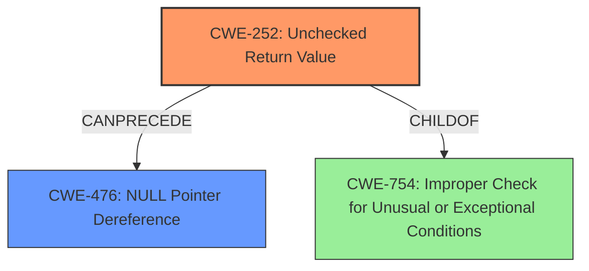

# Raw Analyzer Response for CVE-2022-22233

# Summary
| CWE ID | CWE Name | Confidence | CWE Abstraction Level | CWE Vulnerability Mapping Label | CWE-Vulnerability Mapping Notes |
|---|---|---|---|---|---|
| CWE-252 | Unchecked Return Value | 1.0 | Base | Allowed | Primary CWE |
| CWE-476 | NULL Pointer Dereference | 0.8 | Base | Allowed | Secondary Candidate |

## Evidence and Confidence

*   **Confidence Score:** 0.9
*   **Evidence Strength:** HIGH

## Relationship Analysis
The primary weakness is CWE-252 (**Unchecked Return Value**) which can lead to CWE-476 (**NULL Pointer Dereference**). CWE-252 is a base level CWE, which is a preferred level of abstraction. CWE-476 is also a Base level CWE.

## Vulnerability Chain
The vulnerability chain begins with an **Unchecked Return Value** (CWE-252). If the return value indicates a failure, the program continues execution, potentially leading to a **NULL Pointer Dereference** (CWE-476), ultimately causing a Denial of Service (DoS).

## Summary of Analysis
The vulnerability description clearly indicates an **Unchecked Return Value to NULL Pointer Dereference** in Juniper Networks Junos OS. The key phrase directly points to the root cause being an unchecked return value, which subsequently leads to a null pointer dereference.

The provided evidence explicitly states: "An **Unchecked Return Value to NULL Pointer Dereference** vulnerability...". This statement is strong evidence for selecting CWE-252 as the primary weakness and CWE-476 as a secondary weakness.

CWE-252 (**Unchecked Return Value**) aligns with the vulnerability description because the software fails to verify the return value of a function, potentially leading to unexpected states and conditions. According to CWE specifications, "If an attacker can force the function to fail or otherwise return a value that is not expected, then the subsequent program logic could lead to a vulnerability, because the product is not in a state that the programmer assumes."

CWE-476 (**NULL Pointer Dereference**) is a consequence of the unchecked return value. If a function fails and returns NULL, and this return value is not checked, the program may attempt to dereference the NULL pointer, leading to a crash or denial of service.

The retriever results also support CWE-252 as the top candidate. The relationship analysis shows that CWE-252 can precede CWE-476.

Other CWEs Considered:

*   CWE-1286 (**Improper Validation of Syntactic Correctness of Input**) was considered but is not applicable because the vulnerability is not related to input validation.
*   CWE-664 (**Improper Control of a Resource Through its Lifetime**) is a higher-level Pillar CWE and is not as specific as CWE-252.
*   CWE-755 (**Improper Handling of Exceptional Conditions**) is a Class-level CWE, while CWE-252 is a more specific Base-level CWE and a better fit for the root cause.
*   CWE-775 (**Missing Release of File Descriptor or Handle after Effective Lifetime**) is not relevant as the vulnerability does not involve file descriptors or handles.
*   CWE-606 (**Unchecked Input for Loop Condition**) is not relevant as the vulnerability does not involve loop conditions.
*   CWE-390 (**Detection of Error Condition Without Action**) is not relevant because the code does not detect an error condition and then fail to act on it; rather, it **fails to check** for an error condition in the first place.

The selection of CWE-252 and CWE-476 is based on the explicit mention of "Unchecked Return Value to NULL Pointer Dereference" in the vulnerability description, the supporting evidence from the retriever results, and the hierarchical relationship between the two CWEs. The final selection provides the optimal level of specificity, accurately reflecting the root cause and its immediate consequence.