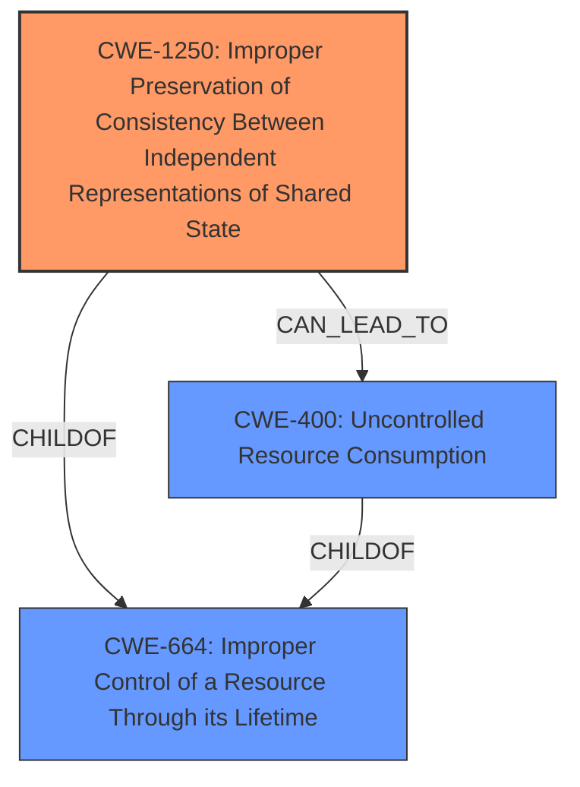

# Analysis for CVE-2022-22234

# Summary
| CWE ID | CWE Name | Confidence | CWE Abstraction Level | CWE Vulnerability Mapping Label | CWE-Vulnerability Mapping Notes |
|---|---|---|---|---|---|
| CWE-1250 | Improper Preservation of Consistency Between Independent Representations of Shared State | 1.0 | Base | Allowed | Primary CWE |
| CWE-400 | Uncontrolled Resource Consumption | 0.5 | Class | Discouraged | Secondary Candidate |

## Evidence and Confidence

*   **Confidence Score:** 0.8
*   **Evidence Strength:** HIGH

## Relationship Analysis
The primary CWE, CWE-1250, is a base-level CWE that directly describes the **improper preservation of consistency between independent representations of shared state**. It is a child of CWE-664 (Improper Control of a Resource Through its Lifetime), indicating a general resource management issue.

CWE-400 (Uncontrolled Resource Consumption) is a class-level CWE representing the impact, but is not the root cause in this case. It is a child of CWE-664.

The relationship between CWE-1250 and CWE-400 is that CWE-1250, the **improper state management**, *can lead to* CWE-400 as the traffic impact and partial DoS. However, the primary focus should be on the **improper state management** itself.

## Vulnerability Chain
The vulnerability chain starts with the **improper preservation of consistency between independent representations of shared state** (CWE-1250). This leads to a state where SFPs are incorrectly detected as unplugged when the device is busy. This incorrect state then results in traffic impact and partial Denial of Service (DoS), which can be classified as Uncontrolled Resource Consumption (CWE-400).

## Summary of Analysis
The initial analysis, supported by the **Vulnerability Description Key Phrases**, highlights the **rootcause** as "**Improper Preservation of Consistency Between Independent Representations of Shared State**". This is strongly supported by the description in the Vulnerability Description section.

> An **Improper Preservation of Consistency Between Independent Representations of Shared State** vulnerability in the Packet Forwarding Engine (PFE) of Juniper Networks Junos OS allows a locally authenticated attacker with low privileges to cause a Denial of Service (DoS).

The Retriever Results also list CWE-1250 as the top match, reinforcing this assessment.

CWE-1250 is the best fit because it directly addresses the **root cause**: the lack of consistent state management across distributed components. While the vulnerability leads to a denial-of-service (DoS), which could be associated with CWE-400 (Uncontrolled Resource Consumption), focusing on CWE-1250 provides a more accurate representation of the underlying weakness. CWE-400 is therefore a secondary consideration representing the impact.

CWE-1250 is at the optimal level of specificity (Base) as it directly describes the flaw.
CWE-400 is too general.