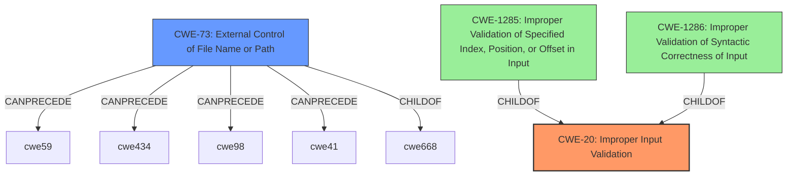

# Raw Analyzer Response for CVE-2022-22241

# Summary
| CWE ID | CWE Name | Confidence | CWE Abstraction Level | CWE Vulnerability Mapping Label | CWE-Vulnerability Mapping Notes |
|---|---|---|---|---|---|
| CWE-20 | Improper Input Validation | 0.75 | Class | Primary | Discouraged |
| CWE-73 | External Control of File Name or Path | 0.5 | Base | Secondary | Allowed |

## Evidence and Confidence

*   **Confidence Score:** 0.75
*   **Evidence Strength:** MEDIUM

## Relationship Analysis
The primary CWE is CWE-20, which is a class-level CWE. It has many children that are more specific. The retriever results also suggest CWE-73, which could be a more specific CWE.

## Vulnerability Chain
The vulnerability chain starts with **improper input validation** (CWE-20), leading to potential unauthorized file access or command execution. If an attacker can control the file name or path (CWE-73), they might be able to access sensitive files or execute arbitrary commands.

## Summary of Analysis
The vulnerability description indicates an **improper input validation** issue that can lead to unauthorized access. The description states: "An **Improper Input Validation** vulnerability in the J-Web component of Juniper Networks Junos OS may allow an unauthenticated attacker to access data without proper authorization. Utilizing a crafted POST request, deserialization may occur which could lead to unauthorized local file access or the ability to execute arbitrary commands."

The primary weakness is the **improper input validation**, which is CWE-20. The retriever results suggest a few CWEs that are children of CWE-20, such as CWE-1285 and CWE-1286. However, based on the description alone, it is hard to pinpoint the exact nature of the **improper input validation**.

The phrase "unauthorized local file access" suggests that CWE-73 (External Control of File Name or Path) might be relevant. However, there is no direct evidence in the description to confirm this. Therefore, it is classified as a secondary candidate with a lower confidence score.

CWE-20 is a class-level CWE, and the mapping guidance discourages its use when more specific CWEs are available. However, given the limited information, it is the most appropriate primary CWE.

**CWEs Considered But Not Used:**

*   **CWE-664: Improper Control of a Resource Through its Lifetime**: This CWE is too high-level (Pillar) and doesn't directly address the root cause of the vulnerability, which is the **improper input validation**.
*   **CWE-1285: Improper Validation of Specified Index, Position, or Offset in Input** and **CWE-1286: Improper Validation of Syntactic Correctness of Input**: These are more specific types of **improper input validation**, but there isn't enough information in the description to determine if these apply.
*   **CWE-754: Improper Check for Unusual or Exceptional Conditions**: This is a class-level CWE and doesn't directly describe the **improper input validation** issue.
*   **CWE-410: Insufficient Resource Pool**: This CWE is not relevant to the vulnerability description.
*   **CWE-250: Execution with Unnecessary Privileges**: This CWE is not relevant to the vulnerability description.
*   **CWE-22: Improper Limitation of a Pathname to a Restricted Directory ('Path Traversal')**: This could be a potential consequence of **improper input validation**, but there isn't enough information to confirm this.
*   **CWE-1250: Improper Preservation of Consistency Between Independent Representations of Shared State**: This CWE is not relevant to the vulnerability description.
*   **CWE-401: Missing Release of Memory after Effective Lifetime**: This CWE is not relevant to the vulnerability description.