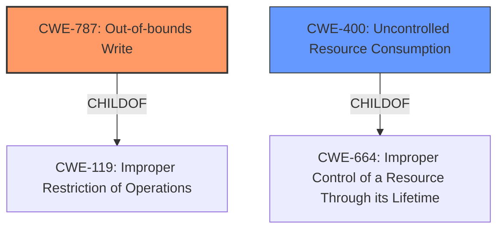

# Analysis Report for CVE-2022-22249

# Vulnerability Analysis Report: CVE-2022-22249

## Description


## Analysis (with Relationship Data)

# Summary
| CWE ID | CWE Name | Confidence | CWE Abstraction Level | CWE Vulnerability Mapping Label | CWE-Vulnerability Mapping Notes |
|---|---|---|---|---|---|
| CWE-787 | Out-of-bounds Write | 0.9 | Base | Allowed | Primary CWE. The vulnerability results in **memory corruption** due to a continuous mac move. |
| CWE-400 | Uncontrolled Resource Consumption | 0.7 | Class | Discouraged | Secondary CWE. The vulnerability leads to a denial of service due to **improper control of a resource through its lifetime**, causing FPCs to crash and reboot. |

## Evidence and Confidence

*   **Confidence Score:** 0.8
*   **Evidence Strength:** HIGH

## Relationship Analysis
The primary CWE is CWE-787 (**Out-of-bounds Write**), which is a base-level CWE and a child of CWE-119 (**Improper Restriction of Operations Within the Bounds of a Memory Buffer**). This relationship indicates that the out-of-bounds write is a specific type of memory safety violation. CWE-400 (**Uncontrolled Resource Consumption**) is a class-level CWE and a child of CWE-664 (**Improper Control of a Resource Through its Lifetime**), indicating a broader resource management issue that results in a denial of service.



## Vulnerability Chain
The vulnerability chain starts with an **improper control of a resource through its lifetime**, leading to a continuous mac move, which then results in **memory corruption** (out-of-bounds write), ultimately causing a denial of service when FPCs crash and reboot.

## Summary of Analysis
The initial analysis identified the root cause as an **improper control of a resource through its lifetime** which leads to **memory corruption**. This aligns with the description of CWE-787 (**Out-of-bounds Write**) which states, "The product writes data past the end, or before the beginning, of the intended buffer." The **memory corruption** specifically indicates this. The resulting denial of service, caused by FPC crashes, is a consequence of the uncontrolled resource consumption, making CWE-400 (**Uncontrolled Resource Consumption**) a relevant secondary CWE.

The evidence from the vulnerability description includes: "When there is a continuous mac move a **memory corruption** causes one or more FPCs to crash and reboot." This directly supports the selection of CWE-787 as the primary weakness and CWE-400 as contributing to the impact.

The graph relationships confirm that CWE-787 is a specific type of memory safety violation (child of CWE-119), while CWE-400 is a broader resource management issue (child of CWE-664). This influenced the decision to prioritize CWE-787 as the primary CWE due to its more specific and direct relation to the **memory corruption**.

The selected CWEs are at the optimal level of specificity. CWE-787 is a base-level CWE that accurately describes the **memory corruption** due to the out-of-bounds write. CWE-400 is a class-level CWE that captures the broader resource management issue leading to the denial of service, but a more specific child is not apparent from the vulnerability description.

Relevant CWE Information:

# Enhanced Context (25 CWEs)
The following CWEs were identified as potentially relevant to this vulnerability:

## CWE-404: Improper Resource Shutdown or Release
**Abstraction Level**: Class
**Similarity Score**: 0.81
**Source**: dense

**Description**:
The product does not release or incorrectly releases a resource before it is made available for re-use.

**Mapping Guidance**:
- Usage: Allowed-with-Review
- Rationale: This CWE entry is a Class and might have Base-level children that would be more appropriate

*This CWE was considered, but not selected because the vulnerability description indicates more of an out-of-bounds write causing memory corruption rather than a general improper resource shutdown or release.*

## CWE-664: Improper Control of a Resource Through its Lifetime
**Abstraction Level**: Pillar
**Similarity Score**: 0.81
**Source**: dense

**Description**:
The product does not maintain or incorrectly maintains control over a resource throughout its lifetime of creation, use, and release.

**Mapping Guidance**:
- Usage: Discouraged
- Rationale: This CWE entry is high-level when lower-level children are available.

*This CWE was considered, but not selected because the description provides more specific information that relates to the out-of-bounds write and memory corruption, allowing for a more detailed CWE selection.*

## CWE-405: Asymmetric Resource Consumption (Amplification)
**Abstraction Level**: Class
**Similarity Score**: 0.79
**Source**: dense

**Description**:
The product does not properly control situations in which an adversary can cause the product to consume or produce excessive resources without requiring the adversary to invest equivalent work or otherwise prove authorization, i.e., the adversary's influence is "asymmetric."

**Mapping Guidance**:
- Usage: Allowed-with-Review
- Rationale: This CWE entry is a Class and might have Base-level children that would be more appropriate

*This CWE was considered but not selected because the vulnerability description does not specifically highlight asymmetric resource consumption. The issue is more about memory corruption leading to a denial of service.*

## CWE-226: Sensitive Information in Resource Not Removed Before Reuse
**Abstraction Level**: Base
**Similarity Score**: 0.79
**Source**: dense

**Description**:
The product releases a resource such as memory or a file so that it can be made available for reuse, but it does not clear or "zeroize" the information contained in the resource before the product performs a critical state transition or makes the resource available for reuse by other entities.

**Mapping Guidance**:
- Usage: Allowed
- Rationale: This CWE entry is at the Base level of abstraction, which is a preferred level of abstraction for mapping to the root causes of vulnerabilities.

*This CWE was considered, but not selected because the vulnerability isn't about sensitive information being exposed due to improper clearing of resources. It is about memory corruption from an out-of-bounds write.*

## CWE-772: Missing Release of Resource after Effective Lifetime
**Abstraction Level**: Base
**Similarity Score**: 0.78
**Source**: dense

**Description**:
The product does not release a resource after its effective lifetime has ended, i.e., after the resource is no longer needed.

**Mapping Guidance**:
- Usage: Allowed
- Rationale: This CWE entry is at the Base level of abstraction, which is a preferred level of abstraction for mapping to the root causes of vulnerabilities.

*This CWE was considered, but not selected because the vulnerability description is about memory corruption and a continuous mac move, and not necessarily a missing release of a resource.*

## CWE-789: Memory Allocation with Excessive Size Value
**Abstraction Level**: Variant
**Similarity Score**: 0.77
**Source**: dense

**Description**:
The product allocates memory based on an untrusted, large size value, but it does not ensure that the size is within expected limits, allowing arbitrary amounts of memory to be allocated.

**Mapping Guidance**:
- Usage: Allowed
- Rationale: This CWE entry is at the Variant level of abstraction, which is a preferred level of abstraction for mapping to the root causes of vulnerabilities.

*This CWE was considered, but not selected because the vulnerability description doesn't mention anything about excessive memory allocation. It focuses on memory corruption.*

## CWE-1325: Improperly Controlled Sequential Memory Allocation
**Abstraction Level**: Base
**Similarity Score**: 0.77
**Source**: dense

**Description**:
The product manages a group of objects or resources and performs a separate memory allocation for each object, but it does not properly limit the total amount of memory that is consumed by all of the combined objects.

**Mapping Guidance**:
- Usage: Allowed
- Rationale: This CWE entry is at the Base level of abstraction, which is a preferred level of abstraction for mapping to the root causes of vulnerabilities.

*This CWE was considered, but not selected because the vulnerability description doesn't detail sequential memory allocation issues. It is focused on memory corruption.*

## CWE-410: Insufficient Resource Pool
**Abstraction Level**: Base
**Similarity Score**: 0.77
**Source**: dense

**Description**:
The product's resource pool is not large enough to handle peak demand, which allows an attacker to prevent others from accessing the resource by using a (relatively) large number


## CWE Relationship Analysis

Current CWEs represent these abstraction levels: .


### Vulnerability Chain Analysis

**Chain starting from CWE-1325:**
- 1325 (Improperly Controlled Sequential Memory Allocation) - ROOT


**Chain starting from CWE-400:**
- 400 (Uncontrolled Resource Consumption) - ROOT


### CWE Relationship Diagram

```mermaid
graph TD
    classDef primary fill:#f96,stroke:#333,stroke-width:2px
    classDef secondary fill:#69f,stroke:#333
    classDef tertiary fill:#9e9,stroke:#333
```


*Report generated on 2025-03-30 21:45:24*
