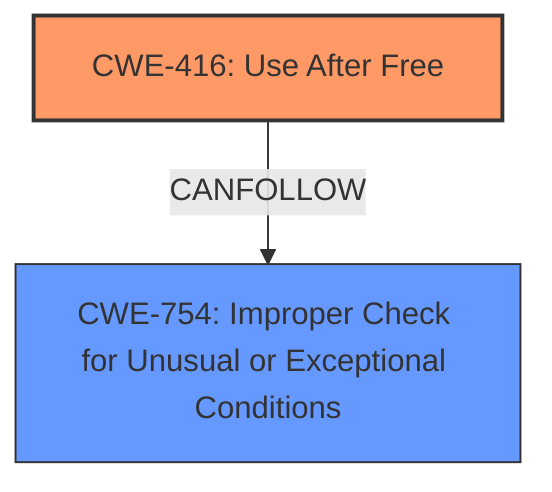

# Analysis Report for CVE-2022-22265

# Vulnerability Analysis Report: CVE-2022-22265

## Description


## Analysis (with Relationship Data)

# Summary
| CWE ID    | CWE Name                                                        | Confidence | CWE Abstraction Level | CWE Vulnerability Mapping Label | CWE-Vulnerability Mapping Notes |
| --------- | --------------------------------------------------------------- | ---------- | --------------------- | ------------------------------- | ------------------------------- |
| CWE-416 | Use After Free | 0.7 | Variant | Allowed | Primary CWE |
| CWE-754 | Improper Check for Unusual or Exceptional Conditions | 0.6 | Class | Allowed-with-Review | Secondary Candidate |

## Evidence and Confidence

*   **Confidence Score:** 0.7
*   **Evidence Strength:** MEDIUM

## Relationship Analysis
The primary relationship impacting the decision is that CWE-416 is a variant of a more general class of errors involving resource management. CWE-754, a class-level CWE, is related to the **improper check or handling of exceptional conditions** that leads to the Use-After-Free.



## Vulnerability Chain
The vulnerability chain starts with an **improper check or handling of exceptional conditions** (potentially CWE-754), which leads to a Use-After-Free (CWE-416). The Use-After-Free then allows for arbitrary memory write and code execution.

## Summary of Analysis
The initial assessment was based on the provided vulnerability description, which highlighted the **improper check or handling of exceptional conditions** as the root cause and the resulting arbitrary memory write and code execution as the impact. The "CVE Reference Links Content Summary" section confirmed that the **weakness** is a Use-After-Free.

The vulnerability description states: "An **improper check or handling of exceptional conditions** in NPU driver prior to SMR Jan-2022 Release 1 allows arbitrary memory write and code execution."
The CVE Reference Links Content Summary states: "An **improper check or handling of exceptional conditions** in NPU driver prior to SMR Jan-2022 Release 1 allows arbitrary memory write and code execution.\n\nThe patch adds proper check of exceptional conditions logic to prevent Use-After-Free."

Based on the evidence, CWE-416 (Use-After-Free) is the most specific and appropriate CWE. CWE-754, while related to the **improper check**, is a higher-level class and less specific than CWE-416.

CWE-416 is at the Variant level of abstraction, which is a preferred level.

Relevant CWE Information:

# Enhanced Context (25 CWEs)
The following CWEs were identified as potentially relevant to this vulnerability:

## CWE-703: Improper Check or Handling of Exceptional Conditions
**Abstraction Level**: Pillar
**Similarity Score**: 0.79
**Source**: dense

**Description**:
The product does not properly anticipate or handle exceptional conditions that rarely occur during normal operation of the product.

**Mapping Guidance**:
- Usage: Discouraged
- Rationale: This CWE entry is extremely high-level, a Pillar.

## CWE-754: Improper Check for Unusual or Exceptional Conditions
**Abstraction Level**: Class
**Similarity Score**: 0.78
**Source**: dense

**Description**:
The product does not check or incorrectly checks for unusual or exceptional conditions that are not expected to occur frequently during day to day operation of the product.

**Mapping Guidance**:
- Usage: Allowed-with-Review
- Rationale: This CWE entry is a Class and might have Base-level children that would be more appropriate

## CWE-416: Use After Free
**Abstraction Level**: variant
**Similarity Score**: 3.75
**Source**: graph

**Description**:
CWE-416: Use After Free

**Mapping Guidance**:
- Usage: Allowed
- Rationale: This CWE entry is at the Variant level of abstraction, which is a preferred level of abstraction for mapping to the root causes of vulnerabilities.

**Relationships**:
- CANFOLLOW -> CWE-754
- CANFOLLOW -> CWE-364
- CANFOLLOW -> CWE-362
- CANFOLLOW -> CWE-1265
- CANPRECEDE -> CWE-123


## CWE Relationship Analysis

Current CWEs represent these abstraction levels: .


### Vulnerability Chain Analysis

**Chain starting from CWE-703:**
- 703 (Improper Check or Handling of Exceptional Conditions) - ROOT


**Chain starting from CWE-364:**
- 364 (Signal Handler Race Condition) - ROOT


### CWE Relationship Diagram

```mermaid
graph TD
    classDef primary fill:#f96,stroke:#333,stroke-width:2px
    classDef secondary fill:#69f,stroke:#333
    classDef tertiary fill:#9e9,stroke:#333
```


*Report generated on 2025-03-30 11:10:14*
