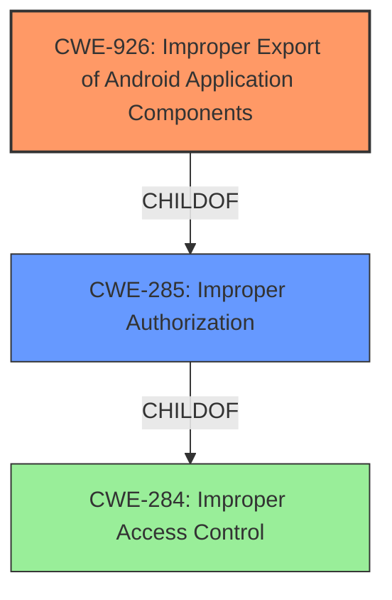

# Raw Analyzer Response for CVE-2022-22266

# Summary
| CWE ID | CWE Name | Confidence | CWE Abstraction Level | CWE Vulnerability Mapping Label | CWE-Vulnerability Mapping Notes |
|---|---|---|---|---|---|
| CWE-926 | Improper Export of Android Application Components | 0.9 | Variant | Allowed | Primary CWE |
| CWE-285 | Improper Authorization | 0.6 | Class | Discouraged | Secondary Candidate |
| CWE-284 | Improper Access Control | 0.5 | Pillar | Discouraged | Secondary Candidate |

## Evidence and Confidence

*   **Confidence Score:** 0.9
*   **Evidence Strength:** HIGH

## Relationship Analysis
The primary CWE, CWE-926 (Improper Export of Android Application Components), is a Variant of CWE-285 (Improper Authorization), which in turn is a ChildOf CWE-284 (Improper Access Control). This indicates a hierarchical relationship where CWE-926 is the most specific and appropriate choice, as it directly addresses the Android application component export issue. The higher-level CWEs (CWE-285 and CWE-284) are less specific and thus less suitable as primary mappings.

## Vulnerability Chain
The vulnerability chain starts with the **Unprotected WifiEvaluationService** (**rootcause**). This leads to the **impact** of allowing untrusted applications to get WiFi information without proper permission. The weakness is due to the improper export of an Android application component, allowing unauthorized access to sensitive data.

## Summary of Analysis
The initial analysis focused on identifying the root cause of the vulnerability, which is the **Unprotected WifiEvaluationService** allowing untrusted applications to access WiFi information. The Retriever Results suggested several CWEs, including CWE-269, CWE-213, CWE-927, CWE-285, CWE-284, and CWE-926.

CWE-926 (Improper Export of Android Application Components) was selected as the primary CWE because it directly addresses the vulnerability description: "(Applicable to China models only) **Unprotected WifiEvaluationService** in TencentWifiSecurity application prior to SMR Jan-2022 Release 1 allows untrusted applications to get WiFi information without proper permission." This CWE specifically deals with the failure to properly restrict which applications can launch a component or access its data. The vulnerability description explicitly states that untrusted applications can access WiFi information without proper permission, aligning perfectly with CWE-926. The evidence is the phrase "**Unprotected WifiEvaluationService**" meaning that it was improperly exported for use by other applications.

CWE-285 (Improper Authorization) and CWE-284 (Improper Access Control) were considered as secondary candidates. While they are related, they are too high-level and less specific than CWE-926. The hierarchical relationship confirms that CWE-926 is the most appropriate choice. The MITRE guidance for CWE-285 and CWE-284 also discourages their use when lower-level CWEs are applicable.

The final decision to use CWE-926 is based on the explicit evidence in the vulnerability description, the specificity of the CWE, and the hierarchical relationships between the CWEs. This selection is at the optimal level of specificity, as it directly addresses the root cause of the vulnerability.

Relevant CWE Information:

# Enhanced Context (25 CWEs)

## CWE-926: Improper Export of Android Application Components
**Abstraction:** Variant
**Status:** Incomplete

### Description
The Android application exports a component for use by other applications, but does not properly restrict which applications can launch the component or access the data it contains.

### Extended Description

The attacks and consequences of improperly exporting a component may depend on the exported component:

  - If access to an exported Activity is not restricted, any application will be able to launch the activity. This may allow a malicious application to gain access to sensitive information, modify the internal state of the application, or trick a user into interacting with the victim application while believing they are still interacting with the malicious application.

  - If access to an exported Service is not restricted, any application may start and bind to the Service. Depending on the exposed functionality, this may allow a malicious application to perform unauthorized actions, gain access to sensitive information, or corrupt the internal state of the application.

  - If access to a Content Provider is not restricted to only the expected applications, then malicious applications might be able to access the sensitive data. Note that in Android before 4.2, the Content Provider is automatically exported unless it has been explicitly declared as NOT exported.