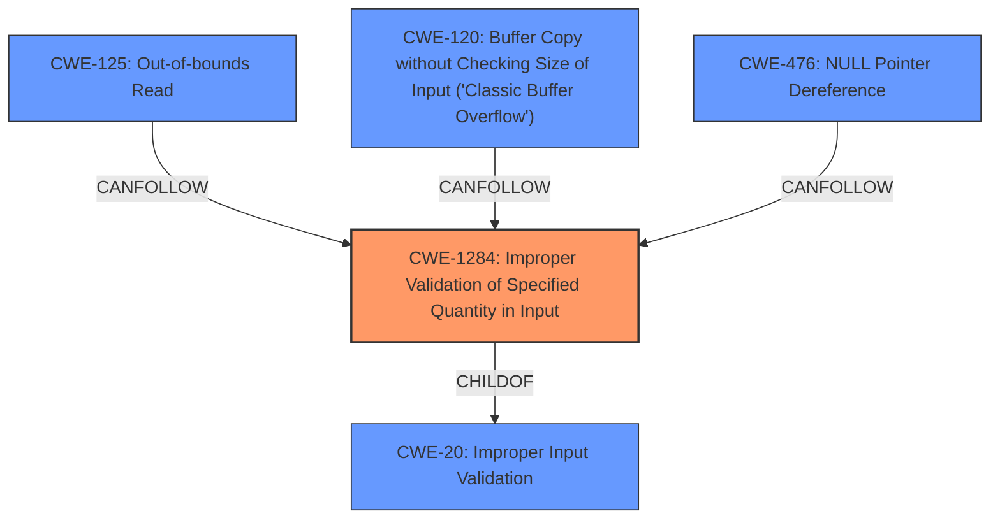

# Analysis Report for CVE-2022-22271

# Vulnerability Analysis Report: CVE-2022-22271

## Description


## Analysis (with Relationship Data)

# Summary
| CWE ID | CWE Name | Confidence | CWE Abstraction Level | CWE Vulnerability Mapping Label | CWE-Vulnerability Mapping Notes |
|---|---|---|---|---|---|
| CWE-1284 | Improper Validation of Specified Quantity in Input | 0.8 | Base | Allowed | Primary CWE |
| CWE-125 | Out-of-bounds Read | 0.6 | Base | Allowed | Secondary Candidate |
| CWE-120 | Buffer Copy without Checking Size of Input ('Classic Buffer Overflow') | 0.5 | Base | Allowed-with-Review | Secondary Candidate |
| CWE-476 | NULL Pointer Dereference | 0.4 | Base | Allowed | Secondary Candidate |

## Evidence and Confidence

*   **Confidence Score:** 0.8
*   **Evidence Strength:** MEDIUM

## Relationship Analysis
The primary CWE selected is CWE-1284, which is a child of CWE-20 (Improper Input Validation). This indicates a hierarchical relationship where CWE-1284 is a more specific instance of the general input validation issue described in CWE-20. CWE-120, CWE-125, and CWE-476 are related to memory corruption and access issues, and can be caused by the lack of input validation. These relationships support the selection of CWE-1284 as the primary weakness, with the others representing potential consequences.



## Vulnerability Chain
The vulnerability chain starts with a **missing input validation** (CWE-1284) which leads to the possibility to copy data from an arbitrary memory address. This can further lead to issues like an out-of-bounds read (CWE-125), buffer overflow (CWE-120), or NULL pointer dereference (CWE-476).

## Summary of Analysis
Initially, the vulnerability description points to a **missing input validation before memory copy**, which suggests a problem related to how input is handled before a memory operation. The description mentions that this **missing input validation** allows attackers to copy data from arbitrary memory. The key phrase is **"missing input validation before memory copy"**.

The retriever results suggest CWE-20 (Improper Input Validation) as a top candidate, but the mapping guidance discourages its use. It suggests using more specific children of CWE-20. Among these children, CWE-1284 (Improper Validation of Specified Quantity in Input) appears most relevant, because the memory copy operation involves a quantity (size or length) that must be validated.

While the description also mentions "copy data from arbitrary memory," this is a consequence of the **missing input validation**. This consequence could manifest as CWE-125 (Out-of-bounds Read), CWE-120 (Buffer Copy without Checking Size), or CWE-476 (NULL Pointer Dereference), depending on the specific implementation and input provided.

The final selection is based on the root cause, which is the **missing input validation** of the quantity related to the memory copy operation. The other CWEs are considered secondary because they are potential consequences rather than the primary weakness.

Relevant CWE Information:

# Enhanced Context (25 CWEs)
The following CWEs were identified as potentially relevant to this vulnerability:

## CWE-1284: Improper Validation of Specified Quantity in Input
**Technical Explanation:** The vulnerability description explicitly states a **missing input validation before memory copy**. CWE-1284 directly addresses scenarios where a product receives input specifying a quantity (such as size or length) but fails to validate that the quantity has the required properties. In this case, the quantity is likely the size of the data to be copied, and the **missing validation** allows attackers to potentially provide a malicious size, leading to memory corruption.
**Security Implications:** Without proper validation, an attacker can specify a large size value, leading to buffer overflows or out-of-bounds reads. This can allow them to overwrite memory, potentially executing arbitrary code or causing a denial of service.
**Relationship Explanation:** CWE-1284 is a child of CWE-20 (Improper Input Validation), indicating that it is a specific type of input validation issue. It can also precede CWE-789 (Uncontrolled Memory Allocation) if the **missing validation** leads to excessive memory allocation.
**Mapping Guidance Influence:** The mapping guidance recommends using specific children of CWE-20 when possible, making CWE-1284 a more appropriate choice than CWE-20.
**Why Primary:** Because the root cause is the **missing input validation** before the memory copy, which relates directly to a quantity (size).

## CWE-125: Out-of-bounds Read
**Technical Explanation:** If the size of the data to be copied is not validated, it could lead to reading data beyond the intended buffer boundaries. The vulnerability description indicates that attackers can copy data from arbitrary memory, which implies that an out-of-bounds read might occur.
**Security Implications:** Out-of-bounds reads can lead to information disclosure, where sensitive data from other memory locations is exposed.
**Relationship Explanation:** CWE-125 is related to memory access errors and can result from **missing input validation**.
**Mapping Guidance Influence:** Not the primary weakness, but a possible consequence of the **missing input validation**.
**Why Secondary:** Because it's a consequence of the root cause, not the root cause itself.

## CWE-120: Buffer Copy without Checking Size of Input ('Classic Buffer Overflow')
**Technical Explanation:** If the size of the data to be copied is not validated, it could lead to copying more data into the buffer than it can hold, resulting in a buffer overflow.
**Security Implications:** Buffer overflows can lead to arbitrary code execution, denial of service, or privilege escalation.
**Relationship Explanation:** CWE-120 is related to memory corruption and can result from **missing input validation**. It is also a child of CWE-119 (Improper Restriction of Operations within the Bounds of a Memory Buffer).
**Mapping Guidance Influence:** The mapping guidance suggests reviewing whether there's any input validation (children of CWE-20) if this CWE is considered. Since the vulnerability description highlights the **missing input validation**, this CWE is a potential consequence.
**Why Secondary:** Because it's a consequence of the root cause, not the root cause itself.

## CWE-476: NULL Pointer Dereference
**Technical Explanation:** Although not directly indicated in the description, the **missing input validation** could potentially lead to a NULL pointer dereference if the arbitrary memory address provided happens to be NULL.
**Security Implications:** NULL pointer dereferences can cause a program to crash, leading to a denial of service.
**Relationship Explanation:** CWE-476 is related to pointer errors and can be triggered by unexpected input.
**Mapping Guidance Influence:** The mapping guidance suggests carefully reading the name and description to ensure the mapping is appropriate. While possible, it is not the most direct consequence of the **missing input validation**.
**Why Secondary:** Less direct than other consequences; relies on specific memory address being NULL.

**CWEs Considered but Not Used:**

*   CWE-20: Improper Input Validation - Discouraged as it is a high-level class. CWE-1284 is a more specific child of this CWE and is more appropriate.
*   CWE-1285: Improper Validation of Specified Index, Position, or Offset in Input - While related, the core issue is the size/length of the data to be copied rather than the index/position.
*   CWE-367: Time-of-check Time-of-use (TOCTOU) Race Condition - Not relevant as the vulnerability doesn't involve race conditions.

The selection of CWE-1284 is at the optimal level of specificity, as it directly addresses the **missing input validation** of the quantity (size) involved in the memory copy operation. The other CWEs are consequences that might occur based on the specific input and implementation details.


## CWE Relationship Analysis

Current CWEs represent these abstraction levels: .


### Vulnerability Chain Analysis

**Chain starting from CWE-476:**
- 476 (NULL Pointer Dereference) - ROOT


**Chain starting from CWE-20:**
- 20 (Improper Input Validation) - ROOT


### CWE Relationship Diagram

```mermaid
graph TD
    classDef primary fill:#f96,stroke:#333,stroke-width:2px
    classDef secondary fill:#69f,stroke:#333
    classDef tertiary fill:#9e9,stroke:#333
```


*Report generated on 2025-03-30 20:27:20*
