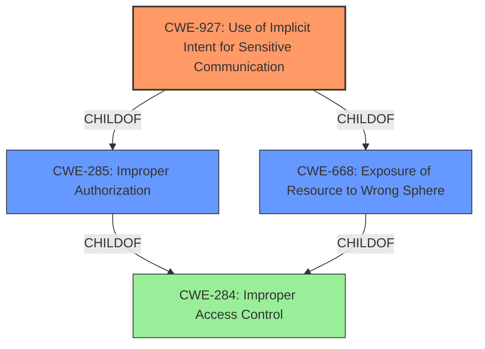

# Analysis Report for CVE-2022-22286

# Vulnerability Analysis Report: CVE-2022-22286

## Description


## Analysis (with Relationship Data)

# Summary
| CWE ID | CWE Name | Confidence | CWE Abstraction Level | CWE Vulnerability Mapping Label | CWE-Vulnerability Mapping Notes |
|---|---|---|---|---|---|
| CWE-927 | Use of Implicit Intent for Sensitive Communication | 0.9 | Variant | Allowed | Primary CWE. The application uses an implicit intent for transmitting sensitive data to other applications. |
| CWE-280 | Improper Handling of Insufficient Permissions or Privileges | 0.7 | Base | Allowed | Secondary CWE. The application does not handle or incorrectly handles when it has insufficient privileges to access resources or functionality as specified by their permissions. |
| CWE-284 | Improper Access Control | 0.5 | Pillar | Discouraged | Secondary CWE. The product does not restrict or incorrectly restricts access to a resource from an unauthorized actor. |

## Evidence and Confidence

*   **Confidence Score:** 0.8
*   **Evidence Strength:** HIGH

## Relationship Analysis
The primary CWE is CWE-927, a Variant that is child of CWE-285 (Improper Authorization) and CWE-668 (Exposure of Resource to Wrong Sphere). CWE-284 (Improper Access Control) is a parent Class of CWE-285. This shows a clear hierarchy where the improper use of implicit intents leads to broader authorization and access control issues. The relationships influenced the decision to include CWE-927 as it is the most specific.



## Vulnerability Chain
The vulnerability chain starts with the **improper use of PendingIntent in Bixby Routines**, leading to the **hijacking and modification of the intent**, and ultimately resulting in the **execution of privileged actions**. The root cause is the **vulnerability using PendingIntent in Bixby Routines**, and the impact is the **ability to execute privileged actions**.

## Summary of Analysis
The initial assessment identified CWE-927 as the primary weakness due to the **use of implicit intents for sensitive communication**. The analysis was further refined based on the relationships between CWEs, specifically focusing on the hierarchy between access control, authorization, and the specific flaw in intent handling. The final selection of CWEs provides a clear and specific representation of the vulnerability, supported by the evidence from the vulnerability description and CVE reference. The retriever results also support this assessment, with CWE-927 being the top combined result. The decision is based on the provided evidence, specifically the **vulnerability using PendingIntent in Bixby Routines** and the ability to **hijack and modify the intent** to **execute privileged action**.

Relevant CWE Information:

# Enhanced Context (25 CWEs)
The following CWEs were identified as potentially relevant to this vulnerability:

## CWE-280: Improper Handling of Insufficient Permissions or Privileges 
**Abstraction Level**: Base
**Similarity Score**: 0.77
**Source**: dense

**Description**:
The product does not handle or incorrectly handles when it has insufficient privileges to access resources or functionality as specified by their permissions. This may cause it to follow unexpected code paths that may leave the product in an invalid state.

**Mapping Guidance**:
- Usage: Allowed
- Rationale: This CWE entry is at the Base level of abstraction, which is a preferred level of abstraction for mapping to the root causes of vulnerabilities.

*Technical Explanation:*
CWE-280 is applicable because the **vulnerability in PendingIntent handling** can be viewed as a failure to properly manage the permissions required for executing privileged actions. The ability to hijack and modify the intent suggests that the system does not correctly handle situations where it has insufficient privileges to prevent unauthorized actions.
*Selection Justification:*
This CWE is selected because the vulnerability allows attackers to perform actions that should require higher privileges, indicating an **improper handling of insufficient permissions**. The vulnerability allows attackers to **execute privileged action by hijacking and modifying the intent**.
*Confidence:* 0.7

## CWE-267: Privilege Defined With Unsafe Actions
**Abstraction Level**: Base
**Similarity Score**: 0.77
**Source**: dense

**Description**:
A particular privilege, role, capability, or right can be used to perform unsafe actions that were not intended, even when it is assigned to the correct entity.

**Mapping Guidance**:
- Usage: Allowed
- Rationale: This CWE entry is at the Base level of abstraction, which is a preferred level of abstraction for mapping to the root causes of vulnerabilities.

*Selection Justification:*
CWE-267 was considered but not selected because the core issue isn't that a privilege is inherently unsafe, but rather the **improper handling of the PendingIntent** which leads to unauthorized access.
*Confidence:* 0.3

## CWE-274: Improper Handling of Insufficient Privileges
**Abstraction Level**: Base
**Similarity Score**: 0.77
**Source**: dense

**Description**:
The product does not handle or incorrectly handles when it has insufficient privileges to perform an operation, leading to resultant weaknesses.

**Mapping Guidance**:
- Usage: Discouraged
- Rationale: This CWE entry could be deprecated in a future version of CWE.

*Selection Justification:*
CWE-274 was considered but not selected as it's discouraged and too similar to CWE-280 which is a better fit.
*Confidence:* 0.3

## CWE-807: Reliance on Untrusted Inputs in a Security Decision
**Abstraction Level**: Base
**Similarity Score**: 0.77
**Source**: dense

**Description**:
The product uses a protection mechanism that relies on the existence or values of an input, but the input can be modified by an untrusted actor in a way that bypasses the protection mechanism.

**Mapping Guidance**:
- Usage: Allowed
- Rationale: This CWE entry is at the Base level of abstraction, which is a preferred level of abstraction for mapping to the root causes of vulnerabilities.

*Selection Justification:*
CWE-807 was considered but not selected because the core of the vulnerability is not the reliance on untrusted inputs, but rather the **improper handling of the PendingIntent** and the associated implicit intents.
*Confidence:* 0.3

## CWE-754: Improper Check for Unusual or Exceptional Conditions
**Abstraction Level**: Class
**Similarity Score**: 0.77
**Source**: dense

**Description**:
The product does not check or incorrectly checks for unusual or exceptional conditions that are not expected to occur frequently during day to day operation of the product.

**Mapping Guidance**:
- Usage: Allowed-with-Review
- Rationale: This CWE entry is a Class and might have Base-level children that would be more appropriate

*Selection Justification:*
CWE-754 was considered but not selected. While the vulnerability might involve unusual conditions, the core issue is more directly related to **improper handling of intents** and access control, making other CWEs more relevant.
*Confidence:* 0.3

## CWE-266: Incorrect Privilege Assignment
**Abstraction Level**: Base
**Similarity Score**: 0.76
**Source**: dense

**Description**:
A product incorrectly assigns a privilege to a particular actor, creating an unintended sphere of control for that actor.

**Mapping Guidance**:
- Usage: Allowed
- Rationale: This CWE entry is at the Base level of abstraction, which is a preferred level of abstraction for mapping to the root causes of vulnerabilities.

*Selection Justification:*
CWE-266 was considered but not selected because the vulnerability is not about incorrect privilege assignment, but rather the **improper handling of PendingIntents** leading to privilege escalation.
*Confidence:* 0.3

## CWE-184: Incomplete List of Disallowed Inputs
**Abstraction Level**: Base
**Similarity Score**: 0.76
**Source**: dense

**Description**:
The product implements a protection mechanism that relies on a list of inputs (or properties of inputs) that are not allowed by policy or otherwise require other action to neutralize before additional processing takes place, but the list is incomplete.

**Mapping Guidance**:
- Usage: Allowed
- Rationale: This CWE entry is at the Base level of abstraction, which is a preferred level of abstraction for mapping to the root causes of vulnerabilities.

*Selection Justification:*
CWE-184 was considered but not selected because the vulnerability is not related


## CWE Relationship Analysis

Current CWEs represent these abstraction levels: .


### Vulnerability Chain Analysis

**Chain starting from CWE-266:**
- 266 (Incorrect Privilege Assignment) - ROOT


**Chain starting from CWE-280:**
- 280 (Improper Handling of Insufficient Permissions or Privileges ) - ROOT


### CWE Relationship Diagram

```mermaid
graph TD
    classDef primary fill:#f96,stroke:#333,stroke-width:2px
    classDef secondary fill:#69f,stroke:#333
    classDef tertiary fill:#9e9,stroke:#333
```


*Report generated on 2025-03-30 13:56:56*
