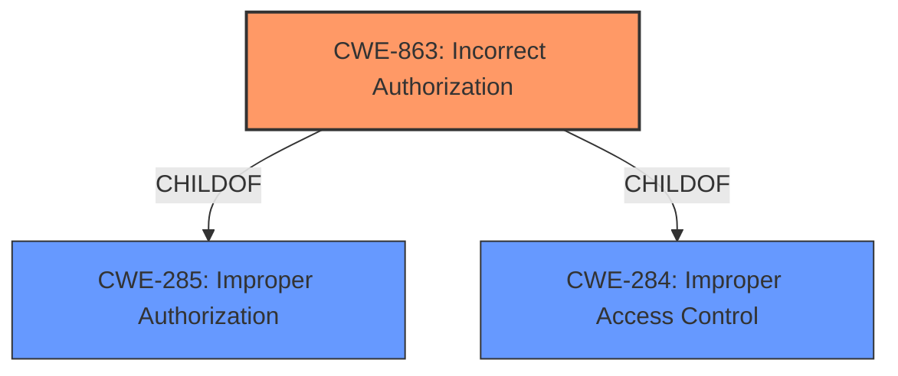

# Analysis Report for CVE-2022-22288

# Vulnerability Analysis Report: CVE-2022-22288

## Description


## Analysis (with Relationship Data)

# Summary
| CWE ID  | CWE Name                                                        | Confidence | CWE Abstraction Level | CWE Vulnerability Mapping Label | CWE-Vulnerability Mapping Notes |
| :-------- | :-------------------------------------------------------------- | :--------- | :-------------------- | :------------------------------ | :------------------------------ |
| CWE-863 | Incorrect Authorization                                       | 0.9        | Class                  | Primary                         | Allowed-with-Review           |
| CWE-285 | Improper Authorization                                        | 0.7        | Class                  | Secondary                       | Discouraged                    |
| CWE-284 | Improper Access Control                                         | 0.6        | Pillar                 | Secondary                       | Discouraged                    |

## Evidence and Confidence

*   **Confidence Score:** 0.9
*   **Evidence Strength:** HIGH

## Relationship Analysis
The primary CWE selected is CWE-863 (**Incorrect Authorization**), which is a child of both CWE-285 (**Improper Authorization**) and CWE-284 (**Improper Access Control**). CWE-285 is a more general form of incorrect authorization. CWE-284 is a very high-level categorization (Pillar) that encompasses various access control issues. Choosing CWE-863 provides a more specific and accurate representation of the vulnerability than either of its parents.



## Vulnerability Chain
The chain of the vulnerability begins with the **improper authorization** in the Galaxy Store application. This leads to the ability to remotely install applications from the allowlist without proper authorization.

## Summary of Analysis
The analysis is based on the provided evidence from the vulnerability description and CVE reference.

The **Vulnerability Description Key Phrases** section states the **rootcause** as "**Improper authorization**".

The **CVE Reference Links Content Summary** confirms the **root cause of vulnerability** as "**Improper authorization vulnerability in Galaxy Store**" and that the Galaxy Store application "**lacks proper authorization checks, allowing for remote app installations of applications on the allowlist.**"

The Retriever Results listed CWE-863 (**Incorrect Authorization**) and CWE-285 (**Improper Authorization**) as potential candidates. CWE-863 is a child of CWE-285, making it a more specific and relevant choice.

CWE-284 (**Improper Access Control**) is a high-level pillar that is discouraged, and more specific child elements should be used instead.

Given the **rootcause** is the **improper authorization**, the best CWE is CWE-863 (**Incorrect Authorization**), because the product performs an authorization check but incorrectly performs the check.

I considered the other CWEs, but they are less appropriate:

*   CWE-212 (**Improper Removal of Sensitive Information Before Storage or Transfer**) is not relevant, as the vulnerability is not related to sensitive information.
*   CWE-939 (**Improper Authorization in Handler for Custom URL Scheme**) is too specific, related to custom URL schemes, which is not mentioned in the description.
*   CWE-926 (**Improper Export of Android Application Components**) is specific to exported Android application components, and there is no evidence of that here.
*   CWE-639 (**Authorization Bypass Through User-Controlled Key**) is focused on user-controlled keys, which is not mentioned.
*   CWE-425 (**Direct Request ('Forced Browsing')**) and CWE-22 (**Improper Limitation of a Pathname to a Restricted Directory ('Path Traversal')**) are not relevant as they do not relate to authorization issues.

# Relevant CWE Information:

# Enhanced Context (25 CWEs)

## CWE-284: Improper Access Control
**Abstraction Level**: Pillar
**Similarity Score**: 0.800
**Source**: alternate_terms

**Description**:
The product does not restrict or incorrectly restricts access to a resource from an unauthorized actor.

**Mapping Guidance**:
- Usage: Discouraged
- Rationale: CWE-284 is extremely high-level, a Pillar. Its name, "Improper Access Control," is often misused in low-information vulnerability reports [REF-1287] or by active use of the OWASP Top Ten, such as "A01:2021-Broken Access Control". It is not useful for trend analysis.
**Comments:** Consider using descendants of CWE-284 that are more specific to the kind of access control involved, such as those involving authorization (Missing Authorization (CWE-862), Incorrect Authorization (CWE-863), Incorrect Permission Assignment for Critical Resource (CWE-732), etc.); authentication (Missing Authentication (CWE-306) or Weak Authentication (CWE-1390)); Incorrect User Management (CWE-286); Improper Restriction of Communication Channel to Intended Endpoints (CWE-923); etc.

## CWE-285: Improper Authorization
**Abstraction Level**: Class
**Similarity Score**: 0.122
**Source**: sparse

**Description**:
The product does not perform or incorrectly performs an authorization check when an actor attempts to access a resource or perform an action.

**Mapping Guidance**:
- Usage: Discouraged
- Rationale: CWE-285 is high-level and lower-level CWEs can frequently be used instead. It is a level-1 Class (i.e., a child of a Pillar).
**Comments:** Look at CWE-285's children and consider mapping to CWEs such as CWE-862: Missing Authorization, CWE-863: Incorrect Authorization, CWE-732: Incorrect Permission Assignment for Critical Resource, or others.

## CWE-939: Improper Authorization in Handler for Custom URL Scheme
**Abstraction Level**: Base
**Similarity Score**: 0.120
**Source**: sparse

**Description**:
The product uses a handler for a custom URL scheme, but it does not properly restrict which actors can invoke the handler using the scheme.

**Mapping Guidance**:
- Usage: Allowed
- Rationale: This CWE entry is at the Base level of abstraction, which is a preferred level of abstraction for mapping to the root causes of vulnerabilities.
**Comments:** Carefully read both the name and description to ensure that this mapping is an appropriate fit. Do not try to 'force' a mapping to a lower-level Base/Variant simply to comply with this preferred level of abstraction.

## CWE-212: Improper Removal of Sensitive Information Before Storage or Transfer
**Abstraction Level**: Base
**Similarity Score**: 0.115
**Source**: sparse

**Description**:
The product stores, transfers, or shares a resource that contains sensitive information, but it does not properly remove that information before the product makes the resource available to unauthorized actors.

**Mapping Guidance**:
- Usage: Allowed
- Rationale: This CWE entry is at the Base level of abstraction, which is a preferred level of abstraction for mapping to the root causes of vulnerabilities.
**Comments:** Carefully read both the name and description to ensure that this mapping is an appropriate fit. Do not try to 'force' a mapping to a lower-level Base/Variant simply to comply with this preferred level of abstraction.

## CWE-863: Incorrect Authorization
**Abstraction Level**: Class
**Similarity Score**: 0.112
**Source**: sparse

**Description**:
The product performs an authorization check when an actor attempts to access a resource or perform an action, but it does not correctly perform the check.

**Mapping Guidance**:
- Usage: Allowed-with-Review
- Rationale: This CWE entry is a Class and might have Base-level children that would be more appropriate
**Comments:** Examine children of this entry to see if there is a better fit

## CWE-926: Improper Export of Android Application Components
**Abstraction Level**: Variant
**Similarity Score**: 0.538
**Source**: dense

**Description**:
The Android application exports a component for use by other applications, but does not properly restrict which applications can launch the component or access the data it contains.

**Mapping Guidance**:
- Usage: Allowed
- Rationale: This CWE entry is at the Variant level of abstraction, which is a preferred level of abstraction for mapping to the root causes of vulnerabilities.
**Comments:** Carefully read both the name and description to ensure that this mapping is an appropriate fit. Do not try to 'force' a mapping to a lower-level Base/Variant simply to comply with this preferred level of abstraction.


## CWE Relationship Analysis

Current CWEs represent these abstraction levels: .


### Vulnerability Chain Analysis

**Chain starting from CWE-862:**
- 862 (Missing Authorization) - ROOT


**Chain starting from CWE-425:**
- 425 (Direct Request ('Forced Browsing')) - ROOT


### CWE Relationship Diagram

```mermaid
graph TD
    classDef primary fill:#f96,stroke:#333,stroke-width:2px
    classDef secondary fill:#69f,stroke:#333
    classDef tertiary fill:#9e9,stroke:#333
```


*Report generated on 2025-03-31 07:23:35*
