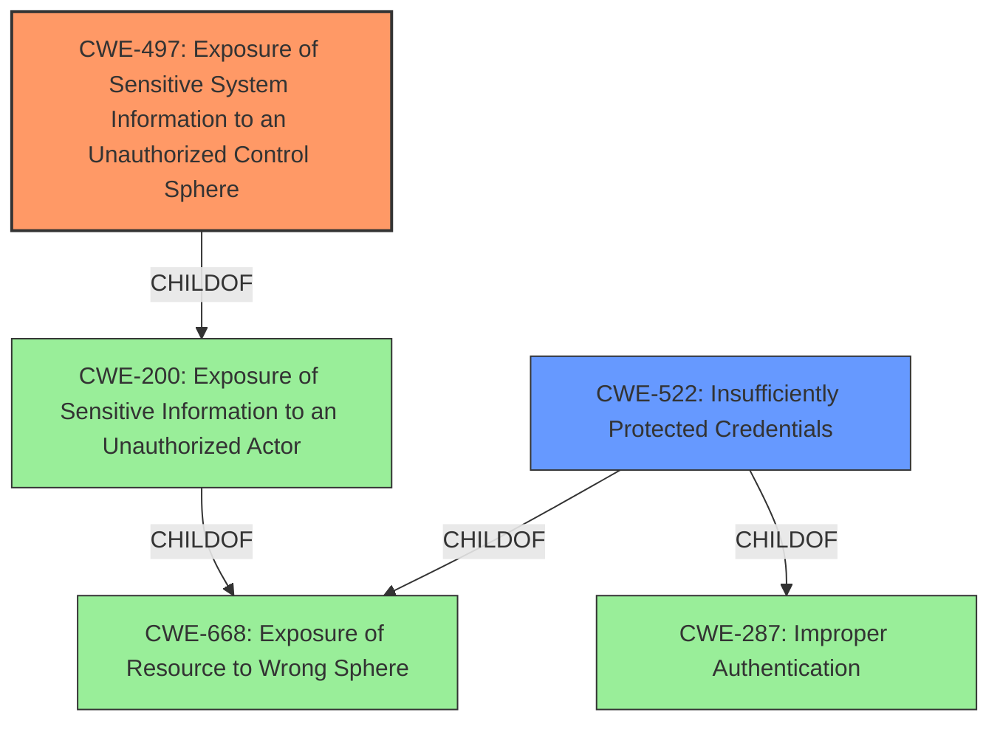

# Analysis for CVE-2022-22303

# Summary

| CWE ID  | CWE Name                                                                              | Confidence | CWE Abstraction Level | CWE Vulnerability Mapping Label | CWE-Vulnerability Mapping Notes |
| :-------- | :------------------------------------------------------------------------------------ | :--------- | :---------------------- | :------------------------------ | :------------------------------ |
| CWE-497 | Exposure of Sensitive System Information to an Unauthorized Control Sphere               | 1.0        | Base                    | Primary                         | Allowed                         |
| CWE-522 | Insufficiently Protected Credentials                                                   | 0.7        | Class                   | Secondary                       | Allowed-with-Review           |

## Evidence and Confidence

*   **Confidence Score:** 0.85
*   **Evidence Strength:** HIGH

## Relationship Analysis
The primary CWE, CWE-497, is a Base level weakness that is a child of CWE-200 (Exposure of Sensitive Information to an Unauthorized Actor). CWE-200 is a Class level weakness that is a child of CWE-668 (Exposure of Resource to Wrong Sphere). CWE-522 (Insufficiently Protected Credentials) is a Class level weakness that is a child of CWE-668 and CWE-287 (Improper Authentication). Given the information available, CWE-497 represents the most specific and accurate classification of the root cause.

## Vulnerability Chain
The vulnerability chain starts with the **exposure of sensitive system information to an unauthorized control sphere [CWE-497]**, specifically FortiGate user credentials stored in cleartext in a config conflict file. This leads to **insufficiently protected credentials [CWE-522]**, which can be accessed by a low-privileged authenticated user, resulting in information disclosure and potential unauthorized actions.

## Summary of Analysis
The initial analysis correctly identifies CWE-497 as the primary weakness, supported by the vulnerability description explicitly stating "exposure of sensitive system information to an unauthorized control sphere vulnerability [CWE-497]". The CVE Reference Links Content Summary confirms this, highlighting the root cause as "exposure of sensitive system information to an unauthorized control sphere" with cleartext storage of credentials.

The selection of CWE-497 is based on the provided evidence and its alignment with the CWE's description. The vulnerability involves the exposure of sensitive system information (FortiGate user credentials) to a low-privileged user who should not have access to this information. This directly matches the definition of CWE-497.

Additionally, CWE-522 is considered as a secondary weakness because the credentials themselves are **insufficiently protected**. While the primary issue is the exposure, the fact that the credentials are stored in cleartext contributes to the overall vulnerability.

The graph relationships reinforce this decision, placing CWE-497 as a child of CWE-200, which aligns with the general pattern of information exposure vulnerabilities. The abstraction level of CWE-497 (Base) is also appropriate, as it provides a specific description of the weakness.

Relevant CWE Information:

# Enhanced Context (25 CWEs)
The following CWEs were identified as potentially relevant to this vulnerability:

## CWE-497: Exposure of Sensitive System Information to an Unauthorized Control Sphere
**Abstraction Level**: Base
**Similarity Score**: 0.79
**Source**: dense

**Description**:
The product does not properly prevent sensitive system-level information from being accessed by unauthorized actors who do not have the same level of access to the underlying system as the product does.

**Mapping Guidance**:
- Usage: Allowed
- Rationale: This CWE entry is at the Base level of abstraction, which is a preferred level of abstraction for mapping to the root causes of vulnerabilities.

## CWE-522: Insufficiently Protected Credentials
**Abstraction Level**: Class
**Similarity Score**: 0.345
**Source**: sparse

**Description**:
The product transmits or stores authentication credentials, but it uses an insecure method that is susceptible to unauthorized interception and/or retrieval.

**Mapping Guidance**:
- Usage: Allowed-with-Review
- Rationale: This CWE entry is a Class and might have Base-level children that would be more appropriate

CWE-200 and CWE-668 were considered but not chosen as the primary weakness because they are class-level CWEs, and CWE-497 provides a more specific description of the vulnerability. CWE-209 was not chosen because the vulnerability is not directly related to the generation of error messages.