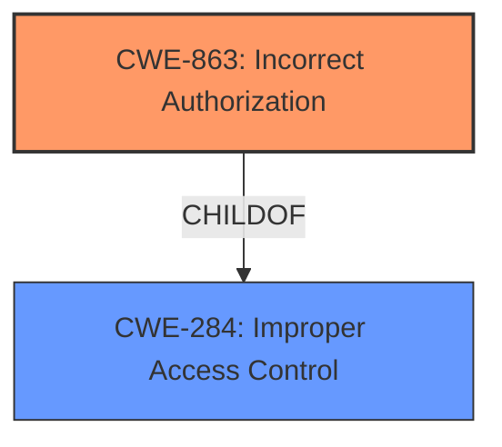

# Enhanced Analysis for CVE-2022-22326

# Summary
| CWE ID  | CWE Name                  | Confidence | CWE Abstraction Level | CWE Vulnerability Mapping Label | CWE-Vulnerability Mapping Notes |
|---------|---------------------------|------------|-----------------------|---------------------------------|---------------------------------|
| CWE-863 | Incorrect Authorization   | 0.9        | Class                 | Allowed-with-Review             | Allowed-with-Review             |
| CWE-284 | Improper Access Control   | 0.7        | Pillar                | Discouraged                     | Discouraged                     |

- The Primary CWE should be first and noted as the Primary CWEs
- The secondary candidate CWEs should be next and noted as secondary candidates.
- The confidence is a confidence score 0 to 1 to rate your confidence in your assessment for that CWE.
- The CWE Abstraction Level as one of these values: Base, Variant, Pillar, Class, Compound
- The Mapping Notes Usage as one of these values: Allowed, Allowed-with-Review, Prohibited, Discouraged

## Evidence and Confidence

*   **Confidence Score:** 0.8
*   **Evidence Strength:** HIGH

## Relationship Analysis
The primary relationship influencing the CWE selection is the hierarchical relationship between CWE-284 (**Improper Access Control**) and its child CWE-863 (**Incorrect Authorization**). While CWE-284 is a broad, high-level classification (Pillar), CWE-863 provides a more specific description of the vulnerability, where the authorization check is performed but is **incorrect**. The vulnerability description's focus on "**insufficient authorization checks**" directly aligns with the definition of CWE-863. This specificity guides the selection of CWE-863 over its parent.



## Vulnerability Chain
The vulnerability chain is relatively simple:

1.  **Root Cause:** **Insufficient authorization checks** (CWE-863)
2.  **Impact:** Unauthorized viewing of logs and files.

## Summary of Analysis
The initial analysis focused on identifying the root cause of the vulnerability, which is the **insufficient authorization checks**. The provided evidence, especially the "**Vulnerability Description Key Phrases**" and the "**CVE Reference Links Content Summary**," clearly points to a problem with how authorization is handled.

The Retriever results suggest considering CWE-284 (**Improper Access Control**) and CWE-863 (**Incorrect Authorization**). However, CWE-284 is a Pillar-level CWE and is discouraged due to its high-level nature. CWE-863 is a Class-level CWE and describes a scenario where an authorization check is performed but is done incorrectly. This aligns well with the "**insufficient authorization checks**" described in the vulnerability description.

The final decision is to select CWE-863 (**Incorrect Authorization**) as the primary CWE. This decision is based on the following:

*   The vulnerability description explicitly mentions "**insufficient authorization checks**."
*   The "**CVE Reference Links Content Summary**" confirms that the root cause is a lack of proper access control enforcement, specifically related to authorization.
*   CWE-863's description matches the vulnerability details, where the authorization check is performed but is **incorrect**.
*   CWE-863 is a more specific Class-level CWE compared to the Pillar-level CWE-284.
*   The MITRE mapping guidance suggests reviewing children of CWE-285 and CWE-284 to find a better fit, and CWE-863 is a child of both.

CWE-284 was considered but not selected as the primary CWE because it is too general. While the vulnerability involves access control, the specific issue is with the authorization check itself, making CWE-863 a more accurate representation of the weakness.

**CWEs Considered But Not Used:**

*   **CWE-284 (Improper Access Control):** This was considered but deemed too general. The problem is specifically with the authorization process, not overall access control.
*   **CWE-285 (Improper Authorization):** Similar to CWE-284, this is a higher-level class that is not as specific as CWE-863.
*   **CWE-287 (Improper Authentication):** Authentication is not the primary issue; the problem lies in how authorization is performed after a user is authenticated.
*   **CWE-639 (Authorization Bypass Through User-Controlled Key):** While authorization bypass is a potential outcome, the root cause isn't necessarily a user-controlled key, but rather an **incorrect** authorization process.
*   **CWE-1390 (Weak Authentication):** Similar to CWE-287, authentication isn't the central issue.

The selection of CWE-863 is at the optimal level of specificity because it directly addresses the root cause of the vulnerability: an **incorrect** authorization check. This level of detail provides valuable information for understanding the weakness and developing appropriate mitigations.


## CWE Relationship Analysis

Current CWEs represent these abstraction levels: .


### Vulnerability Chain Analysis

**Chain starting from CWE-1390:**
- 1390 (Weak Authentication) - ROOT


**Chain starting from CWE-639:**
- 639 (Authorization Bypass Through User-Controlled Key) - ROOT


### CWE Relationship Diagram

```mermaid
graph TD
    classDef primary fill:#f96,stroke:#333,stroke-width:2px
    classDef secondary fill:#69f,stroke:#333
    classDef tertiary fill:#9e9,stroke:#333
```