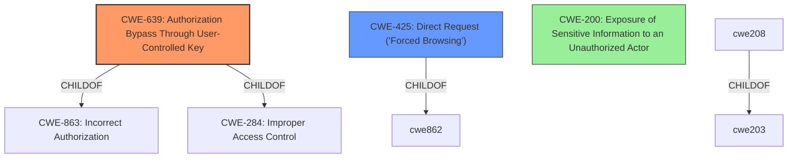

# Enhanced Analysis for CVE-2022-22331

# Summary
| CWE ID | CWE Name | Confidence | CWE Abstraction Level | CWE Vulnerability Mapping Label | CWE-Vulnerability Mapping Notes |
|---|---|---|---|---|---|
| CWE-639 | Authorization Bypass Through User-Controlled Key | 1.0 | Base | Allowed | Primary CWE: Insecure Direct Object Reference (IDOR) |
| CWE-425 | Direct Request ('Forced Browsing') | 0.7 | Base | Allowed | Secondary Candidate |
| CWE-200 | Exposure of Sensitive Information to an Unauthorized Actor | 0.5 | Class | Discouraged | Secondary Candidate |

## Evidence and Confidence

*   **Confidence Score:** 0.8
*   **Evidence Strength:** HIGH

## Relationship Analysis
The primary CWE identified is CWE-639, which falls under the Base abstraction level and has a direct relationship to the **insecure direct object reference** (**IDOR**) vulnerability described. CWE-639 is a child of CWE-863 (Incorrect Authorization) and CWE-284 (Improper Access Control), indicating a hierarchical relationship within authorization-related weaknesses. CWE-425 (Direct Request) is another related CWE, also at the Base level, representing a scenario where authorization is not adequately enforced on restricted URLs. CWE-200 (Exposure of Sensitive Information) is considered but deemed less specific as it represents the impact rather than the root cause. The choice of CWE-639 is driven by its direct alignment with the vulnerability description's root cause.



## Vulnerability Chain
The vulnerability chain begins with the **insecure direct object reference**. The attacker manipulates a key value under their control to access another user's data. The root cause is the **missing or incorrect authorization** check. The impact is the **exposure of sensitive information** and the potential **modification of user details.**

Insecure Direct Object Reference (Root Cause) -> Missing Authorization -> Exposure of Sensitive Information and Modification of User Details (Impact)

## Summary of Analysis
The initial assessment focused on identifying the root cause of the vulnerability, which is the **insecure direct object reference** (IDOR). The evidence from the vulnerability description and CVE Reference Links Content Summary explicitly points to this weakness. The key phrase "insecure direct object vulnerability" directly supports the selection of CWE-639 (Authorization Bypass Through User-Controlled Key).

The relationship analysis highlighted the hierarchical structure of authorization-related CWEs, reinforcing the choice of CWE-639 as the most specific and relevant option. The mapping guidance for CWE-639 allows its usage at the Base level, aligning with the goal of selecting the most granular CWE.

CWE-200 (Exposure of Sensitive Information) was considered but ultimately deemed less appropriate as it represents the impact of the vulnerability rather than the root cause. CWE-425 (Direct Request ('Forced Browsing')) was considered as a secondary candidate.

The final decision is based on the direct evidence from the vulnerability description, the relationship analysis within authorization-related CWEs, and the mapping guidance provided by MITRE. The selected CWEs are at the optimal level of specificity, representing the root cause and potential contributing factors to the vulnerability.

Relevant CWE Information:

# Enhanced Context (25 CWEs)
The following CWEs were identified as potentially relevant to this vulnerability:

## CWE-639: Authorization Bypass Through User-Controlled Key
**Abstraction:** Base
**Similarity Score**: 6156.54
**Source**: sparse

**Description**:
The system's authorization functionality does not prevent one user from gaining access to another user's data or record by modifying the key value identifying the data.

**Mapping Guidance**:
- Usage: Allowed
- Rationale: This CWE entry is at the Base level of abstraction, which is a preferred level of abstraction for mapping to the root causes of vulnerabilities.

## CWE-425: Direct Request ('Forced Browsing')
**Abstraction:** base
**Similarity Score**: 4.33
**Source**: graph

**Description**:
CWE-425: Direct Request ('Forced Browsing')

**Mapping Guidance**:
- Usage: Allowed
- Rationale: This CWE entry is at the Base level of abstraction, which is a preferred level of abstraction for mapping to the root causes of vulnerabilities.

## CWE-200: Exposure of Sensitive Information to an Unauthorized Actor
**Abstraction:** Class
**Similarity Score**: 5781.01
**Source**: sparse

**Description**:
The product exposes sensitive information to an actor that is not explicitly authorized to have access to that information.

**Mapping Guidance**:
- Usage: Discouraged
- Rationale: CWE-200 is commonly misused to represent the loss of confidentiality in a vulnerability, but confidentiality loss is a technical impact - not a root cause error. As of CWE 4.9, over 400 CWE entries can lead to a loss of confidentiality. Other options are often available. [REF-1287].


## CWE Relationship Analysis

Current CWEs represent these abstraction levels: .


### Vulnerability Chain Analysis

**Chain starting from CWE-425:**
- 425 (Direct Request ('Forced Browsing')) - ROOT


**Chain starting from CWE-200:**
- 200 (Exposure of Sensitive Information to an Unauthorized Actor) - ROOT


### CWE Relationship Diagram

```mermaid
graph TD
    classDef primary fill:#f96,stroke:#333,stroke-width:2px
    classDef secondary fill:#69f,stroke:#333
    classDef tertiary fill:#9e9,stroke:#333
```