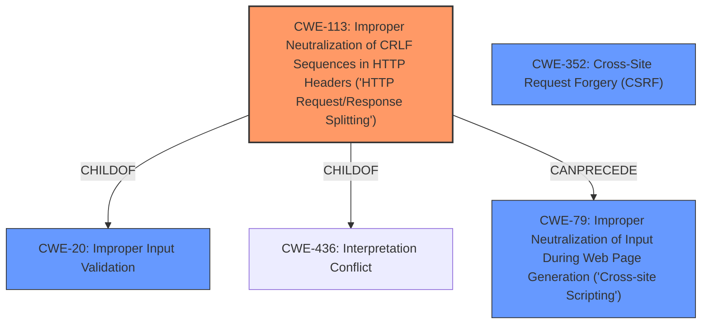

# Enhanced Analysis for CVE-2022-22344

# Summary
| CWE ID | CWE Name | Confidence | CWE Abstraction Level | CWE Vulnerability Mapping Label | CWE-Vulnerability Mapping Notes |
|---|---|---|---|---|---|
| CWE-113 | Improper Neutralization of CRLF Sequences in HTTP Headers ('HTTP Request/Response Splitting') | 0.9 | Variant | Allowed | Primary CWE |
| CWE-79 | Improper Neutralization of Input During Web Page Generation ('Cross-site Scripting') | 0.7 | Base | Allowed | Secondary Candidate |
| CWE-352 | Cross-Site Request Forgery (CSRF) | 0.6 | Compound | Allowed | Secondary Candidate |
| CWE-20 | Improper Input Validation | 0.5 | Class | Discouraged | Secondary Candidate |

## Evidence and Confidence

*   **Confidence Score:** 0.8
*   **Evidence Strength:** HIGH

## Relationship Analysis
The primary CWE, CWE-113, is a variant of CWE-20 and CWE-436. CWE-113 can precede CWE-79. The relationship indicates a possible chain of vulnerabilities where **improper neutralization of CRLF sequences** leads to Cross-Site Scripting. CWE-20 is a high-level class discouraged by MITRE. The abstraction levels influenced the selection, favoring the variant CWE-113 and the base CWE-79.



## Vulnerability Chain
The vulnerability chain starts with **improper validation of input by the HOST headers** (CWE-20), leading to **HTTP header injection** (CWE-113). This can further lead to Cross-Site Scripting (CWE-79) and potentially Cross-Site Request Forgery (CWE-352) due to session hijacking.

## Summary of Analysis
The initial assessment pointed towards **HTTP header injection** due to **improper validation of input by the HOST headers**. The Retriever Results and Complete CWE Specifications confirmed this direction, with CWE-113 being the most relevant. The "Vulnerability Description Key Phrases" section mentioned **HTTP header injection**, which aligns with CWE-113. The CVE Reference Links Content Summary indicated that the product is vulnerable to HTTP header injection, XSS, and CSRF attacks, supporting the potential for CWE-79 and CWE-352.

The final decision prioritizes CWE-113 as the primary CWE because it directly addresses the **HTTP header injection** vulnerability resulting from the **improper neutralization of CRLF sequences**. While CWE-79 and CWE-352 are potential impacts, CWE-113 represents the root cause.

CWE-20 was considered but not chosen as the primary weakness. While the vulnerability stems from **improper input validation**, CWE-20 is too broad. CWE-113 is a more specific and accurate representation of the vulnerability. MITRE discourages the use of CWE-20 when a more specific CWE is available.

Other CWEs considered but not used:

*   CWE-74: Improper Neutralization of Special Elements in Output Used by a Downstream Component ('Injection') - Too generic. CWE-113 provides more specific detail related to HTTP headers.
*   CWE-80: Improper Neutralization of Script-Related HTML Tags in a Web Page (Basic XSS) - While XSS is a potential impact, it's not the root cause.
*   CWE-943: Improper Neutralization of Special Elements in Data Query Logic - Not relevant as the vulnerability does not involve data query logic.
*   CWE-1289: Improper Validation of Unsafe Equivalence in Input - Not the primary issue, as it is more focused on resource identifiers and references, not HTTP headers specifically.
*   CWE-807: Reliance on Untrusted Inputs in a Security Decision - Not the core issue, as the problem is with how the input is handled, not just that it's untrusted.
*   CWE-917: Improper Neutralization of Special Elements used in an Expression Language Statement ('Expression Language Injection') - Not relevant since it's specific to expression language statements.
*   CWE-319: Cleartext Transmission of Sensitive Information - Not relevant, as this vulnerability does not involve transmitting data in cleartext.
*   CWE-116: Improper Encoding or Escaping of Output - Too general compared to the specificity of CWE-113.
*   CWE-138: Improper Neutralization of Special Elements - Too general compared to CWE-113, which is specific to HTTP headers.
*   CWE-22: Improper Limitation of a Pathname to a Restricted Directory ('Path Traversal') - Not applicable as the vulnerability doesn't involve pathnames.
*   CWE-434: Unrestricted Upload of File with Dangerous Type - Not applicable as the vulnerability doesn't involve file uploads.
*   CWE-494: Download of Code Without Integrity Check - Not applicable as the vulnerability doesn't involve code downloads.
*   CWE-770: Allocation of Resources Without Limits or Throttling - Not applicable as the vulnerability doesn't involve resource allocation issues.
*   CWE-190: Integer Overflow or Wraparound - Not applicable as the vulnerability doesn't involve integer overflows.
*   CWE-59: Improper Link Resolution Before File Access ('Link Following') - Not applicable as the vulnerability doesn't involve link resolution issues.
*   CWE-89: Improper Neutralization of Special Elements used in an SQL Command ('SQL Injection') - Not applicable as the vulnerability doesn't involve SQL commands.
*   CWE-1284: Improper Validation of Specified Quantity in Input - Not applicable as the vulnerability doesn't involve validating a specified quantity in input.


## CWE Relationship Analysis

Current CWEs represent these abstraction levels: .


### Vulnerability Chain Analysis

**Chain starting from CWE-89:**
- 89 (Improper Neutralization of Special Elements used in an SQL Command ('SQL Injection')) - ROOT


**Chain starting from CWE-436:**
- 436 (Interpretation Conflict) - ROOT


### CWE Relationship Diagram

```mermaid
graph TD
    classDef primary fill:#f96,stroke:#333,stroke-width:2px
    classDef secondary fill:#69f,stroke:#333
    classDef tertiary fill:#9e9,stroke:#333
```