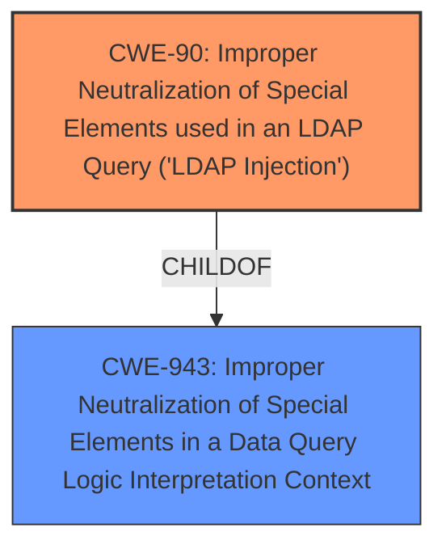

# Analysis Report for CVE-2022-22360

# Vulnerability Analysis Report: CVE-2022-22360

## Description


## Analysis (with Relationship Data)

# Summary
| CWE ID | CWE Name | Confidence | CWE Abstraction Level | CWE Vulnerability Mapping Label | CWE-Vulnerability Mapping Notes |
|---|---|---|---|---|---|
| CWE-90 | Improper Neutralization of Special Elements used in an LDAP Query ('LDAP Injection') | 1.0 | Base | Allowed | Primary CWE |

## Evidence and Confidence

*   **Confidence Score:** 1.0
*   **Evidence Strength:** HIGH

## Relationship Analysis
The primary relationship influencing the selection was the direct match of the vulnerability description to CWE-90, as well as its Base abstraction level. The Retriever Results also highlighted CWE-90 as the top candidate. Other CWEs were considered, but none provided as direct a match.



## Vulnerability Chain
The vulnerability chain consists of:
1.  **Root Cause:** **LDAP injection** due to **improper neutralization** in an LDAP query.
2.  **Impact:** Granting permission to unauthorized resources.

## Summary of Analysis
The analysis strongly supports the selection of CWE-90 as the primary CWE. The vulnerability description explicitly mentions "**LDAP injection**," aligning perfectly with the CWE's name and description: "Improper Neutralization of Special Elements used in an LDAP Query ('LDAP Injection')." The **root cause** of the vulnerability is the **failure to properly neutralize** special elements in the LDAP query, which allows an attacker to inject malicious code. The impact, as stated in the description, is the potential for granting unauthorized access.

The "Vulnerability Description Key Phrases" includes the **weakness** as "**LDAP injection**"

The "CVE Reference Links Content Summary" specifies the "**Root cause of vulnerability**" as "**LDAP injection**"

The Retriever Results also identified CWE-90 as the top candidate, reinforcing its relevance. The abstraction level of Base is preferred, and the Usage is Allowed, according to MITRE guidance.

Other CWEs like CWE-20 (Improper Input Validation) and CWE-74 (Improper Neutralization of Special Elements in Output Used by a Downstream Component ('Injection')) were considered but deemed less specific. CWE-90 directly addresses the LDAP injection issue, making it the most appropriate choice.
CWE-200 (Exposure of Sensitive Information to an Unauthorized Actor) and CWE-863 (Incorrect Authorization) were also considered, but they focus on the impact rather than the root cause of the **LDAP injection**.
CWE-319 (Cleartext Transmission of Sensitive Information) and CWE-611 (Improper Restriction of XML External Entity Reference) are related to different vulnerability types and are not applicable here.
CWE-73 (External Control of File Name or Path) and CWE-434 (Unrestricted Upload of File with Dangerous Type) don't relate to the LDAP context.

The selected CWE is at the optimal level of specificity because it directly describes the **LDAP injection** **weakness**.


## CWE Relationship Analysis

Current CWEs represent these abstraction levels: .


### Vulnerability Chain Analysis

**Chain starting from CWE-200:**
- 200 (Exposure of Sensitive Information to an Unauthorized Actor) - ROOT


**Chain starting from CWE-434:**
- 434 (Unrestricted Upload of File with Dangerous Type) - ROOT


### CWE Relationship Diagram

```mermaid
graph TD
    classDef primary fill:#f96,stroke:#333,stroke-width:2px
    classDef secondary fill:#69f,stroke:#333
    classDef tertiary fill:#9e9,stroke:#333
```


*Report generated on 2025-03-31 03:29:06*
