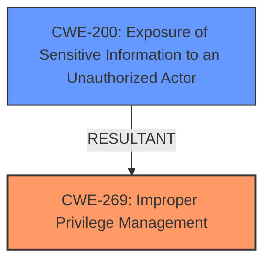

# Enhanced Analysis for CVE-2022-22390

# Summary
| CWE ID | CWE Name | Confidence | CWE Abstraction Level | CWE Vulnerability Mapping Label | CWE-Vulnerability Mapping Notes |
|---|---|---|---|---|---|
| CWE-269 | Improper Privilege Management | 0.9 | Class | Primary | Allowed-with-Review |
| CWE-200 | Exposure of Sensitive Information to an Unauthorized Actor | 0.6 | Class | Secondary | Discouraged |

## Evidence and Confidence

*   **Confidence Score:** 0.75
*   **Evidence Strength:** HIGH

## Relationship Analysis
The primary relationship influencing the decision is the direct match of the **root cause** to CWE-269. CWE-269 is a Class-level CWE, and while it has no children listed in the provided information, the guidance suggests reviewing children for a more specific fit. Given the evidence, and the lack of more granular information, the Class level is appropriate. CWE-200 is a potential impact of the **improper privilege management**, but the root cause is the focus.



## Vulnerability Chain
The chain of events starts with **improper privilege management** (CWE-269), leading to information disclosure (CWE-200).

## Summary of Analysis
The initial analysis identified CWE-269 as the primary weakness due to the explicit mention of "**improper privilege management**" in the vulnerability description. The retriever results also listed CWE-269 as the top candidate. While CWE-269 is a Class-level CWE, the available information does not allow for a more specific mapping to a Base or Variant. The vulnerability description key phrases highlight the **root cause** as "**improper privilege management**" and the impact as "information disclosure," solidifying the choice of CWE-269 as the primary weakness and CWE-200 as the secondary weakness.

The selection is primarily based on the evidence: "IBM Db2 for Linux, UNIX and Windows 9.7, 10.1, 10.5, 11.1, and 11.5 may be vulnerable to an information disclosure caused by **improper privilege management** when table function is used."

The graph relationships influenced the decision by highlighting that CWE-200 is a potential consequence of CWE-269, but CWE-269 is the **root cause**.

CWE-269 is at the optimal level of specificity given the available information. While it's a Class, a more detailed Base or Variant CWE would require more information about the specific mechanism of the **improper privilege management**.

Relevant CWE Information:

# Enhanced Context (25 CWEs)

## CWE-538: Insertion of Sensitive Information into Externally-Accessible File or Directory
**Abstraction Level**: Base
**Similarity Score**: 0.76
**Source**: dense

**Description**:
The product places sensitive information into files or directories that are accessible to actors who are allowed to have access to the files, but not to the sensitive information.

**Why not used**: The vulnerability is not about inserting sensitive information into externally accessible files, but about **improper privilege management**.

## CWE-668: Exposure of Resource to Wrong Sphere
**Abstraction Level**: Class
**Similarity Score**: 0.76
**Source**: dense

**Description**:
The product exposes a resource to the wrong control sphere, providing unintended actors with inappropriate access to the resource.

**Why not used**: CWE-668 is too high-level and doesn't accurately capture the **improper privilege management** aspect.

## CWE-807: Reliance on Untrusted Inputs in a Security Decision
**Abstraction Level**: Base
**Similarity Score**: 0.75
**Source**: dense

**Description**:
The product uses a protection mechanism that relies on the existence or values of an input, but the input can be modified by an untrusted actor in a way that bypasses the protection mechanism.

**Why not used**: The vulnerability is not directly related to reliance on untrusted inputs.

## CWE-226: Sensitive Information in Resource Not Removed Before Reuse
**Abstraction Level**: Base
**Similarity Score**: 0.75
**Source**: dense

**Description**:
The product releases a resource such as memory or a file so that it can be made available for reuse, but it does not clear or "zeroize" the information contained in the resource before the product performs a critical state transition or makes the resource available for reuse by other entities.

**Why not used**: The vulnerability isn't about failing to remove sensitive data before reuse.

## CWE-209: Generation of Error Message Containing Sensitive Information
**Abstraction Level**: Base
**Similarity Score**: 0.75
**Source**: dense

**Description**:
The product generates an error message that includes sensitive information about its environment, users, or associated data.

**Why not used**: The vulnerability is not explicitly about generating error messages containing sensitive information.

## CWE-497: Exposure of Sensitive System Information to an Unauthorized Control Sphere
**Abstraction Level**: Base
**Similarity Score**: 0.74
**Source**: dense

**Description**:
The product does not properly prevent sensitive system-level information from being accessed by unauthorized actors who do not have the same level of access to the underlying system as the product does.

**Why not used**: The vulnerability is more specifically about **improper privilege management** rather than general exposure of system information.

## CWE-274: Improper Handling of Insufficient Privileges
**Abstraction Level**: Base
**Similarity Score**: 0.74
**Source**: dense

**Description**:
The product does not handle or incorrectly handles when it has insufficient privileges to perform an operation, leading to resultant weaknesses.

**Why not used**: The vulnerability is not about the product failing to handle insufficient privileges, but about assigning privileges incorrectly.

## CWE-1289: Improper Validation of Unsafe Equivalence in Input
**Abstraction Level**: Base
**Similarity Score**: 0.74
**Source**: dense

**Description**:
The product receives an input value that is used as a resource identifier or other type of reference, but it does not validate or incorrectly validates that the input is equivalent to a potentially-unsafe value.

**Why not used**: The vulnerability is not about validating unsafe equivalences in input.

## CWE-204: Observable Response Discrepancy
**Abstraction Level**: Base
**Similarity Score**: 0.74
**Source**: dense

**Description**:
The product provides different responses to incoming requests in a way that reveals internal state information to an unauthorized actor outside of the intended control sphere.

**Why not used**: The vulnerability is not about timing discrepancies in responses.

## CWE-212: Improper Removal of Sensitive Information Before Storage or Transfer
**Abstraction Level**: Base
**Similarity Score**: 0.74
**Source**: dense

**Description**:
The product stores, transfers, or shares a resource that contains sensitive information, but it does not properly remove that information before the product makes the resource available to unauthorized actors.

**Why not used**: The vulnerability is not about failing to remove sensitive information before storage or transfer.

## CWE-863: Incorrect Authorization
**Abstraction Level**: Class
**Similarity Score**: 7562.12
**Source**: sparse

**Description**:
The product performs an authorization check when an actor attempts to access a resource or perform an action, but it does not correctly perform the check.

**Why not used**: While related to authorization, the provided information explicitly mentions "**improper privilege management**" which is a broader concept than simply incorrect authorization checks.

## CWE-639: Authorization Bypass Through User-Controlled Key
**Abstraction Level**: Base
**Similarity Score**: 7520.32
**Source**: sparse

**Description**:
The system's authorization functionality does not prevent one user from gaining access to another user's data or record by modifying the key value identifying the data.

**Why not used**: This CWE is too specific and doesn't match the general **improper privilege management**.

## CWE-362: Concurrent Execution using Shared Resource with Improper Synchronization ('Race Condition')
**Abstraction Level**: Class
**Similarity Score**: 7507.97
**Source**: sparse

**Description**:
The product contains a concurrent code sequence that requires temporary, exclusive access to a shared resource, but a timing window exists in which the shared resource can be modified by another code sequence operating concurrently.

**Why not used**: The vulnerability is not related to concurrent execution or race conditions.

## CWE-367: Time-of-check Time-of-use (TOCTOU) Race Condition
**Abstraction Level**: Base
**Similarity Score**: 7505.17
**Source**: sparse

**Description**:
The product checks the state of a resource before using that resource, but the resource's state can change between


## CWE Relationship Analysis

Current CWEs represent these abstraction levels: .


### Vulnerability Chain Analysis

**Chain starting from CWE-200:**
- 200 (Exposure of Sensitive Information to an Unauthorized Actor) - ROOT


**Chain starting from CWE-367:**
- 367 (Time-of-check Time-of-use (TOCTOU) Race Condition) - ROOT


### CWE Relationship Diagram

```mermaid
graph TD
    classDef primary fill:#f96,stroke:#333,stroke-width:2px
    classDef secondary fill:#69f,stroke:#333
    classDef tertiary fill:#9e9,stroke:#333
```