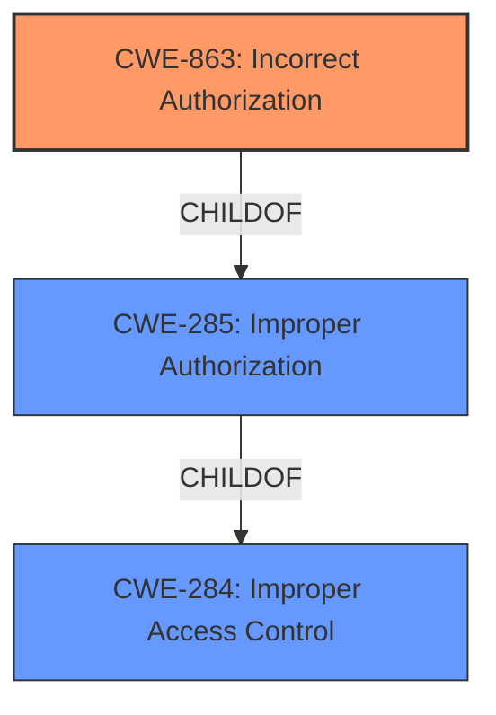

# Enhanced Analysis for CVE-2022-22394

# Summary
| CWE ID | CWE Name | Confidence | CWE Abstraction Level | CWE Vulnerability Mapping Label | CWE-Vulnerability Mapping Notes |
|---|---|---|---|---|---|
| CWE-863 | Incorrect Authorization | 0.9 | Class | Primary | Allowed-with-Review |
| CWE-285 | Improper Authorization | 0.7 | Class | Secondary | Discouraged |
| CWE-284 | Improper Access Control | 0.6 | Pillar | Secondary | Discouraged |

## Evidence and Confidence

*   **Confidence Score:** 0.9
*   **Evidence Strength:** HIGH

## Relationship Analysis
The primary CWE selected is CWE-863, Incorrect Authorization, which is a child of CWE-285, Improper Authorization. CWE-285 is in turn a child of CWE-284, Improper Access Control. We move from general access control issues (CWE-284) to the more specific authorization problems (CWE-285 and CWE-863). Because the vulnerability involves an authorization check that is performed incorrectly, CWE-863 is more appropriate than its parents.



## Vulnerability Chain
The chain of root cause and weaknesses for the Vulnerability Description is as follows:
1.  Root Cause: **Improper enforcement of access controls**
2.  Weakness: Security restrictions are bypassed
3.  Impact: Unauthorized administrator or node access is gained

## Summary of Analysis
The initial analysis focused on the **improper enforcement of access controls**, which is the root cause of the vulnerability. The retriever results pointed to several CWEs related to access control and authorization.

The vulnerability description explicitly states "**improper enforcement of access controls**". This directly aligns with the concept of authorization, where access to resources is not correctly checked or enforced.

CWE-863 (Incorrect Authorization) is the most appropriate because it describes a scenario where an authorization check is performed, but it is done incorrectly. The description mentions that "By signing in, an attacker could exploit this vulnerability to bypass security and gain unauthorized administrator or node access to the vulnerable server." This implies that an authentication process is in place, but the subsequent authorization is flawed, allowing the attacker to gain elevated privileges.

CWE-285 (Improper Authorization) is a more general class of authorization issues and could be considered as a secondary CWE. However, CWE-863 is preferred due to its greater specificity.

CWE-284 (Improper Access Control) is too general and is discouraged by MITRE, which suggests using more specific descendants.

The selected CWEs are at the optimal level of specificity. CWE-863 accurately reflects the **incorrect authorization** mechanism at play, while acknowledging its relationship to the broader category of access control (CWE-284 and CWE-285).


## CWE Relationship Analysis

Current CWEs represent these abstraction levels: .


### Vulnerability Chain Analysis

**Chain starting from CWE-285:**
- 285 (Improper Authorization) - ROOT


**Chain starting from CWE-863:**
- 863 (Incorrect Authorization) - ROOT


### CWE Relationship Diagram

```mermaid
graph TD
    classDef primary fill:#f96,stroke:#333,stroke-width:2px
    classDef secondary fill:#69f,stroke:#333
    classDef tertiary fill:#9e9,stroke:#333
```