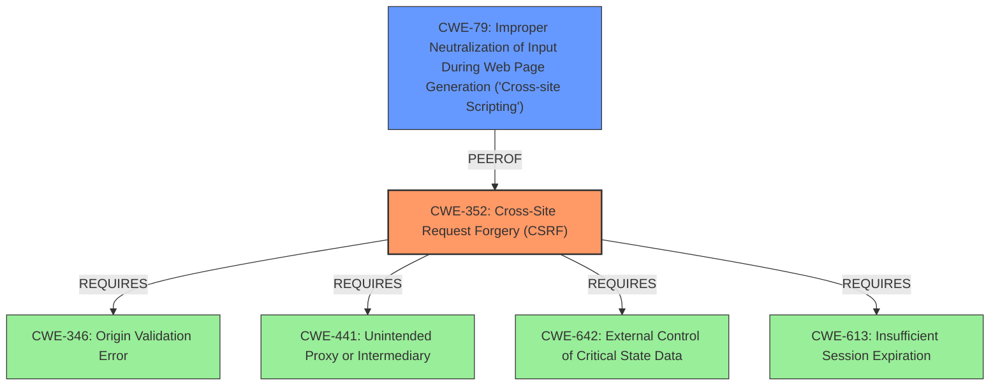

# Analysis Report for CVE-2022-2241

# Vulnerability Analysis Report: CVE-2022-2241

## Description


## Analysis (with Relationship Data)

# Summary
| CWE ID | CWE Name | Confidence | CWE Abstraction Level | CWE Vulnerability Mapping Label | CWE-Vulnerability Mapping Notes |
|---|---|---|---|---|---|
| CWE-352 | Cross-Site Request Forgery (CSRF) | 1.0 | Compound | Allowed | Primary CWE |
| CWE-79 | Improper Neutralization of Input During Web Page Generation ('Cross-site Scripting') | 1.0 | Base | Allowed | Secondary CWE |

## Evidence and Confidence

*   **Confidence Score:** 1.0
*   **Evidence Strength:** HIGH

## Relationship Analysis
The primary CWE is CWE-352, Cross-Site Request Forgery (CSRF), which is a Compound CWE. It REQUIRES other CWEs to be present, such as CWE-346, CWE-441, CWE-642 and CWE-613. CWE-79, Improper Neutralization of Input During Web Page Generation ('Cross-site Scripting'), is a Base CWE and a peer of CWE-352. There is a relationship between XSS and CSRF since an attacker might use CSRF to trick the victim into submitting requests to the server containing an XSS payload.



## Vulnerability Chain
The vulnerability chain begins with a **lack of CSRF check** (CWE-352) which allows attackers to make a logged in admin change the settings via a CSRF attack. The **lack of validation, sanitisation and escaping** (CWE-79) in some of the settings could lead to Stored XSS issues.

## Summary of Analysis
The vulnerability description clearly states that the WordPress plugin **lacks CSRF check** which can allow attackers to change settings. The vulnerability description also states the **lack of validation, sanitisation and escaping** could lead to Stored XSS issues. The CVE Reference Links Content Summary further supports these findings.

The primary weakness is the **lack of CSRF protection** (CWE-352) when updating settings. The secondary weakness is the **lack of proper input validation, sanitization, and escaping** (CWE-79) in some settings, leading to Stored XSS.

The retriever results also suggest these findings.

I am confident in these findings because there is sufficient evidence provided.

Relevant CWE Information:

*   **CWE-352: Cross-Site Request Forgery (CSRF)** - The web application does not sufficiently verify whether a well-formed, valid, consistent request was intentionally provided by the user who submitted the request. The vulnerability description states that there is **no CSRF check in place when updating its settings**. This aligns perfectly with the CWE description.
*   **CWE-79: Improper Neutralization of Input During Web Page Generation ('Cross-site Scripting')** - The product does not neutralize or incorrectly neutralizes user-controllable input before it is placed in output that is used as a web page that is served to other users. The vulnerability description states that there is a **lack of validation, sanitisation and escaping in some of them, it could also lead to Stored XSS issues**. This also aligns perfectly with the CWE description.

Other CWEs Considered:

*   CWE-116: Improper Encoding or Escaping of Output - While related to XSS, CWE-79 is a more specific and appropriate fit for this vulnerability.
*   CWE-862: Missing Authorization and CWE-863: Incorrect Authorization - These CWEs address authorization issues, but the primary issue here is the lack of CSRF protection, which is a distinct weakness.
*   CWE-434: Unrestricted Upload of File with Dangerous Type - This CWE is not relevant as the vulnerability does not involve file uploads.
*   CWE-472: External Control of Assumed-Immutable Web Parameter - While this could be a contributing factor, the main issue is the **lack of CSRF protection** and XSS.


## CWE Relationship Analysis

Current CWEs represent these abstraction levels: .


### Vulnerability Chain Analysis

**Chain starting from CWE-862:**
- 862 (Missing Authorization) - ROOT


**Chain starting from CWE-472:**
- 472 (External Control of Assumed-Immutable Web Parameter) - ROOT


### CWE Relationship Diagram

```mermaid
graph TD
    classDef primary fill:#f96,stroke:#333,stroke-width:2px
    classDef secondary fill:#69f,stroke:#333
    classDef tertiary fill:#9e9,stroke:#333
```


*Report generated on 2025-03-31 05:41:48*
