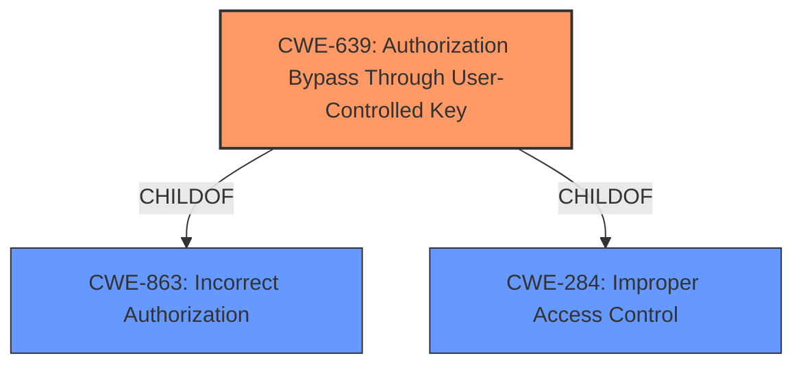

# Analysis Report for CVE-2022-2244

# Vulnerability Analysis Report: CVE-2022-2244

## Description


## Analysis (with Relationship Data)

# Summary
| CWE ID | CWE Name | Confidence | CWE Abstraction Level | CWE Vulnerability Mapping Label | CWE-Vulnerability Mapping Notes |
|---|---|---|---|---|---|
| CWE-639 | Authorization Bypass Through User-Controlled Key | 1.0 | Base | Allowed | Primary CWE |
| CWE-863 | Incorrect Authorization | 0.7 | Class | Allowed-with-Review | Secondary Candidate |

## Evidence and Confidence

*   **Confidence Score:** 0.9
*   **Evidence Strength:** HIGH

## Relationship Analysis
The primary CWE is CWE-639, which is a base-level CWE and a child of CWE-863 and CWE-284. CWE-863 is a class-level CWE that represents an incorrect authorization check, and CWE-284 is a pillar-level CWE that represents improper access control. Because CWE-639 is the most specific, it is the preferred choice.



## Vulnerability Chain
The vulnerability chain starts with **improper authorization**, specifically an Insecure Direct Object Reference (IDOR). The lack of proper authorization checks allows an attacker to access resources they should not, leading to information leakage and data modification.

## Summary of Analysis
The initial assessment identified **improper authorization** as the root cause. Further analysis of the "CVE Reference Links Content Summary" section revealed that the vulnerability is specifically an Insecure Direct Object Reference (IDOR), where the system uses a user-supplied ID without proper authorization checks.

The retriever results indicated CWE-639 (Authorization Bypass Through User-Controlled Key) as a strong candidate. This CWE aligns well with the vulnerability description because it involves bypassing authorization by manipulating a user-controlled key (the issue ID in the URL).

The relationship analysis confirmed that CWE-639 is a more specific (Base) CWE compared to CWE-863 (Incorrect Authorization) and CWE-284 (Improper Access Control), which are higher-level (Class and Pillar, respectively). Therefore, CWE-639 is the most appropriate choice.

The selection of CWE-639 is based on the following evidence:

*   The "Vulnerability Description Key Phrases" section identifies "**improper authorization**" as the root cause.
*   The "CVE Reference Links Content Summary" section describes the vulnerability as an IDOR, where the system relies on a user-supplied ID without proper authorization checks. "Specifically, when a user requests details about a Sentry error, GitLab directly uses the issue ID provided in the URL without verifying if the issue belongs to the Sentry project configured for the GitLab project."
*   CWE-639 (Authorization Bypass Through User-Controlled Key) aligns with the IDOR nature of the vulnerability, as it involves bypassing authorization by manipulating a user-controlled key. "The system's authorization functionality does not prevent one user from gaining access to another user's data or record by modifying the key value identifying the data."
*   CWE-639 is a Base-level CWE, which is the preferred level of abstraction for mapping to the root causes of vulnerabilities.

Other CWEs considered but not used:

*   CWE-285 (Improper Authorization): This CWE is a class-level CWE and is too general for this vulnerability. While it's related, CWE-639 is more specific and accurately reflects the IDOR nature of the vulnerability.
*   CWE-863 (Incorrect Authorization): This CWE is also a class-level CWE and is less specific than CWE-639. It represents a general incorrect authorization check, while CWE-639 specifically addresses authorization bypass through user-controlled keys.
*   CWE-425 (Direct Request ('Forced Browsing')): While related, this CWE focuses on the lack of authorization on restricted URLs, which is a broader category than the specific IDOR vulnerability described.

The selection of CWE-639 is at the optimal level of specificity because it accurately reflects the root cause of the vulnerability (IDOR) and is a Base-level CWE, which is the preferred level of abstraction.

Relevant CWE Information:

# Enhanced Context (25 CWEs)
The following CWEs were identified as potentially relevant to this vulnerability:

## CWE-668: Exposure of Resource to Wrong Sphere
**Abstraction Level**: Class
**Similarity Score**: 0.75
**Source**: dense

**Description**:
The product exposes a resource to the wrong control sphere, providing unintended actors with inappropriate access to the resource.

**Mapping Guidance**:
- Usage: Discouraged
- Rationale: CWE-668 is high-level and is often misused as a catch-all when lower-level CWE IDs might be applicable. It is sometimes used for low-information vulnerability reports [REF-1287]. It is a level-1 Class (i.e., a child of a Pillar). It is not useful for trend analysis.


## CWE-639: Authorization Bypass Through User-Controlled Key
**Abstraction Level**: Base
**Similarity Score**: 0.75
**Source**: dense

**Description**:
The system's authorization functionality does not prevent one user from gaining access to another user's data or record by modifying the key value identifying the data.

**Mapping Guidance**:
- Usage: Allowed
- Rationale: This CWE entry is at the Base level of abstraction, which is a preferred level of abstraction for mapping to the root causes of vulnerabilities.


## CWE-664: Improper Control of a Resource Through its Lifetime
**Abstraction Level**: Pillar
**Similarity Score**: 0.74
**Source**: dense

**Description**:
The product does not maintain or incorrectly maintains control over a resource throughout its lifetime of creation, use, and release.

**Mapping Guidance**:
- Usage: Discouraged
- Rationale: This CWE entry is high-level when lower-level children are available.


## CWE-212: Improper Removal of Sensitive Information Before Storage or Transfer
**Abstraction Level**: Base
**Similarity Score**: 0.74
**Source**: dense

**Description**:
The product stores, transfers, or shares a resource that contains sensitive information, but it does not properly remove that information before the product makes the resource available to unauthorized actors.

**Mapping Guidance**:
- Usage: Allowed
- Rationale: This CWE entry is at the Base level of abstraction, which is a preferred level of abstraction for mapping to the root causes of vulnerabilities.


## CWE-404: Improper Resource Shutdown or Release
**Abstraction Level**: Class
**Similarity Score**: 0.74
**Source**: dense

**Description**:
The product does not release or incorrectly releases a resource before it is made available for re-use.

**Mapping Guidance**:
- Usage: Allowed-with-Review
- Rationale: This CWE entry is a Class and might have Base-level children that would be more appropriate


## CWE-552: Files or Directories Accessible to External Parties
**Abstraction Level**: Base
**Similarity Score**: 0.74
**Source**: dense

**Description**:
The product makes files or directories accessible to unauthorized actors, even though they should not be.

**Mapping Guidance**:
- Usage: Allowed
- Rationale: This CWE entry is at the Base level of abstraction, which is a preferred level of abstraction for mapping to the root causes of vulnerabilities.


## CWE-538: Insertion of Sensitive Information into Externally-Accessible File or Directory
**Abstraction Level**: Base
**Similarity Score**: 0.74
**Source**: dense

**Description**:
The product places sensitive information into files or directories that are accessible to actors who are allowed to have access to the files, but not to the sensitive information.

**Mapping Guidance**:
- Usage: Allowed
- Rationale: This CWE entry is at the Base level of abstraction, which is a preferred level of abstraction for mapping to the root causes of vulnerabilities.


## CWE-274: Improper Handling of Insufficient Privileges
**Abstraction Level**: Base
**Similarity Score**: 0.73
**Source**: dense

**Description**:
The product does not handle or incorrectly handles when it has insufficient privileges to perform an operation, leading to resultant weaknesses.

**Mapping Guidance**:
- Usage: Discouraged
- Rationale: This CWE entry could be deprecated in a future version of CWE.


## CWE-41: Improper Resolution of Path Equivalence
**Abstraction Level**: Base
**Similarity Score**: 0.73
**Source**: dense

**Description**:
The product is vulnerable to file system contents disclosure through path equivalence. Path equivalence involves the use of special characters in file and directory names. The associated manipulations are intended to generate multiple names for the same object.

**Mapping Guidance**:


## CWE Relationship Analysis

Current CWEs represent these abstraction levels: .


### Vulnerability Chain Analysis

**Chain starting from CWE-552:**
- 552 (Files or Directories Accessible to External Parties) - ROOT


**Chain starting from CWE-425:**
- 425 (Direct Request ('Forced Browsing')) - ROOT


### CWE Relationship Diagram

```mermaid
graph TD
    classDef primary fill:#f96,stroke:#333,stroke-width:2px
    classDef secondary fill:#69f,stroke:#333
    classDef tertiary fill:#9e9,stroke:#333
```


*Report generated on 2025-03-31 01:55:12*
