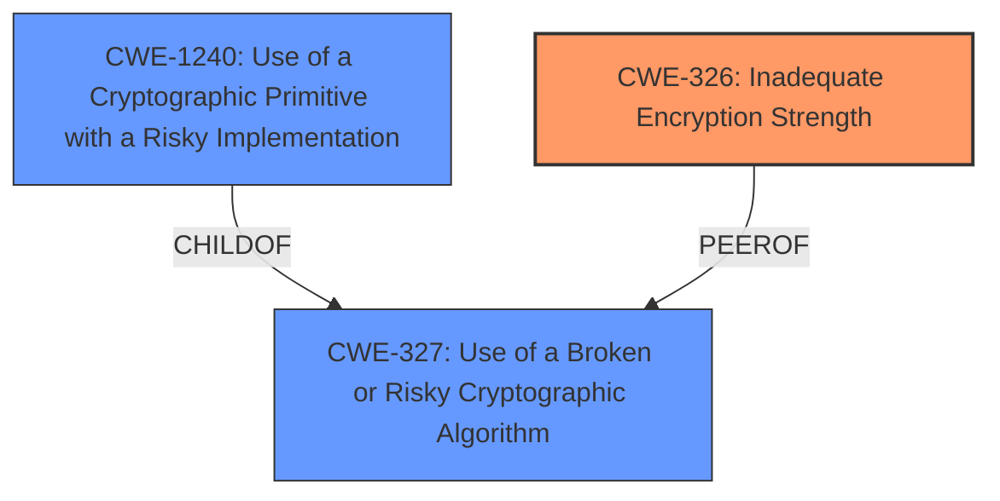

# Analysis Report for CVE-2022-22453

# Vulnerability Analysis Report: CVE-2022-22453

## Description


## Analysis (with Relationship Data)

# Summary
| CWE ID | CWE Name | Confidence | CWE Abstraction Level | CWE Vulnerability Mapping Label | CWE-Vulnerability Mapping Notes |
|---|---|---|---|---|---|
| CWE-326 | Inadequate Encryption Strength | 0.8 | Class | Allowed-with-Review | Primary CWE. The vulnerability description indicates the use of **weaker than expected cryptographic algorithms**. |
| CWE-327 | Use of a Broken or Risky Cryptographic Algorithm | 0.7 | Class | Allowed-with-Review | Secondary CWE. Although **inadequate encryption strength** is mentioned, it might involve broken or risky cryptographic algorithms. |
| CWE-1240 | Use of a Cryptographic Primitive with a Risky Implementation | 0.6 | Base | Allowed | Secondary CWE. It could be a risky implementation of a cryptographic primitive. |

## Evidence and Confidence

*   **Confidence Score:** 0.7
*   **Evidence Strength:** MEDIUM

## Relationship Analysis
The primary CWE is CWE-326, which is a Class-level CWE. CWE-327 and CWE-1240 were considered as possible related CWEs. CWE-327 (Use of a Broken or Risky Cryptographic Algorithm) is a peer of CWE-311 (Missing Encryption of Sensitive Data), while CWE-1240 (Use of a Cryptographic Primitive with a Risky Implementation) is a child of CWE-327. These relationships show a potential chain where a risky algorithm (CWE-327) might stem from a risky implementation (CWE-1240). The abstraction levels influenced the decision to choose CWE-326 as primary, given the limited information, but to include CWE-327 and CWE-1240 as secondary considerations.



## Vulnerability Chain
The vulnerability chain starts with the **use of weaker than expected cryptographic algorithms** (CWE-326), which can potentially lead to the decryption of highly sensitive information. This chain highlights the initial weakness and its direct impact.
  - Root Cause: CWE-326 (**weaker than expected cryptographic algorithms**)
  - Impact: Decrypt highly sensitive information

## Summary of Analysis
The initial assessment focused on the vulnerability description mentioning **weaker than expected cryptographic algorithms**. The retriever results pointed towards CWE-326 (Inadequate Encryption Strength), CWE-327 (Use of a Broken or Risky Cryptographic Algorithm), and CWE-1240 (Use of a Cryptographic Primitive with a Risky Implementation).

The final decision to select CWE-326 as the primary CWE is based on the evidence: "IBM Security Verify Identity Manager 10.0 uses **weaker than expected cryptographic algorithms** that could allow an attacker to decrypt highly sensitive information." This statement directly aligns with the description of CWE-326, which is about using encryption that is "not strong enough for the level of protection required."

CWE-327 and CWE-1240 are included as secondary considerations due to the possibility that the **inadequate encryption strength** stems from either a broken/risky algorithm or a risky implementation of a cryptographic primitive, respectively. However, without more specific details, CWE-326 is the most appropriate primary mapping.

The selected CWEs are at the optimal level of specificity because they directly address the described weakness without making assumptions about the underlying cause. CWE-326 captures the essence of the problem, while CWE-327 and CWE-1240 represent potential underlying causes that cannot be confirmed with the available evidence.

Relevant CWE Information:

# Enhanced Context (25 CWEs)
The following CWEs were identified as potentially relevant to this vulnerability:

## CWE-1240: Use of a Cryptographic Primitive with a Risky Implementation
**Abstraction Level**: Base
**Similarity Score**: 0.79
**Source**: dense

**Description**:
To fulfill the need for a cryptographic primitive, the product implements a cryptographic algorithm using a non-standard, unproven, or disallowed/non-compliant cryptographic implementation.

**Mapping Guidance**:
- Usage: Allowed
- Rationale: This CWE entry is at the Base level of abstraction, which is a preferred level of abstraction for mapping to the root causes of vulnerabilities.

## CWE-1391: Use of Weak Credentials
**Abstraction Level**: Class
**Similarity Score**: 0.78
**Source**: dense

**Description**:
The product uses weak credentials (such as a default key or hard-coded password) that can be calculated, derived, reused, or guessed by an attacker.

**Mapping Guidance**:
- Usage: Allowed-with-Review
- Rationale: This CWE entry is a Class and might have Base-level children that would be more appropriate

## CWE-312: Cleartext Storage of Sensitive Information
**Abstraction Level**: Base
**Similarity Score**: 0.76
**Source**: dense

**Description**:
The product stores sensitive information in cleartext within a resource that might be accessible to another control sphere.

**Mapping Guidance**:
- Usage: Allowed
- Rationale: This CWE entry is at the Base level of abstraction, which is a preferred level of abstraction for mapping to the root causes of vulnerabilities.

## CWE-330: Use of Insufficiently Random Values
**Abstraction Level**: Class
**Similarity Score**: 0.76
**Source**: dense

**Description**:
The product uses insufficiently random numbers or values in a security context that depends on unpredictable numbers.

**Mapping Guidance**:
- Usage: Discouraged
- Rationale: This CWE entry is a level-1 Class (i.e., a child of a Pillar). It might have lower-level children that would be more appropriate

## CWE-203: Observable Discrepancy
**Abstraction Level**: Base
**Similarity Score**: 0.76
**Source**: dense

**Description**:
The product behaves differently or sends different responses under different circumstances in a way that is observable to an unauthorized actor, which exposes security-relevant information about the state of the product, such as whether a particular operation was successful or not.

**Mapping Guidance**:
- Usage: Allowed
- Rationale: This CWE entry is at the Base level of abstraction, which is a preferred level of abstraction for mapping to the root causes of vulnerabilities.

## CWE-345: Insufficient Verification of Data Authenticity
**Abstraction Level**: Class
**Similarity Score**: 0.76
**Source**: dense

**Description**:
The product does not sufficiently verify the origin or authenticity of data, in a way that causes it to accept invalid data.

**Mapping Guidance**:
- Usage: Discouraged
- Rationale: This CWE entry is a level-1 Class (i.e., a child of a Pillar). It might have lower-level children that would be more appropriate

## CWE-319: Cleartext Transmission of Sensitive Information
**Abstraction Level**: Base
**Similarity Score**: 0.75
**Source**: dense

**Description**:
The product transmits sensitive or security-critical data in cleartext in a communication channel that can be sniffed by unauthorized actors.

**Mapping Guidance**:
- Usage: Allowed
- Rationale: This CWE entry is at the Base level of abstraction, which is a preferred level of abstraction for mapping to the root causes of vulnerabilities.

## CWE-311: Missing Encryption of Sensitive Data
**Abstraction Level**: Class
**Similarity Score**: 0.75
**Source**: dense

**Description**:
The product does not encrypt sensitive or critical information before storage or transmission.

**Mapping Guidance**:
- Usage: Discouraged
- Rationale: CWE-311 is high-level with more precise children available. It is a level-1 Class (i.e., a child of a Pillar).

## CWE-331: Insufficient Entropy
**Abstraction Level**: Base
**Similarity Score**: 0.75
**Source**: dense

**Description**:
The product uses an algorithm or scheme that produces insufficient entropy, leaving patterns or clusters of values that are more likely to occur than others.

**Mapping Guidance**:
- Usage: Allowed
- Rationale: This CWE entry is at the Base level of abstraction, which is a preferred level of abstraction for mapping to the root causes of vulnerabilities.

## CWE-656: Reliance on Security Through Obscurity
**Abstraction Level**: Class
**Similarity Score**: 0.75
**Source**: dense

**Description**:
The product uses a protection mechanism whose strength depends heavily on its obscurity, such that knowledge of its algorithms


## CWE Relationship Analysis

Current CWEs represent these abstraction levels: .


### Vulnerability Chain Analysis

**Chain starting from CWE-203:**
- 203 (Observable Discrepancy) - ROOT


**Chain starting from CWE-327:**
- 327 (Use of a Broken or Risky Cryptographic Algorithm) - ROOT


### CWE Relationship Diagram

```mermaid
graph TD
    classDef primary fill:#f96,stroke:#333,stroke-width:2px
    classDef secondary fill:#69f,stroke:#333
    classDef tertiary fill:#9e9,stroke:#333
```


*Report generated on 2025-03-30 15:47:39*
