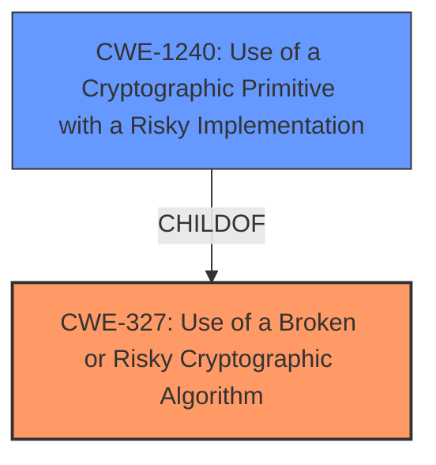

# Enhanced Analysis for CVE-2022-22461

# Summary
| CWE ID | CWE Name | Confidence | CWE Abstraction Level | CWE Vulnerability Mapping Label | CWE-Vulnerability Mapping Notes |
|---|---|---|---|---|---|
| CWE-327 | Use of a Broken or Risky Cryptographic Algorithm | 0.9 | Class | Allowed-with-Review | Primary CWE |
| CWE-1240 | Use of a Cryptographic Primitive with a Risky Implementation | 0.7 | Base | Allowed | Secondary Candidate |

## Evidence and Confidence

*   **Confidence Score:** 0.8
*   **Evidence Strength:** MEDIUM

## Relationship Analysis
The primary CWE is CWE-327 **Use of a Broken or Risky Cryptographic Algorithm**, which is a Class-level CWE. A more specific Base CWE related to this issue is CWE-1240 **Use of a Cryptographic Primitive with a Risky Implementation**, a child of CWE-327.



## Vulnerability Chain
The vulnerability chain starts with the **use of weak cryptographic algorithms** (CWE-327), which leads to the potential **decryption of highly sensitive information**.

## Summary of Analysis
The initial analysis identified CWE-327 **Use of a Broken or Risky Cryptographic Algorithm** as the primary candidate due to the vulnerability description explicitly stating the use of **weak cryptographic algorithms**. The **Vulnerability Description Key Phrases** section supports this with the rootcause identified as "**weak cryptographic algorithms**".

The Retriever Results also support CWE-327 as the top candidate.

Although CWE-327 is a Class-level CWE, the evidence does not allow for a more specific Base CWE to be selected with complete confidence. However, CWE-1240 **Use of a Cryptographic Primitive with a Risky Implementation** is a possible candidate.

Therefore, the final selection includes CWE-327 as the primary weakness, with CWE-1240 as a secondary candidate to be considered.

Relevant CWE Information:

# Enhanced Context (25 CWEs)

## CWE-327: Use of a Broken or Risky Cryptographic Algorithm
**Abstraction:** Class
**Status:** Draft

### Description
The product uses a broken or risky cryptographic algorithm or protocol.

### Extended Description
Cryptographic algorithms are the methods by which data is scrambled to prevent observation or influence by unauthorized actors. Insecure cryptography can be exploited to expose sensitive information, modify data in unexpected ways, spoof identities of other users or devices, or other impacts.

### Mapping Guidance
**Usage:** Allowed-with-Review
**Rationale:** This CWE entry is a Class and might have Base-level children that would be more appropriate

## CWE-1240: Use of a Cryptographic Primitive with a Risky Implementation
**Abstraction:** Base
**Status:** Draft

### Description
To fulfill the need for a cryptographic primitive, the product implements a cryptographic algorithm using a non-standard, unproven, or disallowed/non-compliant cryptographic implementation.

### Extended Description
Cryptographic protocols and systems depend on cryptographic primitives (and associated algorithms) as their basic building blocks.

I considered other CWEs from the Retriever Results, but did not select them because they were not as directly relevant to the provided vulnerability description. For example, CWE-916 **Use of Password Hash With Insufficient Computational Effort** is more specific to password hashing, while the vulnerability description refers to general cryptographic algorithms. Similarly, CWE-319 **Cleartext Transmission of Sensitive Information** describes a different type of vulnerability than the one described in the vulnerability description.


## CWE Relationship Analysis

Current CWEs represent these abstraction levels: .


### Vulnerability Chain Analysis

**Chain starting from CWE-916:**
- 916 (Use of Password Hash With Insufficient Computational Effort) - ROOT


**Chain starting from CWE-327:**
- 327 (Use of a Broken or Risky Cryptographic Algorithm) - ROOT


### CWE Relationship Diagram

```mermaid
graph TD
    classDef primary fill:#f96,stroke:#333,stroke-width:2px
    classDef secondary fill:#69f,stroke:#333
    classDef tertiary fill:#9e9,stroke:#333
```