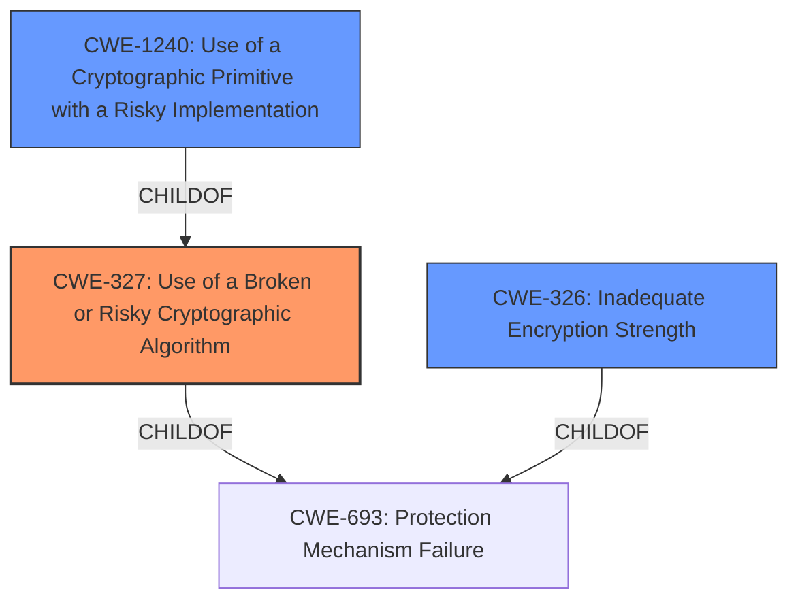

# Analysis for CVE-2022-22462

# Summary
| CWE ID | CWE Name | Confidence | CWE Abstraction Level | CWE Vulnerability Mapping Label | CWE-Vulnerability Mapping Notes |
|---|---|---|---|---|---|
| CWE-327 | Use of a Broken or Risky Cryptographic Algorithm | 0.9 | Class | Allowed-with-Review | Primary CWE. The product uses weaker than expected cryptographic algorithms. |
| CWE-1240 | Use of a Cryptographic Primitive with a Risky Implementation | 0.7 | Base | Allowed | Secondary Candidate. The vulnerability description indicates the use of a potentially risky cryptographic implementation, but it does not provide specific details. |
| CWE-326 | Inadequate Encryption Strength | 0.6 | Class | Allowed-with-Review | Secondary Candidate. This CWE is related to using encryption that is not strong enough, which aligns with the description of weaker than expected cryptographic algorithms. |

## Evidence and Confidence

*   **Confidence Score:** 0.8
*   **Evidence Strength:** MEDIUM

## Relationship Analysis
The primary CWE is CWE-327, a Class-level weakness describing the use of broken or risky cryptographic algorithms. CWE-1240, a Base-level weakness, is a child of CWE-327 and describes the use of a cryptographic primitive with a risky implementation. CWE-326, a Class, describes inadequate encryption strength and is related to CWE-327.

## Vulnerability Chain
The vulnerability chain starts with the **use of weak cryptographic algorithms** (CWE-327). This leads to the potential for an attacker to **decrypt highly sensitive information**, which is the impact.

## Summary of Analysis
The initial analysis identified CWE-327 as the primary weakness due to the **root cause** being **"weak cryptographic algorithms"**. The retriever results also listed CWE-327 as the top candidate.

The vulnerability description explicitly states the use of "weaker than expected cryptographic algorithms," which directly aligns with CWE-327's description: "The product uses a broken or risky cryptographic algorithm or protocol." The impact, as stated, is that an attacker could "decrypt highly sensitive information."

CWE-1240 was considered because it is a more specific Base-level CWE related to the use of cryptographic primitives with risky implementations. However, without more details about the specific cryptographic primitives used, CWE-327 is a more appropriate fit.

CWE-326 was also considered, as "Inadequate Encryption Strength" is closely related to using weak or risky cryptographic algorithms. However, CWE-327 is a more direct match for the vulnerability description.

The final decision is primarily based on the **Vulnerability Description Key Phrases**, particularly the **root cause** of **"weak cryptographic algorithms"** and the CVE Reference Links Content Summary that indicates the use of weak cryptography.

The selection of CWE-327 is at the optimal level of specificity because the description focuses on the algorithm itself being weak or risky. While further analysis could potentially identify a more specific weakness related to the implementation (CWE-1240) or strength (CWE-326) of the encryption, the available evidence does not support such a determination.