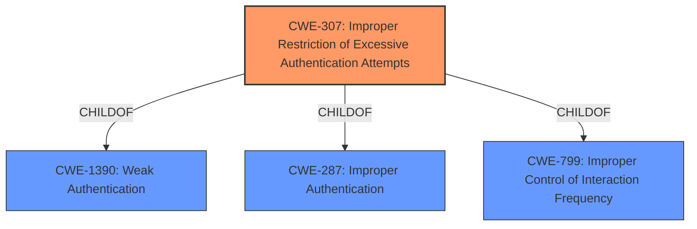

# Enhanced Analysis for CVE-2022-22485

# Summary
| CWE ID | CWE Name | Confidence | CWE Abstraction Level | CWE Vulnerability Mapping Label | CWE-Vulnerability Mapping Notes |
|---|---|---|---|---|---|
| CWE-307 | Improper Restriction of Excessive Authentication Attempts | 1.0 | Base | Allowed | Primary CWE |

## Evidence and Confidence

*   **Confidence Score:** 1.0
*   **Evidence Strength:** HIGH

## Relationship Analysis
The primary CWE, CWE-307, is a Base level CWE which is ideal for this vulnerability. CWE-307 is a child of both CWE-1390 (Weak Authentication) and CWE-287 (Improper Authentication), but those are class level CWEs. CWE-307 is also a child of CWE-799 (Improper Control of Interaction Frequency) which is a peer that describes a similar vulnerability.



## Vulnerability Chain
The vulnerability chain starts with the **improper handling of failed login attempts**, specifically the **failure to increment the counter for invalid sign-on attempts** from the Operations Center. This leads to the **impact** where an attacker could use brute force techniques to gain unauthorized administrative access to the IBM Spectrum Protect Server.

## Summary of Analysis
The vulnerability description states that "an unsuccessful attempt to log into IBM Spectrum Protect Operations Center 8.1.0.000 through 8.1.14.000 does not cause the administrators invalid sign-on count to be incremented on the IBM Spectrum Protect Server. An attacker could exploit this vulnerability using brute force techniques to gain unauthorized administrative access to the IBM Spectrum Protect Server". The CVE Reference Links Content Summary states "The IBM Spectrum Protect Server, in certain instances, may not increment the number of invalid sign-on attempts from Operations Center." This means that there is a **missing** or **improper** restriction on authentication attempts which is described by CWE-307: Improper Restriction of Excessive Authentication Attempts. The retriever results also lists CWE-307 as the highest ranked CWE with a base abstraction level.

Other CWEs were considered but not selected:

*   CWE-522: Insufficiently Protected Credentials - This CWE addresses the insecure storage or transmission of credentials, but the provided vulnerability description does not indicate credentials are being handled insecurely.
*   CWE-327: Use of a Broken or Risky Cryptographic Algorithm - This CWE addresses the use of weak or broken encryption algorithms, but the provided vulnerability description does not indicate that cryptography is involved.
*   CWE-319: Cleartext Transmission of Sensitive Information - This CWE addresses the transmission of sensitive information in cleartext, but the provided vulnerability description does not indicate that information is being transmitted in cleartext.
*   CWE-326: Inadequate Encryption Strength - This CWE addresses the use of encryption that is not strong enough, but the provided vulnerability description does not indicate that encryption is being used.
*   CWE-778: Insufficient Logging - This CWE addresses the omission of security-critical events from logs. While logging might be a secondary concern, the primary weakness is the lack of restriction on authentication attempts.
*   CWE-208: Observable Timing Discrepancy - This CWE addresses timing discrepancies that reveal information. This is not relevant to the vulnerability description.
*   CWE-287: Improper Authentication - This CWE is a class level CWE that is too general. CWE-307 is a child of CWE-287 and is a better fit.
*   CWE-799: Improper Control of Interaction Frequency - This CWE addresses the failure to limit the frequency of interactions, and could have been a possible match, but is less precise than CWE-307. The description of CWE-799 says, "an authentication routine might not limit the number of times an attacker can guess a password" which is similar to the vulnerability description, but CWE-307 covers this case directly.
*   CWE-1390: Weak Authentication - This CWE is a class level CWE that is too general. CWE-307 is a child of CWE-1390 and is a better fit.

Relevant CWE Information:


## CWE Relationship Analysis

Current CWEs represent these abstraction levels: .


### Vulnerability Chain Analysis

**Chain starting from CWE-208:**
- 208 (Observable Timing Discrepancy) - ROOT


**Chain starting from CWE-327:**
- 327 (Use of a Broken or Risky Cryptographic Algorithm) - ROOT


### CWE Relationship Diagram

```mermaid
graph TD
    classDef primary fill:#f96,stroke:#333,stroke-width:2px
    classDef secondary fill:#69f,stroke:#333
    classDef tertiary fill:#9e9,stroke:#333
```