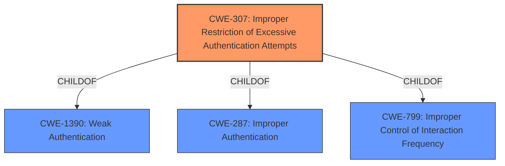

# Raw Analyzer Response for CVE-2022-22487

# Summary
| CWE ID | CWE Name | Confidence | CWE Abstraction Level | CWE Vulnerability Mapping Label | CWE-Vulnerability Mapping Notes |
|---|---|---|---|---|---|
| CWE-307 | Improper Restriction of Excessive Authentication Attempts | 1.0 | Base | Allowed | Primary CWE |

## Evidence and Confidence

*   **Confidence Score:** 1.0
*   **Evidence Strength:** HIGH

## Relationship Analysis
CWE-307 is a Base level CWE that describes the **improper restriction of excessive authentication attempts**. It is a child of CWE-1390 (Weak Authentication), CWE-287 (Improper Authentication), and CWE-799 (Improper Control of Interaction Frequency). The vulnerability description explicitly states that the **rootcause** is the "**allow unlimited attempts to login to the storage agent without locking the administrative ID**". This aligns perfectly with the description of CWE-307.

## Vulnerability Chain
The vulnerability chain is:
1.  **Root Cause:** **Improper Restriction of Excessive Authentication Attempts** (CWE-307) - The system **allows unlimited attempts to login without locking the administrative ID**.
2.  **Attack Vector:** Brute Force - A remote attacker exploits this by using brute force techniques.
3.  **Impact:** Unauthorized Administrative Access - The attacker gains unauthorized administrative access to the IBM Spectrum Protect storage agent and server.

## Summary of Analysis
The initial analysis identified CWE-307 as the primary candidate based on the **rootcause** described in the vulnerability description, which is the "**allow unlimited attempts to login to the storage agent without locking the administrative ID**". This perfectly aligns with the CWE-307 description, which addresses the **improper restriction of excessive authentication attempts**.

The retriever results also support CWE-307 as the top candidate.

Based on the vulnerability description and supporting retriever results, CWE-307 is the most appropriate CWE. The CWE is at the Base level of abstraction, which is the preferred level, and the mapping guidance allows its usage.

Other CWEs considered but not used:
*   CWE-256: Plaintext Storage of a Password - This is not relevant, as the vulnerability is about the lack of lockout, not the storage of passwords.
*   CWE-522: Insufficiently Protected Credentials - This is a class-level CWE and doesn't fit as precisely as CWE-307.
*   CWE-327: Use of a Broken or Risky Cryptographic Algorithm - Not related to cryptography issues.
*   CWE-799: Improper Control of Interaction Frequency - While related, CWE-307 is a more specific child that directly addresses the authentication attempt issue.
*   CWE-1390: Weak Authentication - This is a class-level CWE and doesn't fit as precisely as CWE-307.
Relevant CWE Information: