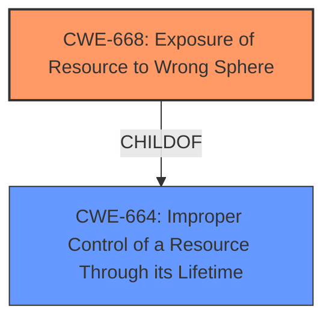

# Raw Analyzer Response for CVE-2022-22515

# Summary
| CWE ID    | CWE Name                                                              | Confidence | CWE Abstraction Level | CWE Vulnerability Mapping Label | CWE-Vulnerability Mapping Notes |
| :-------- | :-------------------------------------------------------------------- | :--------- | :---------------------- | :------------------------------ | :------------------------------ |
| CWE-668   | Exposure of Resource to Wrong Sphere                                  | 0.9        | Class                   | Primary CWE                     | Discouraged                   |

## Evidence and Confidence

*   **Confidence Score:** 0.9
*   **Evidence Strength:** HIGH

## Relationship Analysis
The primary relationship influencing the decision is the parent-child relationship, with CWE-668 being a child of CWE-664 (Improper Control of a Resource Through its Lifetime). The analysis considered the discouraged usage of CWE-668 due to its high-level nature but found sufficient evidence to support its relevance.

## Vulnerability Chain
The vulnerability chain involves the following sequence:

1.  **Root Cause:** **Insecure file access** through IEC code libraries (CAA File, SysFile, and SysFileAsync)
2.  **Weakness:** CWE-668 Exposure of Resource to Wrong Sphere - The control program has access to configuration files that it should not have access to.
3.  **Impact:** Unauthorized modification and reading of configuration files, leading to potential disruption of industrial processes.

## Summary of Analysis
The initial analysis focused on identifying the **root cause** of the vulnerability and mapping it to the most appropriate CWE. The provided evidence clearly indicates that the control program has access to resources (configuration files) that it should not have access to, which aligns with the description of CWE-668 (Exposure of Resource to Wrong Sphere).

The selection of CWE-668 is based on the CVE Reference Links Content Summary, which explicitly mentions: "The control program has access to resources (configuration files) that it should not have access to, allowing for unauthorized modification and reading."

While CWE-668 is discouraged for general use due to its high-level nature, the specific details provided in the vulnerability description and CVE Reference Links Content Summary provide sufficient evidence to justify its selection. This is further supported by the retriever results, which list CWE-668 as a relevant CWE with a similarity score of 0.076.

The decision to use CWE-668 is at the optimal level of specificity, considering the available information. While more specific CWEs might exist, the current evidence primarily points to the exposure of a resource to the wrong control sphere.

Relevant CWE Information:

# Enhanced Context (25 CWEs)
The following CWEs were identified as potentially relevant to this vulnerability:

## CWE-274: Improper Handling of Insufficient Privileges
**Abstraction Level**: Base
**Similarity Score**: 0.76
**Source**: dense

**Description**:
The product does not handle or incorrectly handles when it has insufficient privileges to perform an operation, leading to resultant weaknesses.

**Mapping Guidance**:
- Usage: Discouraged
- Rationale: This CWE entry could be deprecated in a future version of CWE.

*Reason for not selecting:* This CWE focuses on *insufficient* privileges, whereas the described vulnerability involves *excessive* privileges or access to resources that should not be permitted.

## CWE-1220: Insufficient Granularity of Access Control
**Abstraction Level**: Base
**Similarity Score**: 0.76
**Source**: dense

**Description**:
The product implements access controls via a policy or other feature with the intention to disable or restrict accesses (reads and/or writes) to assets in a system from untrusted agents. However, implemented access controls lack required granularity, which renders the control policy too broad because it allows accesses from unauthorized agents to the security-sensitive assets.

**Mapping Guidance**:
- Usage: Allowed
- Rationale: This CWE entry is at the Base level of abstraction, which is a preferred level of abstraction for mapping to the root causes of vulnerabilities.

*Reason for not selecting:* While related to access control issues, CWE-1220 emphasizes a lack of *granularity* in access controls. The primary issue here is that a control program has access to resources it should not, rather than a granularity problem.

## CWE-653: Improper Isolation or Compartmentalization
**Abstraction Level**: Class
**Similarity Score**: 0.76
**Source**: dense

**Description**:
The product does not properly compartmentalize or isolate functionality, processes, or resources that require different privilege levels, rights, or permissions.

**Mapping Guidance**:
- Usage: Allowed
- Rationale: This CWE entry is at the Base level of abstraction, which is a preferred level of abstraction for mapping to the root causes of vulnerabilities.

*Reason for not selecting:* This CWE is a broader category about compartmentalization. While related, CWE-668 more specifically addresses the exposure of resources to the wrong control sphere.

## CWE-664: Improper Control of a Resource Through its Lifetime
**Abstraction Level**: Pillar
**Similarity Score**: 0.76
**Source**: dense

**Description**:
The product does not maintain or incorrectly maintains control over a resource throughout its lifetime of creation, use, and release.

**Mapping Guidance**:
- Usage: Discouraged
- Rationale: This CWE entry is high-level when lower-level children are available.

*Reason for not selecting:* This is a higher-level (Pillar) CWE, and CWE-668 (its child) is a more specific and applicable classification for this vulnerability.

## CWE-668: Exposure of Resource to Wrong Sphere
**Abstraction Level**: Class
**Similarity Score**: 0.75
**Source**: dense

**Description**:
The product exposes a resource to the wrong control sphere, providing unintended actors with inappropriate access to the resource.

**Mapping Guidance**:
- Usage: Discouraged
- Rationale: CWE-668 is high-level and is often misused as a catch-all when lower-level CWE IDs might be applicable. It is sometimes used for low-information vulnerability reports [REF-1287]. It is a level-1 Class (i.e., a child of a Pillar). It is not useful for trend analysis.

*Reason for selecting:* As described above, this is the primary CWE selected.

## CWE-280: Improper Handling of Insufficient Permissions or Privileges
**Abstraction Level**: Base
**Similarity Score**: 0.75
**Source**: dense

**Description**:
The product does not handle or incorrectly handles when it has insufficient privileges to access resources or functionality as specified by their permissions. This may cause it to follow unexpected code paths that may leave the product in an invalid state.

**Mapping Guidance**:
- Usage: Allowed
- Rationale: This CWE entry is at the Base level of abstraction, which is a preferred level of abstraction for mapping to the root causes of vulnerabilities.

*Reason for not selecting:* This CWE describes the opposite problem: *insufficient* permissions, not exposure due to incorrect permissions.

## CWE-691: Insufficient Control Flow Management
**Abstraction Level**: Pillar
**Similarity Score**: 0.74
**Source**: dense

**Description**:
The code does not sufficiently manage its control flow during execution, creating conditions in which the control flow can be modified in unexpected ways.

**Mapping Guidance**:
- Usage: Discouraged
- Rationale: This CWE entry is extremely high-level, a Pillar. However, classification research is limited for weaknesses of this type, so there can be gaps or organizational difficulties within CWE that force use of this weakness, even at such a high level of abstraction.

*Reason for not selecting:* This is a very high-level CWE that doesn't accurately describe the specific issue.

## CWE-552: Files or Directories Accessible to External Parties
**Abstraction Level**: Base
**Similarity Score**: 0.74
**Source**: dense

**Description**:
The product makes files or directories accessible to unauthorized actors, even though they should not be.

**Mapping Guidance**:
- Usage: Allowed
- Rationale: This CWE entry is at the Base level of abstraction, which is a preferred level of abstraction for mapping to the root causes of vulnerabilities.

*Reason for not selecting:* While related, CWE-552 is more general and less precise than CWE-668, which captures the essence of exposing resources to the wrong control sphere.

## CWE-639: Authorization Bypass Through User-Controlled Key
**Abstraction Level**: Base
**Similarity Score**: 0.74
**Source**: dense

**Description**:
The system's authorization functionality does not prevent one user from gaining access to another user's data or record by modifying the key value identifying the data.

**Mapping Guidance**:
- Usage: Allowed
- Rationale: This CWE entry