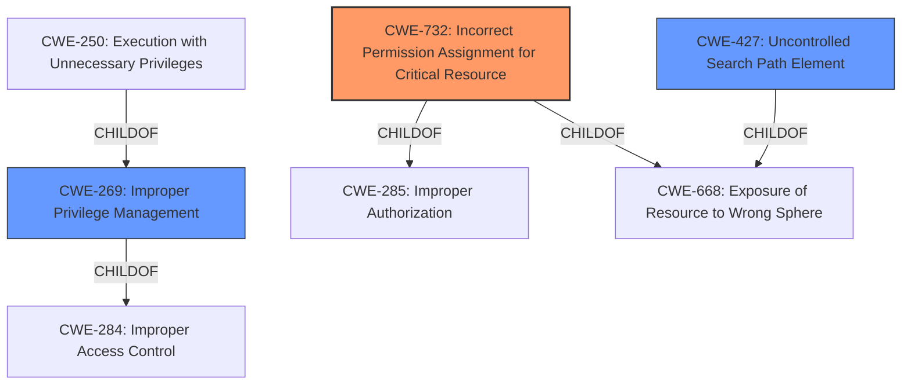

# Analysis Report for CVE-2022-22521

# Vulnerability Analysis Report: CVE-2022-22521

## Description


## Analysis (with Relationship Data)

# Summary
| CWE ID  | CWE Name                                                       | Confidence | CWE Abstraction Level | CWE Vulnerability Mapping Label | CWE-Vulnerability Mapping Notes |
| :-------- | :------------------------------------------------------------- | :--------- | :---------------------- | :------------------------------ | :------------------------------ |
| CWE-732   | Incorrect Permission Assignment for Critical Resource          | 0.9        | Class                   | Allowed-with-Review             | Primary CWE                     |
| CWE-269   | Improper Privilege Management                                  | 0.7        | Class                   | Discouraged                     | Secondary Candidate             |
| CWE-427   | Uncontrolled Search Path Element                             | 0.6        | Base                    | Allowed                         | Secondary Candidate             |

## Evidence and Confidence

*   **Confidence Score:** 0.8
*   **Evidence Strength:** HIGH

## Relationship Analysis
The primary CWE selected is CWE-732, which falls under the Class abstraction level and is a child of both CWE-285 (Improper Authorization) and CWE-668 (Exposure of Resource to Wrong Sphere). CWE-269 (Improper Privilege Management) is a parent of CWE-250 (Execution with Unnecessary Privileges) and a child of CWE-284 (Improper Access Control). CWE-427 (Uncontrolled Search Path Element) is a child of CWE-668 (Exposure of Resource to Wrong Sphere). The relationships influenced the decision to prioritize CWE-732 as it more specifically describes the **incorrect permission assignment** issue at the root of the vulnerability, while CWE-269 is a more general classification. CWE-427 was considered due to the possibility of an attacker placing a malicious executable in the affected directory, but CWE-732 more accurately captures the **root cause** of the issue.



## Vulnerability Chain
The vulnerability chain starts with the **incorrect permission assignment** on the installation directory (CWE-732), allowing a low-privileged user to **modify executable files**. This leads to a **privilege escalation** when an administrator unknowingly executes the malicious executable, granting the attacker elevated privileges.

## Summary of Analysis
The initial assessment focused on identifying the **root cause** of the vulnerability. The evidence clearly indicates that the **incorrect permission assignment** on the `C:\MIELE_SERVICE\` directory is the primary weakness. This is supported by the "CVE Reference Links Content Summary" which states: "The software fails to properly restrict write access to its installation directory, allowing any user to modify or replace files within that directory."

The retriever results also suggested CWE-732 (Incorrect Permission Assignment for Critical Resource) as the top candidate.

The decision to select CWE-732 is based on the following:

*   It directly addresses the **root cause** of the vulnerability: the **incorrect permission assignment** that allows unauthorized modification of critical resources.
*   The "CVE Reference Links Content Summary" explicitly mentions the failure to properly restrict write access to the installation directory.
*   CWE-732 is at the Class level of abstraction, providing a balance between specificity and generality.
*   While CWE-269 (Improper Privilege Management) is related, it is a more general classification and is discouraged for use when more specific CWEs are available.
*   CWE-427 (Uncontrolled Search Path Element) was considered due to the potential for an attacker to place a malicious executable in the affected directory, but CWE-732 more accurately captures the **root cause** of the issue.
*   The Mitre Mapping Guidance usage for CWE-732 is Allowed-with-Review, this is because the description is often misused for authorization issues (CWE-285). After review, this case matches the CWE description.

Based on the evidence and analysis, CWE-732 is the most appropriate classification for this vulnerability, and it is at the optimal level of specificity. Other CWEs were considered but ultimately deemed less accurate in representing the **root cause** of the issue.

Relevant CWE Information:

# Enhanced Context (25 CWEs)
The following CWEs were identified as potentially relevant to this vulnerability:

## CWE-41: Improper Resolution of Path Equivalence
**Abstraction Level**: Base
**Similarity Score**: 0.75

## CWE-184: Incomplete List of Disallowed Inputs
**Abstraction Level**: Base
**Similarity Score**: 0.75

## CWE-1289: Improper Validation of Unsafe Equivalence in Input
**Abstraction Level**: Base
**Similarity Score**: 0.75

## CWE-653: Improper Isolation or Compartmentalization
**Abstraction Level**: Class
**Similarity Score**: 0.75

## CWE-74: Improper Neutralization of Special Elements in Output Used by a Downstream Component ('Injection')
**Abstraction Level**: Class
**Similarity Score**: 0.74

## CWE-138: Improper Neutralization of Special Elements
**Abstraction Level**: Class
**Similarity Score**: 0.74

## CWE-73: External Control of File Name or Path
**Abstraction Level**: Base
**Similarity Score**: 0.73

## CWE-668: Exposure of Resource to Wrong Sphere
**Abstraction Level**: Class
**Similarity Score**: 0.73

## CWE-23: Relative Path Traversal
**Abstraction Level**: Base
**Similarity Score**: 0.73

## CWE-664: Improper Control of a Resource Through its Lifetime
**Abstraction Level**: Pillar
**Similarity Score**: 0.73

## CWE-427: Uncontrolled Search Path Element
**Abstraction Level**: Base
**Similarity Score**: 10307.82

## CWE-22: Improper Limitation of a Pathname to a Restricted Directory ('Path Traversal')
**Abstraction Level**: Base
**Similarity Score**: 9469.18

## CWE-367: Time-of-check Time-of-use (TOCTOU) Race Condition
**Abstraction Level**: Base
**Similarity Score**: 9299.48

## CWE-59: Improper Link Resolution Before File Access ('Link Following')
**Abstraction Level**: Base
**Similarity Score**: 9277.93

## CWE-23: Relative Path Traversal
**Abstraction Level**: Base
**Similarity Score**: 9116.31

## CWE-22: Improper Limitation of a Pathname to a Restricted Directory ('Path Traversal')
**Abstraction Level**: base
**Similarity Score**: 4.33

## CWE-770: Allocation of Resources Without Limits or Throttling
**Abstraction Level**: base
**Similarity Score**: 4.33

## CWE-190: Integer Overflow or Wraparound
**Abstraction Level**: base
**Similarity Score**: 4.33

## CWE-94: Improper Control of Generation of Code ('Code Injection')
**Abstraction Level**: base
**Similarity Score**: 3.89

## CWE-426: Untrusted Search Path
**Abstraction Level**: base
**Similarity Score**: 3.64

## CWE-427: Uncontrolled Search Path Element
**Abstraction Level**: base
**Similarity Score**: 3.64

## CWE-843: Access of Resource Using Incompatible Type ('Type Confusion')
**Abstraction Level**: base
**Similarity Score**: 3.44

## CWE-1284: Improper Validation of Specified Quantity in Input
**Abstraction Level**: base
**Similarity Score**: 3.42

## CWE-98: Improper Control of Filename for Include/Require Statement in PHP Program ('PHP Remote File Inclusion')
**Abstraction Level**: variant
**Similarity Score**: 3.33

## CWE-41: Improper Resolution of Path Equivalence
**Abstraction Level**: Base
**Similarity Score**: 3.32

CWE-20 (Improper Input Validation)


## CWE Relationship Analysis

Current CWEs represent these abstraction levels: .


### Vulnerability Chain Analysis

**Chain starting from CWE-41:**
- 41 (Improper Resolution of Path Equivalence) - ROOT


**Chain starting from CWE-668:**
- 668 (Exposure of Resource to Wrong Sphere) - ROOT


### CWE Relationship Diagram

```mermaid
graph TD
    classDef primary fill:#f96,stroke:#333,stroke-width:2px
    classDef secondary fill:#69f,stroke:#333
    classDef tertiary fill:#9e9,stroke:#333
```


*Report generated on 2025-03-31 10:00:48*
