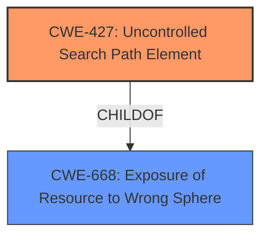

# Enhanced Analysis for CVE-2022-22528

# Summary
| CWE ID | CWE Name | Confidence | CWE Abstraction Level | CWE Vulnerability Mapping Label | CWE-Vulnerability Mapping Notes |
|---|---|---|---|---|---|
| CWE-427 | Uncontrolled Search Path Element | 0.9 | Base | Allowed | Primary CWE |

## Evidence and Confidence

*   **Confidence Score:** 0.9
*   **Evidence Strength:** MEDIUM

## Relationship Analysis
The primary relationship that influenced the selection was that CWE-427 [CWE-427: Uncontrolled Search Path Element] is a child of CWE-668 [CWE-668: Exposure of Resource to Wrong Sphere]. This indicates that the core issue involves exposing a resource to the wrong sphere of control due to an uncontrolled search path element. The vulnerability description strongly aligns with this hierarchical structure, making CWE-427 the most specific and relevant choice.



## Vulnerability Chain
The vulnerability chain starts with the ASE installer **incorrectly making an entry in the system PATH environment variable**. This leads to a standard user being able to execute malicious Windows binaries, ultimately resulting in privilege escalation.

## Summary of Analysis
The initial assessment strongly points to CWE-427 [CWE-427: Uncontrolled Search Path Element] as the most appropriate classification. The vulnerability description clearly states that the ASE installer makes an entry in the system PATH environment variable, which allows a standard user to execute malicious Windows binaries. This aligns perfectly with the description of CWE-427 [CWE-427: Uncontrolled Search Path Element], which involves the product using a fixed or controlled search path, but one or more locations in that path can be under the control of unintended actors.

The evidence for this classification is primarily derived from the **Vulnerability Description**:
"SAP Adaptive Server Enterprise (ASE) - version 16.0, installation makes an entry in the system PATH environment variable in Windows platform which, under certain conditions, allows a Standard User to execute malicious Windows binaries which may lead to privilege escalation on the local system."

The graph relationships further support this decision. CWE-427 [CWE-427: Uncontrolled Search Path Element] is a child of CWE-668 [CWE-668: Exposure of Resource to Wrong Sphere], indicating that the issue involves exposing a resource to the wrong sphere of control due to an uncontrolled search path element.

The selection of CWE-427 [CWE-427: Uncontrolled Search Path Element] is at the optimal level of specificity because it directly addresses the **root cause** of the vulnerability: the **uncontrolled search path element**. This allows a standard user to execute malicious binaries, leading to privilege escalation. Other CWEs, such as CWE-269 [CWE-269: Improper Privilege Management], are too general and do not capture the specific nature of the vulnerability.

**CWEs Considered But Not Used:**

*   **CWE-732 [CWE-732: Incorrect Permission Assignment for Critical Resource]**: While privilege escalation is an impact, the **root cause** is not an incorrect permission assignment but rather an uncontrolled search path.
*   **CWE-250 [CWE-250: Execution with Unnecessary Privileges]**: This is not about the program running with unnecessary privileges but rather about the ability of a standard user to execute malicious binaries due to the **uncontrolled search path**.
*   **CWE-59 [CWE-59: Improper Link Resolution Before File Access ('Link Following')]**: This CWE is not applicable since the vulnerability does not involve symbolic links or shortcuts.
*   **CWE-20 [CWE-20: Improper Input Validation]**: This is a broad class and does not accurately represent the specific weakness of an **uncontrolled search path element**.


## CWE Relationship Analysis

Current CWEs represent these abstraction levels: .


### Vulnerability Chain Analysis

**Chain starting from CWE-250:**
- 250 (Execution with Unnecessary Privileges) - ROOT


**Chain starting from CWE-668:**
- 668 (Exposure of Resource to Wrong Sphere) - ROOT


### CWE Relationship Diagram

```mermaid
graph TD
    classDef primary fill:#f96,stroke:#333,stroke-width:2px
    classDef secondary fill:#69f,stroke:#333
    classDef tertiary fill:#9e9,stroke:#333
```