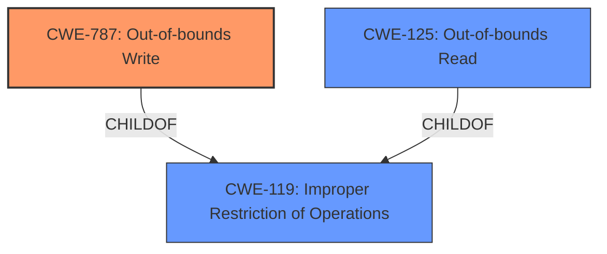

# Enhanced Analysis for CVE-2022-22538

# Summary
| CWE ID | CWE Name | Confidence | CWE Abstraction Level | CWE Vulnerability Mapping Label | CWE-Vulnerability Mapping Notes |
|---|---|---|---|---|---|
| CWE-787 | Out-of-bounds Write | 0.7 | Base | Allowed | Primary CWE |
| CWE-119 | Improper Restriction of Operations within the Bounds of a Memory Buffer | 0.5 | Class | Discouraged | Secondary CWE |
| CWE-125 | Out-of-bounds Read | 0.4 | Base | Allowed | Secondary CWE |

## Evidence and Confidence

*   **Confidence Score:** 0.7
*   **Evidence Strength:** MEDIUM

## Relationship Analysis
The primary CWE is CWE-787 **Out-of-bounds Write**, a **Base** level CWE which is a child of the **Class** level CWE-119 **Improper Restriction of Operations within the Bounds of a Memory Buffer**. CWE-125 **Out-of-bounds Read** is a peer of CWE-787 and also a child of CWE-119. The relationship is hierarchical since the **Class** CWE-119 is a parent of the **Base** CWE-787. I chose the **Base** CWE-787 since that is more specific than the **Class** CWE-119.



## Vulnerability Chain
The vulnerability chain starts with a **manipulated Adobe Illustrator file format** which leads to the **application crash**. The root cause is likely an **Out-of-bounds Write (CWE-787)** when processing the manipulated file.

## Summary of Analysis
The initial analysis considered CWE-787 **Out-of-bounds Write** as a potential candidate, given that the **application crashes** due to a **manipulated Adobe Illustrator file format**. This aligns with the description of CWE-787, which involves writing data past the end or before the beginning of the intended buffer, potentially leading to a crash.

The evidence supporting this assessment comes from the **Vulnerability Description Key Phrases**, which mentions a **manipulated Adobe Illustrator file format** causing the **application crashes**. The Retriever Results also lists CWE-787 as a potential match, which further supports this classification.

The final decision to assign CWE-787 as the primary CWE is based on its alignment with the vulnerability description and the Retriever Results. While other CWEs like CWE-20 **Improper Input Validation** and CWE-119 **Improper Restriction of Operations within the Bounds of a Memory Buffer** were considered, they were deemed less specific than CWE-787. CWE-20 is a high-level class, and CWE-119 is discouraged when more specific CWEs are available.

CWE-787 is at the optimal level of specificity because it directly describes the **root cause** of the vulnerability, which is the **out-of-bounds write** that leads to the **application crash**. This is more specific than simply stating that there is an **improper input validation** or a general **improper restriction of operations within the bounds of a memory buffer**.

Relevant CWE Information:

# Enhanced Context (25 CWEs)

## CWE-119: Improper Restriction of Operations within the Bounds of a Memory Buffer
**Abstraction:** Class
**Similarity Score**: 0.77 (dense), 6373.22 (sparse)
**Description**: The product performs operations on a memory buffer, but it reads from or writes to a memory location outside the buffer's intended boundary. This may result in read or write operations on unexpected memory locations that could be linked to other variables, data structures, or internal program data.
**Mapping Guidance**:
- Usage: Discouraged
- Rationale: CWE-119 is commonly misused in low-information vulnerability reports when lower-level CWEs could be used instead, or when more details about the vulnerability are available.

## CWE-125: Out-of-bounds Read
**Abstraction**: Base
**Similarity Score**: 0.78 (dense), 6332.46 (sparse)
**Description**: The product reads data past the end, or before the beginning, of the intended buffer.
**Mapping Guidance**:
- Usage: Allowed
- Rationale: This CWE entry is at the Base level of abstraction, which is a preferred level of abstraction for mapping to the root causes of vulnerabilities.

## CWE-787: Out-of-bounds Write
**Abstraction**: Base
**Similarity Score**: 4.33 (graph)
**Description**: The product writes data past the end, or before the beginning, of the intended buffer.
**Mapping Guidance**:
- Usage: Allowed
- Rationale: This CWE entry is at the Base level of abstraction, which is a preferred level of abstraction for mapping to the root causes of vulnerabilities.

## CWE-20: Improper Input Validation
**Abstraction**: Class
**Similarity Score**: 5955.35 (sparse)
**Description**: The product receives input or data, but it does not validate or incorrectly validates that the input has the properties that are required to process the data safely and correctly.
**Mapping Guidance**:
- Usage: Discouraged
- Rationale: CWE-20 is commonly misused in low-information vulnerability reports when lower-level CWEs could be used instead, or when more details about the vulnerability are available.

## CWE-121: Stack-based Buffer Overflow
**Abstraction**: Variant
**Similarity Score**: 0.125
**Description**: A stack-based buffer overflow condition is a condition where the buffer being overwritten is allocated on the stack (i.e., is a local variable or, rarely, a parameter to a function).
**Mapping Guidance**:
- Usage: Allowed
- Rationale: This CWE entry is at the Variant level of abstraction, which is a preferred level of abstraction for mapping to the root causes of vulnerabilities.

## Other CWEs Considered:
CWE-20 **Improper Input Validation**: Although the vulnerability involves a **manipulated** file, the description doesn't explicitly state **improper validation** of the file's contents as the root cause. It is possible, but not explicitly stated. Therefore, I'm not assigning this CWE as primary.
CWE-121 **Stack-based Buffer Overflow**: Not enough information is available to determine if this is a stack-based buffer overflow.
CWE-94 **Improper Control of Generation of Code**: This CWE is not applicable because there is no evidence that the vulnerability involves the generation of code based on external input.
CWE-69 **Improper Handling of Windows ::DATA Alternate Data Stream**: This is specific to Windows alternate data streams, and there is no indication that this vulnerability involves this specific mechanism.
CWE-825 **Expired Pointer Dereference**: There is no mention of pointers in the vulnerability description.
CWE-1286 **Improper Validation of Syntactic Correctness of Input**: While the file may have syntax errors, this isn't explicitly mentioned as the root cause.
CWE-276 **Incorrect Default Permissions**: Not applicable since the vulnerability is not related to default permissions.
CWE-126 **Buffer Over-read**: The description states the application crashes, which is more indicative of an out-of-bounds write.
CWE-1289: **Improper Validation of Unsafe Equivalence in Input**: Lacks sufficient details in the description.
CWE-125: **Out-of-bounds Read**: It is difficult to determine whether it is an out-of-bounds read vs write, so this is set to secondary.
CWE-131: **Incorrect Calculation of Buffer Size**: No information about buffer size calculations.
CWE-252: **Unchecked Return Value**: No information about return values.
CWE-788: **Access of Memory Location After End of Buffer**: Overlaps with other CWEs and might be deprecated in the future.
CWE-184: **Incomplete List of Disallowed Inputs**: Not applicable as the issue isn't about a list of disallowed inputs.
CWE-129: **Improper Validation of Array Index**: Not directly applicable as the issue isn't explicitly about array index validation.
CWE-824: **Access of Uninitialized Pointer**: Not applicable, no mention of pointers.
CWE-130: **Improper Handling of Length Parameter Inconsistency**: Not applicable, no mention of length parameter issues.
CWE-1284: **Improper Validation of Specified Quantity


## CWE Relationship Analysis

Current CWEs represent these abstraction levels: .


### Vulnerability Chain Analysis

**Chain starting from CWE-121:**
- 121 (Stack-based Buffer Overflow) - ROOT


**Chain starting from CWE-119:**
- 119 (Improper Restriction of Operations within the Bounds of a Memory Buffer) - ROOT


### CWE Relationship Diagram

```mermaid
graph TD
    classDef primary fill:#f96,stroke:#333,stroke-width:2px
    classDef secondary fill:#69f,stroke:#333
    classDef tertiary fill:#9e9,stroke:#333
```