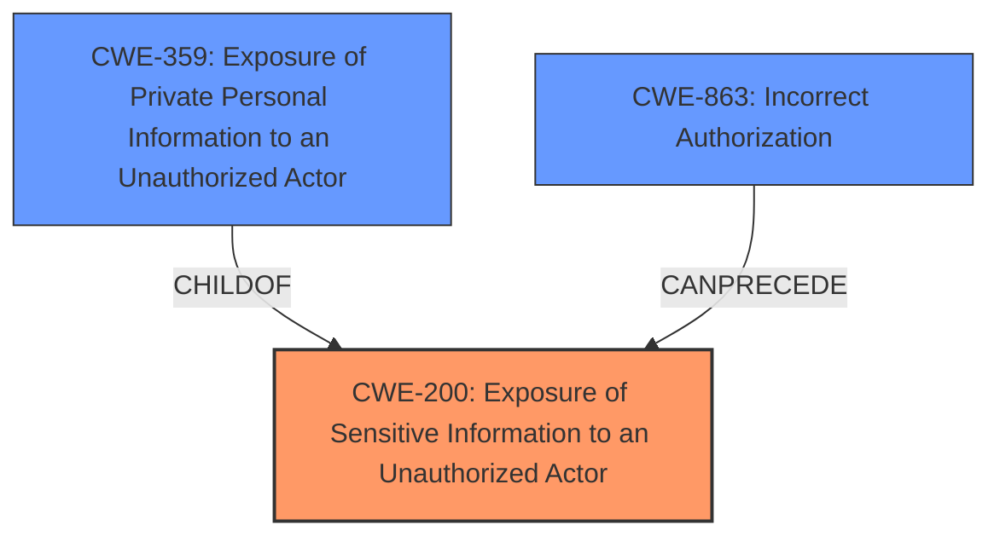

# Enhanced Analysis for CVE-2022-22542

# Summary
| CWE ID  | CWE Name                                                    | Confidence | CWE Abstraction Level | CWE Vulnerability Mapping Label | CWE-Vulnerability Mapping Notes |
|---------|-------------------------------------------------------------|------------|-----------------------|---------------------------------|---------------------------------|
| CWE-200 | Exposure of Sensitive Information to an Unauthorized Actor | 0.9        | Class                  | Primary                           | Discouraged                     |
| CWE-359 | Exposure of Private Personal Information to an Unauthorized Actor | 0.8        | Base                  | Secondary                         | Allowed                         |
| CWE-863 | Incorrect Authorization                                    | 0.7        | Class                  | Secondary                         | Allowed-with-Review           |

## Evidence and Confidence

*   **Confidence Score:** 0.8
*   **Evidence Strength:** MEDIUM

## Relationship Analysis
The primary CWE is CWE-200, which is a class-level CWE. CWE-359 and CWE-863 are related to CWE-200 as potential causes or more specific types of information exposure. CWE-359 is a child of CWE-200, representing a specific type of sensitive information (private personal information). CWE-863 can lead to CWE-200 if authorization is not handled correctly, resulting in unauthorized access to sensitive information.



## Vulnerability Chain
The chain of events is as follows:

1.  **Root Cause:** **Incorrect authorization** (potentially, but not definitively stated).
2.  **Weakness:** Sensitive information (private addresses and bank details) is accessible due to the **lack of** proper authorization checks.
3.  **Impact:** Exposure of private personal information to unauthorized actors, leading to a compromise of confidentiality.

CWE-863 could be the root cause, but the description does not definitively state that authorization is missing or incorrect, only that the information is exposed.

## Summary of Analysis
The initial assessment focused on identifying the root cause and the type of information exposed.

The vulnerability description explicitly mentions the exposure of private addresses and bank details of Employee Business Partners to unauthorized actors. The description states, "S/4HANA Supplier Factsheet exposes the private address and bank details... and Enterprise Search... exposes the private address fields... to an actor that is not explicitly authorized to have access to that information, which could compromise Confidentiality."

Based on the evidence, the primary weakness is CWE-200, "Exposure of Sensitive Information to an Unauthorized Actor," because the vulnerability description explicitly states the exposure of sensitive information. However, CWE-200 is a class-level CWE and is discouraged. Therefore, a more specific CWE is needed.

CWE-359, "Exposure of Private Personal Information to an Unauthorized Actor," is a child of CWE-200 and is more specific. It better reflects the type of information exposed in this vulnerability, which includes private addresses and bank details.

CWE-863, "Incorrect Authorization," could be a contributing factor or root cause, as the description mentions that the actors are "not explicitly authorized to have access to that information." However, there is not enough information to definitively state that the authorization mechanism is broken or missing. It could be a configuration issue or a design flaw that leads to the exposure.

The final decision is to map the vulnerability to CWE-200 as the primary CWE since the vulnerability is described as an exposure of information. In addition, map the vulnerability to CWE-359 as it is a child of CWE-200 and focuses on privacy. Finally, map the vulnerability to CWE-863 as a possible root cause.

Relevant CWE Information:

# Enhanced Context (25 CWEs)

## CWE-538: Insertion of Sensitive Information into Externally-Accessible File or Directory
**Abstraction Level**: Base
**Similarity Score**: 0.77
**Source**: dense

**Description**:
The product places sensitive information into files or directories that are accessible to actors who are allowed to have access to the files, but not to the sensitive information.

**Mapping Guidance**:
- Usage: Allowed
- Rationale: This CWE entry is at the Base level of abstraction, which is a preferred level of abstraction for mapping to the root causes of vulnerabilities.

## CWE-497: Exposure of Sensitive System Information to an Unauthorized Control Sphere
**Abstraction Level**: Base
**Similarity Score**: 0.76
**Source**: dense

**Description**:
The product does not properly prevent sensitive system-level information from being accessed by unauthorized actors who do not have the same level of access to the underlying system as the product does.

**Mapping Guidance**:
- Usage: Allowed
- Rationale: This CWE entry is at the Base level of abstraction, which is a preferred level of abstraction for mapping to the root causes of vulnerabilities.

## CWE-668: Exposure of Resource to Wrong Sphere
**Abstraction Level**: Class
**Similarity Score**: 0.76
**Source**: dense

**Description**:
The product exposes a resource to the wrong control sphere, providing unintended actors with inappropriate access to the resource.

**Mapping Guidance**:
- Usage: Discouraged
- Rationale: CWE-668 is high-level and is often misused as a catch-all when lower-level CWE IDs might be applicable. It is sometimes used for low-information vulnerability reports [REF-1287]. It is a level-1 Class (i.e., a child of a Pillar). It is not useful for trend analysis.

## CWE-639: Authorization Bypass Through User-Controlled Key
**Abstraction Level**: Base
**Similarity Score**: 0.76
**Source**: dense

**Description**:
The system's authorization functionality does not prevent one user from gaining access to another user's data or record by modifying the key value identifying the data.

**Mapping Guidance**:
- Usage: Allowed
- Rationale: This CWE entry is at the Base level of abstraction, which is a preferred level of abstraction for mapping to the root causes of vulnerabilities.

## CWE-552: Files or Directories Accessible to External Parties
**Abstraction Level**: Base
**Similarity Score**: 0.76
**Source**: dense

**Description**:
The product makes files or directories accessible to unauthorized actors, even though they should not be.

**Mapping Guidance**:
- Usage: Allowed
- Rationale: This CWE entry is at the Base level of abstraction, which is a preferred level of abstraction for mapping to the root causes of vulnerabilities.

## CWE-274: Improper Handling of Insufficient Privileges
**Abstraction Level**: Base
**Similarity Score**: 0.75
**Source**: dense

**Description**:
The product does not handle or incorrectly handles when it has insufficient privileges to perform an operation, leading to resultant weaknesses.

**Mapping Guidance**:
- Usage: Discouraged
- Rationale: This CWE entry could be deprecated in a future version of CWE.

## CWE-213: Exposure of Sensitive Information Due to Incompatible Policies
**Abstraction Level**: Base
**Similarity Score**: 0.75
**Source**: dense

**Description**:
The product's intended functionality exposes information to certain actors in accordance with the developer's security policy, but this information is regarded as sensitive according to the intended security policies of other stakeholders such as the product's administrator, users, or others whose information is being processed.

**Mapping Guidance**:
- Usage: Allowed
- Rationale: This CWE entry is at the Base level of abstraction, which is a preferred level of abstraction for mapping to the root causes of vulnerabilities.

## CWE-807: Reliance on Untrusted Inputs in a Security Decision
**Abstraction Level**: Base
**Similarity Score**: 0.75
**Source**: dense

**Description**:
The product uses a protection mechanism that relies on the existence or values of an input, but the input can be modified by an untrusted actor in a way that bypasses the protection mechanism.

**Mapping Guidance**:
- Usage: Allowed
- Rationale: This CWE entry is at the Base level of abstraction, which is a preferred level of abstraction for mapping to the root causes of vulnerabilities.

## CWE-226: Sensitive Information in Resource Not Removed Before Reuse
**Abstraction Level**: Base
**Similarity Score**: 0.75
**Source**: dense

**Description**:
The product releases a resource such as memory or a file so that it can be made available for reuse, but it does not clear or "zeroize" the information contained in the resource before the product performs a critical state transition or makes the resource available for reuse by other entities.

**Mapping Guidance**:
- Usage: Allowed
- Rationale:


## CWE Relationship Analysis

Current CWEs represent these abstraction levels: .


### Vulnerability Chain Analysis

**Chain starting from CWE-552:**
- 552 (Files or Directories Accessible to External Parties) - ROOT


**Chain starting from CWE-200:**
- 200 (Exposure of Sensitive Information to an Unauthorized Actor) - ROOT


### CWE Relationship Diagram

```mermaid
graph TD
    classDef primary fill:#f96,stroke:#333,stroke-width:2px
    classDef secondary fill:#69f,stroke:#333
    classDef tertiary fill:#9e9,stroke:#333
```