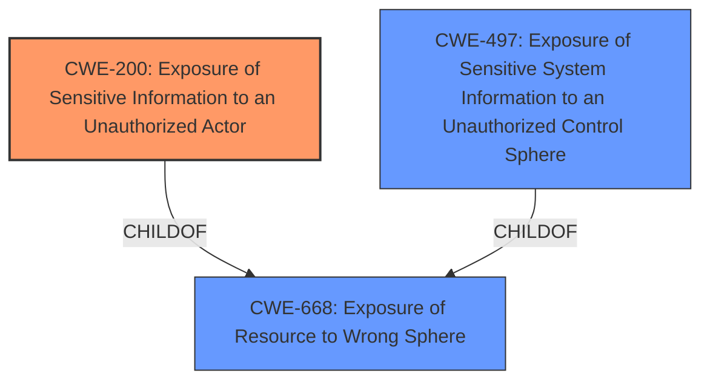

# Enhanced Analysis for CVE-2022-22547

# Summary
| CWE ID | CWE Name | Confidence | CWE Abstraction Level | CWE Vulnerability Mapping Label | CWE-Vulnerability Mapping Notes |
|---|---|---|---|---|---|
| CWE-200 | Exposure of Sensitive Information to an Unauthorized Actor | 0.8 | Class | Primary | Discouraged, but selected as the best fit given the available evidence. |
| CWE-668 | Exposure of Resource to Wrong Sphere | 0.6 | Class | Secondary | Discouraged but considered as a broader classification. |
| CWE-497 | Exposure of Sensitive System Information to an Unauthorized Control Sphere | 0.5 | Base | Secondary | Allowed, considered due to the system-level information exposure. |

## Evidence and Confidence

*   **Confidence Score:** 0.8
*   **Evidence Strength:** MEDIUM

## Relationship Analysis
The primary relationship considered was the parent-child relationship between CWE-668, CWE-200, and CWE-497. While CWE-200 is discouraged, it appears to be the closest match, and CWE-497 is more specific but might not fully capture the essence of the vulnerability without more information. CWE-668 is a higher-level class that is also discouraged but remains a possibility if more specific CWEs are insufficient.



## Vulnerability Chain
The chain of weaknesses starts with the exposure of a Jetty web server on a random port, leading to potential information disclosure, and finally enabling information gathering for future exploits.
  - Root Cause: Unnecessary exposure of Jetty web server
  - Weakness: **Information Disclosure** via the exposed service
  - Impact: **Information Gathering** that could be used to exploit future vulnerabilities

## Summary of Analysis
Initially, the analysis focused on identifying the root cause of the vulnerability and its impact. The primary CWE considered was **CWE-200 (Exposure of Sensitive Information to an Unauthorized Actor)**, based on the **"Information Disclosure"** aspect in the CVE description and the advisory's categorization. However, the mapping guidance for CWE-200 discourages its use when other lower-level CWEs are applicable.

The provided evidence highlights that the Simple Diagnostics Agent exposes a Jetty web server on a random port, potentially allowing attackers to gather sensitive information. This aligns with the description of **CWE-200 (Exposure of Sensitive Information to an Unauthorized Actor)**, which involves exposing sensitive information to an unauthorized actor. The **impact** is **information gathering**, which supports this classification. The "CVE Reference Links Content Summary" section explicitly mentions "**Information Disclosure**" as a weakness.

Other CWEs like **CWE-668 (Exposure of Resource to Wrong Sphere)** and **CWE-497 (Exposure of Sensitive System Information to an Unauthorized Control Sphere)** were also considered but deemed less specific. While **CWE-668 (Exposure of Resource to Wrong Sphere)** is a broader classification, it doesn't fully capture the nature of the information exposure. **CWE-497 (Exposure of Sensitive System Information to an Unauthorized Control Sphere)**, although more specific, requires evidence that system-level information is being exposed, which isn't explicitly stated in the provided description.

Ultimately, **CWE-200 (Exposure of Sensitive Information to an Unauthorized Actor)** was chosen as the primary CWE due to its direct relevance to the **information disclosure** aspect of the vulnerability. The choice is made cautiously, acknowledging the discouraged usage of **CWE-200 (Exposure of Sensitive Information to an Unauthorized Actor)**, but based on the available evidence, it represents the most accurate classification.

**CWE-923 (Improper Restriction of Communication Channel to Intended Endpoints)** was also considered, especially given the random port exposure mentioned in the vulnerability description. However, it focuses more on communication channel restrictions and intended endpoints, whereas the key issue here is the exposure of sensitive information regardless of the communication channel. Therefore, it was not selected as the primary CWE.
The decision is primarily based on the vulnerability description and the CVE reference links content summary, particularly the emphasis on **information disclosure**. The retriever results and complete CWE specifications were used to refine the choice and consider alternative mappings.


## CWE Relationship Analysis

Current CWEs represent these abstraction levels: .


### Vulnerability Chain Analysis

**Chain starting from CWE-200:**
- 200 (Exposure of Sensitive Information to an Unauthorized Actor) - ROOT


**Chain starting from CWE-668:**
- 668 (Exposure of Resource to Wrong Sphere) - ROOT


### CWE Relationship Diagram

```mermaid
graph TD
    classDef primary fill:#f96,stroke:#333,stroke-width:2px
    classDef secondary fill:#69f,stroke:#333
    classDef tertiary fill:#9e9,stroke:#333
```