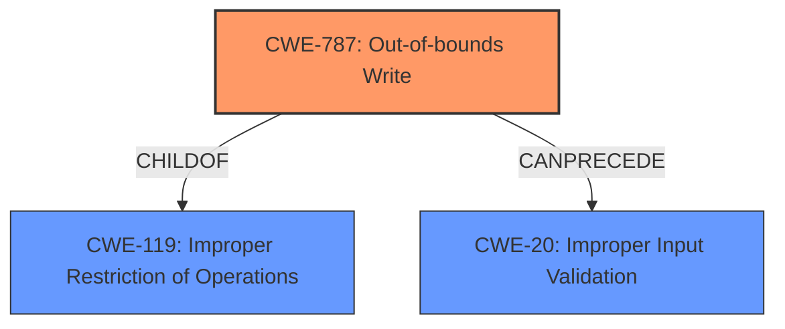

# Enhanced Analysis for CVE-2022-22558

# Summary
| CWE ID | CWE Name | Confidence | CWE Abstraction Level | CWE Vulnerability Mapping Label | CWE-Vulnerability Mapping Notes |
|---|---|---|---|---|---|
| CWE-787 | Out-of-bounds Write | 0.9 | Base | Primary | Allowed |
| CWE-119 | Improper Restriction of Operations within the Bounds of a Memory Buffer | 0.7 | Class | Secondary | Discouraged |
| CWE-20 | Improper Input Validation | 0.6 | Class | Secondary | Discouraged |

## Evidence and Confidence

*   **Confidence Score:** 0.8
*   **Evidence Strength:** HIGH

## Relationship Analysis
The primary CWE is CWE-787, which is a child of CWE-119. CWE-119 is a class-level CWE, and the guidance suggests using more specific CWEs when available. The vulnerability also involves improper input validation (CWE-20) which can lead to the out-of-bounds write.



## Vulnerability Chain
The vulnerability chain starts with **Improper SMM communication buffer verification**, which leads to an out-of-bounds write (CWE-787). The **improper verification** can be seen as a form of improper input validation (CWE-20). This allows an attacker to perform arbitrary writes, ultimately leading to a denial of service.

## Summary of Analysis
Based on the vulnerability description and CVE reference, the root cause is an **improper SMM communication buffer verification** in the Dell PowerEdge Server BIOS and Dell Precision Workstation BIOS. This **improper verification** allows an attacker with local high privileges to perform arbitrary writes (CWE-787), potentially leading to a denial of service.

The evidence supporting this analysis includes:

*   "Dell PowerEdge Server BIOS and Dell Precision Workstation 7910 and 7920 Rack BIOS contain an **Improper SMM communication buffer verification** vulnerability."
*   "A Local High Privileged attacker could potentially exploit this vulnerability leading to arbitrary writes or denial of service."
*   "**Improper SMM Communication Buffer Verification:** The BIOS does not properly validate communication buffers used in System Management Mode (SMM). This lack of verification allows for manipulation of the buffers."
*   "**Arbitrary Writes:** An attacker can leverage the vulnerability to perform arbitrary write operations in memory."

CWE-787 (Out-of-bounds Write) is the most specific CWE that accurately describes the vulnerability's core weakness. CWE-119 (Improper Restriction of Operations within the Bounds of a Memory Buffer) is a more general class that applies, but CWE-787 is preferred due to its greater specificity. CWE-20 is also related because the **improper verification** of the SMM communication buffer can be seen as a type of improper input validation.

The selection of CWE-787 is at the optimal level of specificity because it directly reflects the **root cause** identified in the vulnerability description. The other CWEs considered, such as CWE-125 (Out-of-bounds Read) or CWE-805 (Buffer Access with Incorrect Length Value), do not accurately capture the writing aspect of the vulnerability.

Relevant CWE Information:
### CWE-787: Out-of-bounds Write
**Abstraction Level**: Base
**Similarity Score**: 4.33
**Source**: graph

**Description**:
CWE-787: Out-of-bounds Write

**Mapping Guidance**:
- Usage: Allowed
- Rationale: This CWE entry is at the Base level of abstraction, which is a preferred level of abstraction for mapping to the root causes of vulnerabilities.


## CWE Relationship Analysis

Current CWEs represent these abstraction levels: .


### Vulnerability Chain Analysis

**Chain starting from CWE-805:**
- 805 (Buffer Access with Incorrect Length Value) - ROOT


**Chain starting from CWE-20:**
- 20 (Improper Input Validation) - ROOT


### CWE Relationship Diagram

```mermaid
graph TD
    classDef primary fill:#f96,stroke:#333,stroke-width:2px
    classDef secondary fill:#69f,stroke:#333
    classDef tertiary fill:#9e9,stroke:#333
```