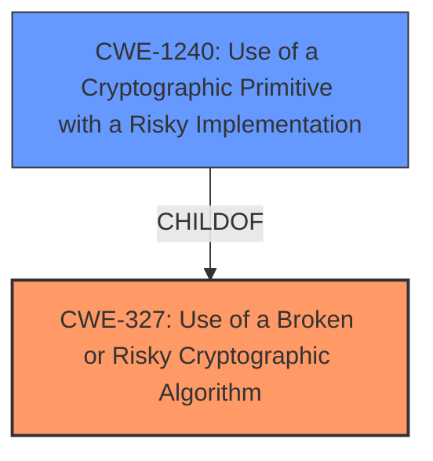

# Enhanced Analysis for CVE-2022-22559

# Summary
| CWE ID  | CWE Name                                                        | Confidence | CWE Abstraction Level | CWE Vulnerability Mapping Label | CWE-Vulnerability Mapping Notes |
| :-------- | :-------------------------------------------------------------- | :--------- | :-------------------- | :------------------------------ | :------------------------------ |
| CWE-327 | Use of a Broken or Risky Cryptographic Algorithm                  | 0.9        | Class                 | Primary CWE                     | Allowed-with-Review             |
| CWE-1240 | Use of a Cryptographic Primitive with a Risky Implementation    | 0.7        | Base                  | Secondary Candidate             | Allowed                         |

## Evidence and Confidence

*   **Confidence Score:** 0.8
*   **Evidence Strength:** HIGH

## Relationship Analysis
The primary CWE identified is CWE-327, which is a Class-level CWE. The analysis considered the child relationship between CWE-327 and CWE-1240. Since the vulnerability description specifies the use of a **broken or risky cryptographic algorithm**, CWE-327 is initially selected as the more general classification. However, the relationship dictates that the child CWEs of CWE-327 should be reviewed for a more precise fit. CWE-1240, a base level CWE, describes the usage of a cryptographic primitive with a risky implementation. Ultimately, the decision is to assign both CWE-327 and CWE-1240 to capture both the general cryptographic issue and the specific implementation risk.



## Vulnerability Chain
The vulnerability chain starts with the **use of a broken or risky cryptographic algorithm** (CWE-327), which leads to potential information disclosure.
  - Root Cause: CWE-327: Use of a Broken or Risky Cryptographic Algorithm
  - Weakness: CWE-1240: Use of a Cryptographic Primitive with a Risky Implementation
  - Impact: Information Disclosure

## Summary of Analysis
The initial analysis focused on the **root cause** described in the vulnerability description: "**broken or risky cryptographic algorithm**". This led to the selection of CWE-327 (Use of a Broken or Risky Cryptographic Algorithm) as the primary CWE, due to its direct relevance to the described weakness.

The retriever results and relationship analysis prompted a deeper examination. While CWE-327 is a Class-level CWE, its child CWE-1240 (Use of a Cryptographic Primitive with a Risky Implementation) provides a more specific description of the vulnerability.

The final decision was to include both CWE-327 and CWE-1240. CWE-327 captures the general cryptographic issue, while CWE-1240 highlights the risk associated with the specific implementation. This approach provides a comprehensive representation of the vulnerability, covering both the high-level weakness and the specific technical details.

The decision is based on the following evidence:
- Vulnerability Description Key Phrases: "**broken or risky cryptographic algorithm**"
- CVE Reference Links Content Summary: "The vulnerability stems from the use of a broken or risky cryptographic algorithm within Dell PowerScale OneFS."

Relevant CWE Information:

# Enhanced Context (25 CWEs)

## CWE-1240: Use of a Cryptographic Primitive with a Risky Implementation
**Abstraction Level**: Base
**Similarity Score**: 0.80
**Source**: dense

**Description**:
To fulfill the need for a cryptographic primitive, the product implements a cryptographic algorithm using a non-standard, unproven, or disallowed/non-compliant cryptographic implementation.

**Mapping Guidance**:
- Usage: Allowed
- Rationale: This CWE entry is at the Base level of abstraction, which is a preferred level of abstraction for mapping to the root causes of vulnerabilities.

## CWE-327: Use of a Broken or Risky Cryptographic Algorithm
**Abstraction Level:** Class
**Similarity Score**: 7686.00
**Source**: sparse

**Description**:
The product uses a broken or risky cryptographic algorithm or protocol.

**Mapping Guidance**:
- Usage: Allowed-with-Review
- Rationale: This CWE entry is a Class and might have Base-level children that would be more appropriate

### CWEs Considered But Not Used
- CWE-639 (Authorization Bypass Through User-Controlled Key): While this CWE appeared in the Retriever Results, it does not align with the vulnerability description, which focuses on cryptographic issues rather than authorization.
- CWE-321 (Use of Hard-coded Cryptographic Key): This CWE is too specific, as the vulnerability description does not mention hard-coded keys.
- CWE-347 (Improper Verification of Cryptographic Signature): This CWE is not applicable, as the vulnerability is related to the algorithm itself rather than its verification.
- CWE-326 (Inadequate Encryption Strength): This CWE is similar, but CWE-327 is a more direct match to the description of a **broken or risky cryptographic algorithm**. Also, the description does not say the encryption is inadequate, simply that the algorithm is broken or risky.
- CWE-208 (Observable Timing Discrepancy): The description focuses on the cryptographic algorithm itself, not timing discrepancies.
- CWE-328 (Use of Weak Hash): The description does not specify the use of a hash function.
- CWE-203 (Observable Discrepancy): The description focuses on the cryptographic algorithm itself, not observable discrepancies.
- CWE-338 (Use of Cryptographically Weak Pseudo-Random Number Generator (PRNG)): The description does not specify the use of a PRNG.


## CWE Relationship Analysis

Current CWEs represent these abstraction levels: .


### Vulnerability Chain Analysis

**Chain starting from CWE-208:**
- 208 (Observable Timing Discrepancy) - ROOT


**Chain starting from CWE-203:**
- 203 (Observable Discrepancy) - ROOT


### CWE Relationship Diagram

```mermaid
graph TD
    classDef primary fill:#f96,stroke:#333,stroke-width:2px
    classDef secondary fill:#69f,stroke:#333
    classDef tertiary fill:#9e9,stroke:#333
```