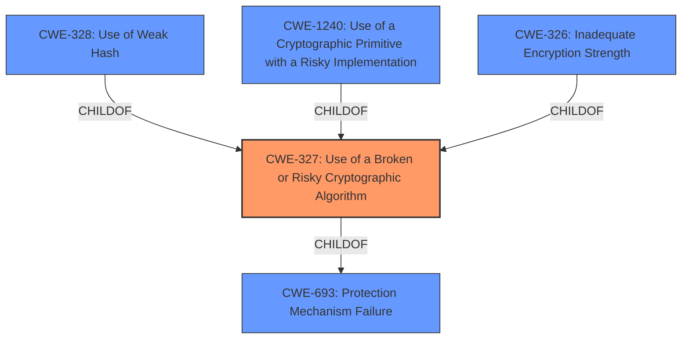

# Analysis for CVE-2022-22564

# Summary
| CWE ID | CWE Name | Confidence | CWE Abstraction Level | CWE Vulnerability Mapping Label | CWE-Vulnerability Mapping Notes |
|---|---|---|---|---|---|
| CWE-327 | Use of a Broken or Risky Cryptographic Algorithm | 1.0 | Class | Allowed-with-Review | Primary CWE |

## Evidence and Confidence

*   **Confidence Score:** 1.0
*   **Evidence Strength:** HIGH

## Relationship Analysis
The primary relationship influencing the selection was the ChildOf relationship between CWE-327 and more specific Base-level CWEs. However, based on the evidence, a more specific CWE could not be selected, so CWE-327 was chosen.

## Vulnerability Chain
The vulnerability chain starts with the **use of a broken cryptographic algorithm** (CWE-327), which allows an attacker to perform MitM attacks, leading to the potential to obtain sensitive information.

## Summary of Analysis
The vulnerability description clearly states that Dell EMC Unity versions before 5.2.0.0.5.173 use a **broken cryptographic algorithm**. The CVE Reference Links Content Summary reinforces this by stating, "The vulnerability is due to the **use of broken cryptographic algorithms** in Dell Unity versions before 5.2.0.0.5.173" and "Weaknesses/vulnerabilities present: **Use of broken cryptographic algorithms**." The vulnerability can be exploited by performing MitM attacks to obtain sensitive information.

The Retriever Results identify CWE-327 "Use of a Broken or Risky Cryptographic Algorithm" as the top candidate CWE. The description for CWE-327, "The product uses a **broken or risky cryptographic algorithm** or protocol," aligns directly with the vulnerability description.

CWE-327 is a Class-level CWE, and the Mapping Guidance suggests reviewing child CWEs for a better fit. Several child CWEs of CWE-327 were considered, including:
* CWE-328 "Use of Weak Hash": This is not applicable as the vulnerability description does not specifically mention a weak hash function.
* CWE-1240 "Use of a Cryptographic Primitive with a Risky Implementation": While this is a possibility, the description is too generic.
* CWE-326 "Inadequate Encryption Strength": This is similar to CWE-327 but focuses on the strength of the encryption rather than the algorithm being broken or risky.
* CWE-321 "Use of Hard-coded Cryptographic Key": This is not relevant as the vulnerability description doesn't mention hard-coded keys.
* CWE-757 "Selection of Less-Secure Algorithm During Negotiation ('Algorithm Downgrade')": The vulnerability description doesn't indicate that a less secure algorithm was negotiated.

Given the available information, CWE-327 is the most appropriate CWE because it aligns directly with the provided evidence. While more specific CWEs exist, there is insufficient evidence to support their selection. Therefore, I am selecting CWE-327.