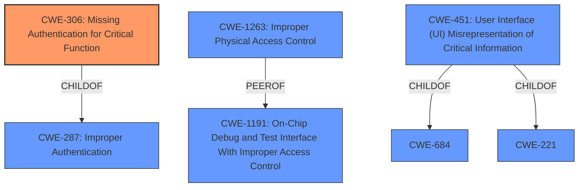

# Analysis for CVE-2022-22652

# Summary
| CWE ID | CWE Name | Confidence | CWE Abstraction Level | CWE Vulnerability Mapping Label | CWE-Vulnerability Mapping Notes |
|---|---|---|---|---|---|
| CWE-306 | Missing Authentication for Critical Function | 0.8 | Base | Allowed | Primary CWE |
| CWE-1263 | Improper Physical Access Control | 0.6 | Class | Allowed-with-Review | Secondary Candidate |
| CWE-451 | User Interface (UI) Misrepresentation of Critical Information | 0.5 | Class | Allowed-with-Review | Secondary Candidate |

## Evidence and Confidence

*   **Confidence Score:** 0.8
*   **Evidence Strength:** MEDIUM

## Relationship Analysis
The primary CWE selected is CWE-306 (**Missing Authentication for Critical Function**), a Base level CWE. This vulnerability could also be classified under CWE-287 (**Improper Authentication**), but that is a Class level CWE, and CWE-306 is a child of that, making it more specific. CWE-1263 (**Improper Physical Access Control**) is a Class level CWE and a peer of CWE-1191 (**On-Chip Debug and Test Interface With Improper Access Control**). CWE-451 (**User Interface (UI) Misrepresentation of Critical Information**) is a Class level CWE and a child of CWE-684 and CWE-221.

## Vulnerability Chain
The **root cause** is the **missing authentication** for the GSMA authentication panel when presented on the lock screen, which leads to the impact of unauthorized access to carrier account information.

## Summary of Analysis
The initial assessment identified CWE-306 (**Missing Authentication for Critical Function**) as the primary weakness, as the GSMA authentication panel could be accessed without requiring device unlock. The vulnerability description states: "The GSMA authentication panel could be presented on the lock screen." The CVE Reference Links Content Summary states: "Root cause of vulnerability: The GSMA authentication panel could be presented on the lock screen." and "Weaknesses/vulnerabilities: Inadequate lock screen protection for the GSMA authentication panel."

The analysis considered CWE-1263 (**Improper Physical Access Control**) and CWE-451 (**User Interface (UI) Misrepresentation of Critical Information**) as secondary candidates. CWE-1263 was considered because the vulnerability involves physical access to the device. CWE-451 was considered because the vulnerability allows a person with physical access to view and modify the carrier account information and settings from the lock screen. However, these are less directly related to the **root cause** than CWE-306.

The selected CWEs are at the optimal level of specificity, with CWE-306 being a Base level CWE that accurately reflects the **missing authentication** for a critical function. CWE-1263 and CWE-451 are higher level Class CWEs and do not accurately reflect the **root cause**.