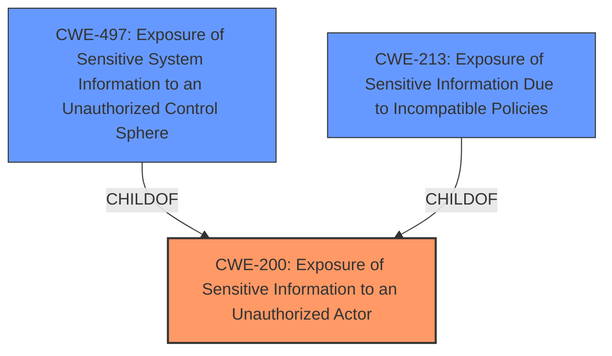

# Analysis Report for CVE-2022-22680

# Vulnerability Analysis Report: CVE-2022-22680

## Description


## Analysis (with Relationship Data)

# Summary
| CWE ID  | CWE Name | Confidence | CWE Abstraction Level | CWE Vulnerability Mapping Label | CWE-Vulnerability Mapping Notes |
|-----------------|-------------------------------------------------------------------|-------------------|-------------------------|-----------------------------------|----------------------------------------------------------------------------------------------------------------------------------|
| **CWE-200** | Exposure of Sensitive Information to an Unauthorized Actor | 0.8 | Class | Primary | Discouraged: Represents the loss of confidentiality, a technical impact, not a root cause. However, it aligns with the **exposure of sensitive information** described. |
| CWE-497 | Exposure of Sensitive System Information to an Unauthorized Control Sphere | 0.6 | Base | Secondary | Allowed: A more specific potential cause for **exposure of sensitive information**, focusing on system-level details. |
| CWE-213 | Exposure of Sensitive Information Due to Incompatible Policies | 0.5 | Base | Secondary | Allowed: Another potential cause, where information is exposed due to conflicting security policies. |

## Evidence and Confidence

*   **Confidence Score:** 0.7
*   **Evidence Strength:** MEDIUM

## Relationship Analysis
The primary relationship considered was the ChildOf relationship between CWE-497 and CWE-200, as well as CWE-213 and CWE-200. CWE-497 and CWE-213 provide more specific details about the type of information exposed, while CWE-200 serves as a more general classification. The choice to use CWE-200 as primary is due to its direct match with the vulnerability description, although its discouraged usage is noted.



## Vulnerability Chain
The vulnerability chain starts with the **exposure of sensitive information to an unauthorized actor** due to an unspecified vulnerability in the Web Server, leading to remote attackers obtaining sensitive information.

## Summary of Analysis
The initial assessment strongly pointed towards CWE-200 due to the explicit mention of **"Exposure of sensitive information to an unauthorized actor"** in both the vulnerability description and the CVE reference. However, CWE-200 is discouraged for direct mapping as it is a high-level weakness. Despite this, it remains the most accurate single representation of the described vulnerability. CWE-497 and CWE-213 were considered as more specific alternatives, but lack sufficient detail.

The final decision to use CWE-200 as the primary weakness is based on its direct relevance to the provided description, acknowledging its discouraged usage and supplementing it with more specific but less conclusive secondary CWEs like CWE-497 and CWE-213.

The assessment relies heavily on the provided evidence, specifically:

*   **Vulnerability Description:** "**Exposure of sensitive information to an unauthorized actor** vulnerability in Web Server..."
*   **CVE Reference Links Content Summary:** "**Root cause of vulnerability**: Exposure of sensitive information due to an unspecified vulnerability in the Web Server."

The selection of CWE-200, despite its discouraged usage, is justified by the lack of specific details regarding the root cause, making it the most accurate representation of the information provided. It is at the optimal level of specificity given the available details, even though ideally a more specific CWE would be preferred.

Relevant CWE Information:

# Enhanced Context (25 CWEs)

## CWE-538: Insertion of Sensitive Information into Externally-Accessible File or Directory
**Abstraction Level**: Base
**Similarity Score**: 0.77
**Source**: dense

**Description**:
The product places sensitive information into files or directories that are accessible to actors who are allowed to have access to the files, but not to the sensitive information.

**Mapping Guidance**:
- Usage: Allowed
- Rationale: This CWE entry is at the Base level of abstraction, which is a preferred level of abstraction for mapping to the root causes of vulnerabilities.

*Rejected*: This CWE requires the insertion of sensitive information into a file or directory, which is not explicitly mentioned in the vulnerability description.

## CWE-213: Exposure of Sensitive Information Due to Incompatible Policies
**Abstraction Level**: Base
**Similarity Score**: 0.75
**Source**: dense

**Description**:
The product's intended functionality exposes information to certain actors in accordance with the developer's security policy, but this information is regarded as sensitive according to the intended security policies of other stakeholders such as the product's administrator, users, or others whose information is being processed.

**Mapping Guidance**:
- Usage: Allowed
- Rationale: This CWE entry is at the Base level of abstraction, which is a preferred level of abstraction for mapping to the root causes of vulnerabilities.

*Accepted as Secondary*: Could be a potential cause if the **exposure** is due to conflicting policies.

## CWE-212: Improper Removal of Sensitive Information Before Storage or Transfer
**Abstraction Level**: Base
**Similarity Score**: 0.74
**Source**: dense

**Description**:
The product stores, transfers, or shares a resource that contains sensitive information, but it does not properly remove that information before the product makes the resource available to unauthorized actors.

**Mapping Guidance**:
- Usage: Allowed
- Rationale: This CWE entry is at the Base level of abstraction, which is a preferred level of abstraction for mapping to the root causes of vulnerabilities.

*Rejected*: This requires improper removal of sensitive information, which is not mentioned in the description.

## CWE-497: Exposure of Sensitive System Information to an Unauthorized Control Sphere
**Abstraction Level**: Base
**Similarity Score**: 0.74
**Source**: dense

**Description**:
The product does not properly prevent sensitive system-level information from being accessed by unauthorized actors who do not have the same level of access to the underlying system as the product does.

**Mapping Guidance**:
- Usage: Allowed
- Rationale: This CWE entry is at the Base level of abstraction, which is a preferred level of abstraction for mapping to the root causes of vulnerabilities.

*Accepted as Secondary*: Could be a potential cause if the **exposure** is about system-level information.

## CWE-226: Sensitive Information in Resource Not Removed Before Reuse
**Abstraction Level**: Base
**Similarity Score**: 0.73
**Source**: dense

**Description**:
The product releases a resource such as memory or a file so that it can be made available for reuse, but it does not clear or "zeroize" the information contained in the resource before the product performs a critical state transition or makes the resource available for reuse by other entities.

**Mapping Guidance**:
- Usage: Allowed
- Rationale: This CWE entry is at the Base level of abstraction, which is a preferred level of abstraction for mapping to the root causes of vulnerabilities.

*Rejected*: Requires resource reuse without clearing sensitive data, which is not in the description.

## CWE-74: Improper Neutralization of Special Elements in Output Used by a Downstream Component ('Injection')
**Abstraction Level**: Class
**Similarity Score**: 0.73
**Source**: dense

**Description**:
The product constructs all or part of a command, data structure, or record using externally-influenced input from an upstream component, but it does not neutralize or incorrectly neutralizes special elements that could modify how it is parsed or interpreted when it is sent to a downstream component.

**Mapping Guidance**:
- Usage: Discouraged
- Rationale: CWE-74 is high-level and often misused when lower-level weaknesses are more appropriate.

*Rejected*: This is related to injection vulnerabilities, which is not mentioned in the description.

## CWE-200: Exposure of Sensitive Information to an Unauthorized Actor
**Abstraction Level**: Class
**Similarity Score**: 0.73
**Source**: dense

**Description**:
The product exposes sensitive information to an actor that is not explicitly authorized to have access to that information.

**Mapping Guidance**:
- Usage: Discouraged
- Rationale: CWE-200 is commonly misused to represent the loss of confidentiality in a vulnerability, but confidentiality loss is a technical impact - not a root cause error. As of CWE 4.9, over 400 CWE entries can lead to a loss of confidentiality. Other options are often available. [REF-1287].

*Selected as Primary*: Matches the description directly, but usage is discouraged.

## CWE-668: Exposure of Resource to Wrong Sphere
**Abstraction Level**: Class
**Similarity Score**: 0.72
**Source**: dense

**Description**:
The product exposes a resource to the wrong control sphere, providing unintended actors with inappropriate access to the resource.

**Mapping Guidance**:
- Usage: Discouraged
- Rationale: CWE-668 is high-level and is often misused as a catch-all when lower-level CWE IDs might be


## CWE Relationship Analysis

Current CWEs represent these abstraction levels: .


### Vulnerability Chain Analysis

**Chain starting from CWE-200:**
- 200 (Exposure of Sensitive Information to an Unauthorized Actor) - ROOT


**Chain starting from CWE-538:**
- 538 (Insertion of Sensitive Information into Externally-Accessible File or Directory) - ROOT


### CWE Relationship Diagram

```mermaid
graph TD
    classDef primary fill:#f96,stroke:#333,stroke-width:2px
    classDef secondary fill:#69f,stroke:#333
    classDef tertiary fill:#9e9,stroke:#333
```


*Report generated on 2025-03-30 20:40:48*
