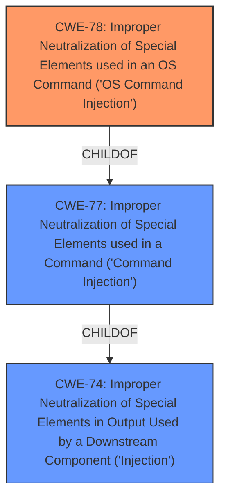

# Analysis for CVE-2022-22684

# Summary
| CWE ID | CWE Name | Confidence | CWE Abstraction Level | CWE Vulnerability Mapping Label | CWE-Vulnerability Mapping Notes |
|---|---|---|---|---|---|
| CWE-78 | Improper Neutralization of Special Elements used in an OS Command ('OS Command Injection') | 1.0 | Base | Allowed | Primary CWE |

## Evidence and Confidence

*   **Confidence Score:** 1.0
*   **Evidence Strength:** HIGH

## Relationship Analysis
The primary CWE is CWE-78, which is a base CWE and child of the class CWE-77. CWE-78 represents a specific type of command injection related to operating system commands. The other CWEs considered were related to more general injection issues.

## Vulnerability Chain
The vulnerability chain starts with **improper neutralization of special elements** leading to **OS command injection**, allowing remote authenticated users to execute arbitrary commands.

## Summary of Analysis
The initial analysis identified **Improper neutralization of special elements** used in an OS command as the root cause, leading to a **command injection** vulnerability. The retriever results and similar CVE descriptions suggested CWE-78, CWE-77, and CWE-89 as potential candidates.

The final decision was to assign CWE-78, as it directly matches the vulnerability description and CVE Reference Links Content Summary, which explicitly mentions "Improper neutralization of special elements used in an OS command ('OS Command Injection')". CWE-78 is a Base level CWE, which is the preferred level of abstraction.

The primary CWE match for similar CVE Descriptions was CWE-89, but the vulnerability description explicitly refers to OS commands, which makes CWE-78 a more accurate fit.

Relevant CWE Information:

# Enhanced Context (25 CWEs)

## CWE-23: Relative Path Traversal
**Abstraction Level**: Base
**Similarity Score**: 0.79
**Source**: dense
Not Selected: This CWE is not selected because the vulnerability is related to command injection and not path traversal.

## CWE-41: Improper Resolution of Path Equivalence
**Abstraction Level**: Base
**Similarity Score**: 0.79
**Source**: dense
Not Selected: This CWE is not selected because the vulnerability is related to command injection and not path equivalence.

## CWE-74: Improper Neutralization of Special Elements in Output Used by a Downstream Component ('Injection')
**Abstraction Level**: Class
**Similarity Score**: 0.78
**Source**: dense
Not Selected: This CWE is too general. While command injection is a form of injection, a more specific CWE is available.

## CWE-73: External Control of File Name or Path
**Abstraction Level**: Base
**Similarity Score**: 0.78
**Source**: dense
Not Selected: This CWE is not selected because the vulnerability is related to command injection and not external control of file names or paths.

## CWE-36: Absolute Path Traversal
**Abstraction Level**: Base
**Similarity Score**: 0.78
**Source**: dense
Not Selected: This CWE is not selected because the vulnerability is related to command injection and not path traversal.

## CWE-184: Incomplete List of Disallowed Inputs
**Abstraction Level**: Base
**Similarity Score**: 0.78
**Source**: dense
Not Selected: This CWE is not selected because the vulnerability is related to command injection, not an incomplete list of disallowed inputs.

## CWE-59: Improper Link Resolution Before File Access ('Link Following')
**Abstraction Level**: Base
**Similarity Score**: 0.78
**Source**: dense
Not Selected: This CWE is not selected because the vulnerability is related to command injection and not link resolution.

## CWE-138: Improper Neutralization of Special Elements
**Abstraction Level**: Class
**Similarity Score**: 0.77
**Source**: dense
Not Selected: This CWE is too general. While this CWE relates to improper neutralization, a more specific CWE for OS Command Injection exists.

## CWE-427: Uncontrolled Search Path Element
**Abstraction Level**: Base
**Similarity Score**: 0.77
**Source**: dense
Not Selected: This CWE is not selected because the vulnerability is related to command injection and not uncontrolled search path elements.

## CWE-24: Path Traversal: '../filedir'
**Abstraction Level**: Variant
**Similarity Score**: 0.76
**Source**: dense
Not Selected: This CWE is not selected because the vulnerability is related to command injection and not path traversal.

## CWE-1336: Improper Neutralization of Special Elements Used in a Template Engine
**Abstraction Level**: Base
**Similarity Score**: 9361.27
**Source**: sparse
Not Selected: This CWE is not selected because the vulnerability is related to OS command injection and not template injection.

## CWE-138: Improper Neutralization of Special Elements
**Abstraction Level**: Class
**Similarity Score**: 9348.59
**Source**: sparse
Not Selected: This CWE is not selected because the vulnerability is related to OS command injection and not a general neutralization issue.

## CWE-22: Improper Limitation of a Pathname to a Restricted Directory ('Path Traversal')
**Abstraction Level**: Base
**Similarity Score**: 9337.45
**Source**: sparse
Not Selected: This CWE is not selected because the vulnerability is related to command injection and not path traversal.

## CWE-79: Improper Neutralization of Input During Web Page Generation ('Cross-site Scripting')
**Abstraction Level**: Base
**Similarity Score**: 9305.24
**Source**: sparse
Not Selected: This CWE is not selected because the vulnerability is related to command injection and not cross-site scripting.

## CWE-116: Improper Encoding or Escaping of Output
**Abstraction Level**: Class
**Similarity Score**: 9268.05
**Source**: sparse
Not Selected: This CWE is not selected because the vulnerability is related to command injection and not improper encoding or escaping of output.

## CWE-79: Improper Neutralization of Input During Web Page Generation ('Cross-site Scripting')
**Abstraction Level**: base
**Similarity Score**: 5.03
**Source**: graph
Not Selected: This CWE is not selected because the vulnerability is related to command injection and not cross-site scripting.

## CWE-78: Improper Neutralization of Special Elements used in an OS Command ('OS Command Injection')
**Abstraction Level**: base
**Similarity Score**: 5.03
**Source**: graph
Selected: This CWE is selected because the vulnerability description explicitly mentions "**Improper neutralization of special elements** used in an OS command (OS Command Injection)".

## CWE-494: Download of Code Without Integrity Check
**Abstraction Level**: base
**Similarity Score**: 4.33
**Source**: graph
Not Selected: This CWE is not selected because the vulnerability is related to command injection and not downloading code without an integrity check.

## CWE-22: Improper Limitation of a Pathname to a Restricted Directory ('Path Traversal')
**Abstraction Level**: base
**Similarity Score**: 4.33
**Source**: graph
Not Selected: This CWE is not selected because the vulnerability is related to command injection and not path traversal.

## CWE-88: Improper Neutralization of Argument Delimiters in a Command ('Argument Injection')
**Abstraction Level**: base
**Similarity Score**: 3.64
**Source**: graph
Not Selected: While argument injection could potentially be related, the description focuses on the broader OS command injection, making CWE-78 a more direct fit.

## CWE-1336: Improper Neutralization of Special Elements Used in a Template Engine
**Abstraction Level**: base
**Similarity Score**: 3.64
**Source**: graph
Not Selected: This CWE is not selected because the vulnerability is related to OS command injection and not template injection.

## CWE-98: Improper Control of Filename for Include/Require Statement in PHP Program ('PHP Remote File Inclusion')
**Abstraction Level**: variant
**Similarity Score**: 3.33
**Source**: graph
Not Selected: This CWE is not selected because the vulnerability is related to command injection and not PHP remote file inclusion.

## CWE-94: Improper Control of Generation of Code ('Code Injection')
**Abstraction Level**: base
**Similarity Score**: 3.30
**Source**: graph
Not Selected: This CWE is not selected because the vulnerability is related to command injection, and CWE-7