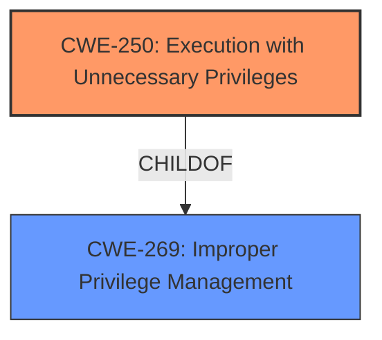

# Analysis Report for CVE-2022-22704

# Vulnerability Analysis Report: CVE-2022-22704

## Description


## Analysis (with Relationship Data)

# Summary
| CWE ID | CWE Name | Confidence | CWE Abstraction Level | CWE Vulnerability Mapping Label | CWE-Vulnerability Mapping Notes |
|---|---|---|---|---|---|
| CWE-250 | Execution with Unnecessary Privileges | 0.9 | Base | Allowed | Primary CWE |
| CWE-269 | Improper Privilege Management | 0.7 | Class | Discouraged | Secondary Candidate |

## Evidence and Confidence

*   **Confidence Score:** 0.9
*   **Evidence Strength:** HIGH

## Relationship Analysis
The primary relationship influencing the decision is the hierarchical relationship where CWE-250 is a child of CWE-269. While CWE-269 is a broader classification, CWE-250 provides a more specific characterization of the **incorrect design** that led to the vulnerability. The abstraction level of CWE-250 as Base aligns with the goal of identifying a specific, actionable weakness.



## Vulnerability Chain
The vulnerability chain starts with an **incorrect design** decision to rely on systemd for user context configuration, leading to the zabbix-agent2 process running as root (Execution with Unnecessary Privileges). This grants broader access than needed and increases the potential impact of any subsequent vulnerability in the agent (privilege escalation to root).

## Summary of Analysis
The initial analysis focused on the **incorrect design** and its impact of privilege escalation. The **Vulnerability Description Key Phrases** clearly points to the **rootcause** being the **incorrect design**, leading to privilege escalation. The CVE Reference Links Content Summary confirms this, stating that the `zabbix-agent2` service runs as root due to the reliance on systemd, which is not present in Alpine Linux.

The retriever results suggested CWE-269 (Improper Privilege Management), and CWE-250 (Execution with Unnecessary Privileges).

CWE-269 is a Class-level CWE, and the mapping guidance discourages its use because it is often misused and is not useful for trend analysis. The guidance recommends examining its children for more specific CWEs.

CWE-250 (Execution with Unnecessary Privileges) is a Base-level CWE, which is a preferred level of abstraction. The description of CWE-250 matches the vulnerability where the product performs an operation (running the agent) at a privilege level (root) that is higher than required.

Therefore, CWE-250 is the better fit as it more accurately describes the **rootcause** of the vulnerability.

Relevant CWE Information:

# Enhanced Context (25 CWEs)

## CWE-250: Execution with Unnecessary Privileges
**Abstraction:** Base
**Status:** Draft

### Description
The product performs an operation at a privilege level that is higher than the minimum level required, which creates new weaknesses or amplifies the consequences of other weaknesses.

### Extended Description
New weaknesses can be exposed because running with extra privileges, such as root or Administrator, can disable the normal security checks being performed by the operating system or surrounding environment. Other pre-existing weaknesses can turn into security vulnerabilities if they occur while operating at raised privileges.

### Mapping Guidance
**Usage:** Allowed
**Rationale:** This CWE entry is at the Base level of abstraction, which is a preferred level of abstraction for mapping to the root causes of vulnerabilities.

## CWE-269: Improper Privilege Management
**Abstraction:** Class
**Status:** Draft

### Description
The product does not properly assign, modify, track, or check privileges for an actor, creating an unintended sphere of control for that actor.

### Mapping Guidance
**Usage:** Discouraged
**Rationale:** CWE-269 is commonly misused. It can be conflated with "privilege escalation," which is a technical impact that is listed in many low-information vulnerability reports. It is not useful for trend analysis.


## CWE Relationship Analysis

Current CWEs represent these abstraction levels: .


### Vulnerability Chain Analysis

**Chain starting from CWE-269:**
- 269 (Improper Privilege Management) - ROOT


**Chain starting from CWE-250:**
- 250 (Execution with Unnecessary Privileges) - ROOT


### CWE Relationship Diagram

```mermaid
graph TD
    classDef primary fill:#f96,stroke:#333,stroke-width:2px
    classDef secondary fill:#69f,stroke:#333
    classDef tertiary fill:#9e9,stroke:#333
```


*Report generated on 2025-03-31 09:12:39*
