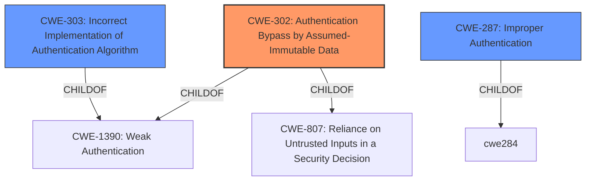

# Raw Analyzer Response for CVE-2022-22729

# Summary
| CWE ID | CWE Name | Confidence | CWE Abstraction Level | CWE Vulnerability Mapping Label | CWE-Vulnerability Mapping Notes |
|---|---|---|---|---|---|
| CWE-302 | Authentication Bypass by Assumed-Immutable Data | 0.9 | Base | Allowed | Primary CWE |
| CWE-303 | Incorrect Implementation of Authentication Algorithm | 0.7 | Base | Allowed | Secondary Candidate |
| CWE-287 | Improper Authentication | 0.5 | Class | Discouraged | Secondary Candidate |

## Evidence and Confidence

*   **Confidence Score:** 0.9
*   **Evidence Strength:** HIGH

## Relationship Analysis
The primary CWE, CWE-302, is a base-level CWE that falls under CWE-1390 (Weak Authentication) and CWE-807 (Reliance on Untrusted Inputs in a Security Decision). The vulnerability involves bypassing authentication by manipulating data assumed to be immutable, which aligns with the description of CWE-302. While CWE-287 (Improper Authentication) is a parent class, CWE-302 provides a more specific description of the vulnerability's root cause. CWE-303 (Incorrect Implementation of Authentication Algorithm) is considered as a possible alternative since the **improper authentication** stems from incorrect handling of packets, which could be seen as a flawed implementation.

## Vulnerability Chain
The vulnerability chain starts with the **improper authentication** of receiving packets.
This leads to authentication bypass.
The ability to craft malformed packets and send it to the server is the vector.

## Summary of Analysis
The initial assessment considered CWE-287, a class-level CWE for improper authentication. However, upon closer examination of the vulnerability description and the retriever results, CWE-302 (Authentication Bypass by Assumed-Immutable Data) emerged as the most appropriate choice. The "CVE Reference Links Content Summary" clearly states that the server's reliance on assumed-immutable data allows an attacker to bypass authentication, directly aligning with CWE-302's description.
The vulnerability's root cause lies in the **improper authentication** of packets received by the CAMS for HIS server, as stated in the "Vulnerability Description Key Phrases". The crafted packets exploit this weakness, allowing attackers to bypass authentication. This aligns with the description of CWE-302, which states that the authentication scheme uses key data elements that are assumed to be immutable, but can be controlled or modified by the attacker.
CWE-302 is at the base level of abstraction, which is the preferred level.

Relevant CWE Information:

# Enhanced Context (25 CWEs)

## CWE-302: Authentication Bypass by Assumed-Immutable Data
**Abstraction:** Base
**Similarity Score**: 0.77
**Source**: dense

**Description**:
The authentication scheme or implementation uses key data elements that are assumed to be immutable, but can be controlled or modified by the attacker.

**Mapping Guidance**:
- Usage: Allowed
- Rationale: This CWE entry is at the Base level of abstraction, which is a preferred level of abstraction for mapping to the root causes of vulnerabilities.

## CWE-303: Incorrect Implementation of Authentication Algorithm
**Abstraction:** Base
**Similarity Score**: 0.79
**Source**: dense

**Description**:
The requirements for the product dictate the use of an established authentication algorithm, but the implementation of the algorithm is incorrect.

**Mapping Guidance**:
- Usage: Allowed
- Rationale: This CWE entry is at the Base level of abstraction, which is a preferred level of abstraction for mapping to the root causes of vulnerabilities.

## CWE-287: Improper Authentication
**Abstraction:** Class
**Similarity Score**: 5268.16
**Source**: sparse

**Description**:
When an actor claims to have a given identity, the product does not prove or insufficiently proves that the claim is correct.

**Mapping Guidance**:
- Usage: Discouraged
- Rationale: This CWE entry might be misused when lower-level CWE entries are likely to be applicable. It is a level-1 Class (i.e., a child of a Pillar).