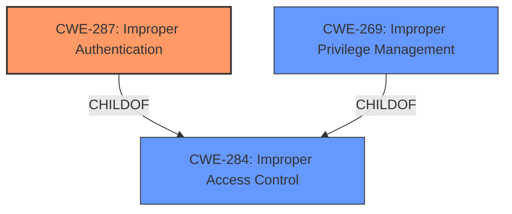

# Analysis Report for CVE-2022-22730

# Vulnerability Analysis Report: CVE-2022-22730

## Description


## Analysis (with Relationship Data)

# Summary
| CWE ID | CWE Name | Confidence | CWE Abstraction Level | CWE Vulnerability Mapping Label | CWE-Vulnerability Mapping Notes |
|---|---|---|---|---|---|
| CWE-287 | Improper Authentication | 0.8 | Class | Primary | Discouraged |
| CWE-269 | Improper Privilege Management | 0.6 | Class | Secondary | Discouraged |
| CWE-284 | Improper Access Control | 0.5 | Pillar | Secondary | Discouraged |

## Evidence and Confidence

*   **Confidence Score:** 0.8
*   **Evidence Strength:** HIGH

## Relationship Analysis
The primary relationship impacting the decision is that CWE-287 [CWE-287: Improper Authentication] is a ChildOf CWE-284 [CWE-284: Improper Access Control]. Since the vulnerability description explicitly mentions "**Improper authentication**", CWE-287 [CWE-287: Improper Authentication] is more directly relevant. However, the ultimate impact is "escalation of privilege", which relates to the broader concept of access control, so CWE-284 [CWE-284: Improper Access Control] is a secondary consideration. The retriever results also suggest CWE-269 [CWE-269: Improper Privilege Management], which is also a child of CWE-284 [CWE-284: Improper Access Control] and describes **improper** privilege management. This CWE is less directly supported by the vulnerability description, but the impact (privilege escalation) supports it as a secondary consideration.



## Vulnerability Chain
The vulnerability chain starts with **improper authentication** (CWE-287 [CWE-287: Improper Authentication]), which leads to the potential for privilege escalation. Thus, the chain is:

CWE-287 [CWE-287: Improper Authentication] -> Privilege Escalation

## Summary of Analysis
The initial assessment strongly points to CWE-287 [CWE-287: Improper Authentication] due to the explicit mention of "**Improper authentication**" in both the vulnerability description and the CVE Reference Links Content Summary ("Root cause of vulnerability: **Improper authentication**"). The vulnerability description key phrases also highlight "**Improper authentication**" as the root cause. The impact, "escalation of privilege," further supports the selection of CWE-287 [CWE-287: Improper Authentication] because **improper authentication** is a common prerequisite for privilege escalation.

The retriever results list CWE-284 [CWE-284: Improper Access Control] as the top match, and CWE-287 [CWE-287: Improper Authentication] as the second match, but MITRE discourages the use of CWE-284 [CWE-284: Improper Access Control] because its too high-level "Its name, 'Improper Access Control,' is often misused in low-information vulnerability reports". The documentation for CWE-287 [CWE-287: Improper Authentication] states the same concern: "This CWE entry might be misused when lower-level CWE entries are likely to be applicable."

Given that the root cause is explicitly identified as **improper authentication**, selecting CWE-287 [CWE-287: Improper Authentication] is the more appropriate and specific choice, despite the discouragement.

The evidence from the vulnerability description is clear: "**Improper authentication** in the Intel(R) Edge Insights for Industrial software before version 2.6.1 may allow an unauthenticated user to potentially enable escalation of privilege via network access." The "CVE Reference Links Content Summary" reinforces this with "Root cause of vulnerability: **Improper authentication**".

CWE-287 [CWE-287: Improper Authentication] is at the Class level, making it more specific than the Pillar-level CWE-284 [CWE-284: Improper Access Control].

Based on the evidence, the vulnerability is best represented by CWE-287 [CWE-287: Improper Authentication], with CWE-269 [CWE-269: Improper Privilege Management] and CWE-284 [CWE-284: Improper Access Control] as secondary considerations due to the impact of privilege escalation.

Relevant CWE Information:

# Enhanced Context (25 CWEs)
The following CWEs were identified as potentially relevant to this vulnerability:

## CWE-653: Improper Isolation or Compartmentalization
**Abstraction Level**: Class
**Similarity Score**: 0.77
**Source**: dense

**Description**:
The product does not properly compartmentalize or isolate functionality, processes, or resources that require different privilege levels, rights, or permissions.

**Mapping Guidance**:
- Usage: Allowed
- Rationale: This CWE entry is at the Base level of abstraction, which is a preferred level of abstraction for mapping to the root causes of vulnerabilities.

## CWE-274: Improper Handling of Insufficient Privileges
**Abstraction Level**: Base
**Similarity Score**: 0.76
**Source**: dense

**Description**:
The product does not handle or incorrectly handles when it has insufficient privileges to perform an operation, leading to resultant weaknesses.

**Mapping Guidance**:
- Usage: Discouraged
- Rationale: This CWE entry could be deprecated in a future version of CWE.

## CWE-667: Improper Locking
**Abstraction Level**: Class
**Similarity Score**: 0.75
**Source**: dense

**Description**:
The product does not properly acquire or release a lock on a resource, leading to unexpected resource state changes and behaviors.

**Mapping Guidance**:
- Usage: Allowed-with-Review
- Rationale: This CWE entry is a Class and might have Base-level children that would be more appropriate

## CWE-668: Exposure of Resource to Wrong Sphere
**Abstraction Level**: Class
**Similarity Score**: 0.75
**Source**: dense

**Description**:
The product exposes a resource to the wrong control sphere, providing unintended actors with inappropriate access to the resource.

**Mapping Guidance**:
- Usage: Discouraged
- Rationale: CWE-668 is high-level and is often misused as a catch-all when lower-level CWE IDs might be applicable. It is sometimes used for low-information vulnerability reports [REF-1287]. It is a level-1 Class (i.e., a child of a Pillar). It is not useful for trend analysis.

## CWE-1390: Weak Authentication
**Abstraction Level**: Class
**Similarity Score**: 0.75
**Source**: dense

**Description**:
The product uses an authentication mechanism to restrict access to specific users or identities, but the mechanism does not sufficiently prove that the claimed identity is correct.

**Mapping Guidance**:
- Usage: Allowed-with-Review
- Rationale: This CWE entry is a Class and might have Base-level children that would be more appropriate

## CWE-280: Improper Handling of Insufficient Permissions or Privileges
**Abstraction Level**: Base
**Similarity Score**: 0.75
**Source**: dense

**Description**:
The product does not handle or incorrectly handles when it has insufficient privileges to access resources or functionality as specified by their permissions. This may cause it to follow unexpected code paths that may leave the product in an invalid state.

**Mapping Guidance**:
- Usage: Allowed
- Rationale: This CWE entry is at the Base level of abstraction, which is a preferred level of abstraction for mapping to the root causes of vulnerabilities.

## CWE-226: Sensitive Information in Resource Not Removed Before Reuse
**Abstraction Level**: Base
**Similarity Score**: 0.74
**Source**: dense

**Description**:
The product releases a resource such as memory or a file so that it can be made available for reuse, but it does not clear or "zeroize" the information contained in the resource before the product performs a critical state transition or makes the resource available for reuse by other entities.

**Mapping Guidance**:
- Usage: Allowed
- Rationale: This CWE entry is at the Base level of abstraction, which is a preferred level of abstraction for mapping to the root causes of vulnerabilities.

## CWE-1391: Use of Weak Credentials
**Abstraction Level**: Class
**Similarity Score**: 0.74
**Source**: dense

**Description**:
The product uses weak credentials (such as a default key or hard-coded password) that can be calculated, derived, reused, or guessed by an attacker.

**Mapping Guidance**:
- Usage: Allowed-with-Review
- Rationale: This CWE entry is a Class and might have Base-level children that would be more appropriate

##


## CWE Relationship Analysis

Current CWEs represent these abstraction levels: .


### Vulnerability Chain Analysis

**Chain starting from CWE-280:**
- 280 (Improper Handling of Insufficient Permissions or Privileges ) - ROOT


**Chain starting from CWE-1390:**
- 1390 (Weak Authentication) - ROOT


### CWE Relationship Diagram

```mermaid
graph TD
    classDef primary fill:#f96,stroke:#333,stroke-width:2px
    classDef secondary fill:#69f,stroke:#333
    classDef tertiary fill:#9e9,stroke:#333
```


*Report generated on 2025-03-31 09:08:12*
