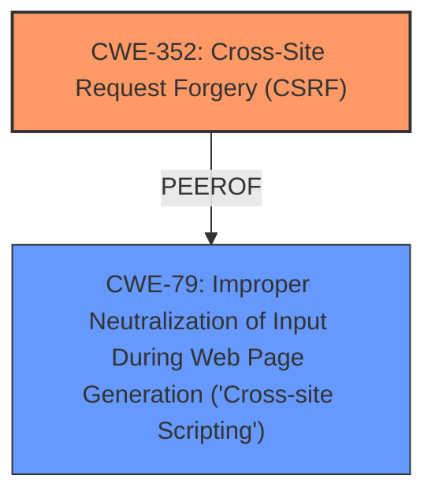

# Enhanced Analysis for CVE-2022-22734

# Summary
| CWE ID | CWE Name | Confidence | CWE Abstraction Level | CWE Vulnerability Mapping Label | CWE-Vulnerability Mapping Notes |
|---|---|---|---|---|---|
| CWE-352 | Cross-Site Request Forgery (CSRF) | 1.0 | Compound | Allowed | Primary CWE |
| CWE-79 | Improper Neutralization of Input During Web Page Generation ('Cross-site Scripting') | 1.0 | Base | Allowed | Secondary Candidate |

## Evidence and Confidence

*   **Confidence Score:** 1.0
*   **Evidence Strength:** HIGH

## Relationship Analysis
The primary weakness is CWE-352 [Cross-Site Request Forgery (CSRF)], a compound weakness that occurs when an application does not sufficiently verify if a request was intentionally provided by the user. The secondary weakness is CWE-79 [Improper Neutralization of Input During Web Page Generation ('Cross-site Scripting')], a base weakness that occurs when a product does not neutralize user-controllable input before placing it in output used as a web page. CWE-352 Requires other CWEs to be effective such as CWE-346, CWE-441, CWE-642, and CWE-613. CWE-79 can be related to CWE-352 as an attacker might use CSRF to trick the victim into submitting requests to the server containing an XSS payload.



## Vulnerability Chain
The vulnerability chain starts with a **lack of CSRF protection** (CWE-352), allowing an attacker to trick a logged-in administrator into performing actions. This leads to the ability to inject Cross-Site Scripting payloads due to the **failure to sanitize and escape quotes** (CWE-79). The injected XSS can then be executed by other users, leading to potential account compromise.

## Summary of Analysis
The initial analysis identified two key weaknesses: **lack of CSRF protection** and **cross-site scripting**. The vulnerability description states, "The Simple Quotation WordPress plugin through 1.3.2 does not have CSRF check when creating or editing a quote and does not sanitise and escape Quotes. As a result, attacker could make a logged in admin create or edit arbitrary quote, and put Cross-Site Scripting payloads in them." This directly supports the selection of CWE-352 and CWE-79.

The graph relationships show that CWE-352 and CWE-79 can be related, where CSRF can be used to deliver XSS payloads. The selection of these CWEs is at the optimal level of specificity, as they accurately represent the **root cause** (CSRF) and the resulting weakness (XSS) based on the provided evidence.

The following CWEs were considered but not used:

*   CWE-116 [Improper Encoding or Escaping of Output]: While related to XSS, CWE-79 is a more specific and appropriate classification for this vulnerability.
*   CWE-862 [Missing Authorization] and CWE-863 [Incorrect Authorization]: These CWEs are related to authorization issues, but the primary issue is the **lack of CSRF protection**, which is better captured by CWE-352.
*   CWE-434 [Unrestricted Upload of File with Dangerous Type]: This CWE is not relevant as the vulnerability does not involve file uploads.
*   CWE-149 [Improper Neutralization of Quoting Syntax]: The vulnerability description indicates a failure to sanitize and escape quotes, but does not specify that it is an issue of improper neutralization, so it is less appropriate.


## CWE Relationship Analysis

Current CWEs represent these abstraction levels: .


### Vulnerability Chain Analysis

**Chain starting from CWE-862:**
- 862 (Missing Authorization) - ROOT


**Chain starting from CWE-434:**
- 434 (Unrestricted Upload of File with Dangerous Type) - ROOT


### CWE Relationship Diagram

```mermaid
graph TD
    classDef primary fill:#f96,stroke:#333,stroke-width:2px
    classDef secondary fill:#69f,stroke:#333
    classDef tertiary fill:#9e9,stroke:#333
```